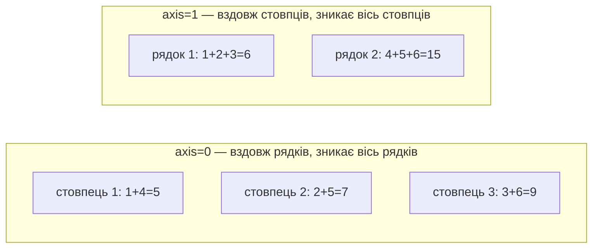
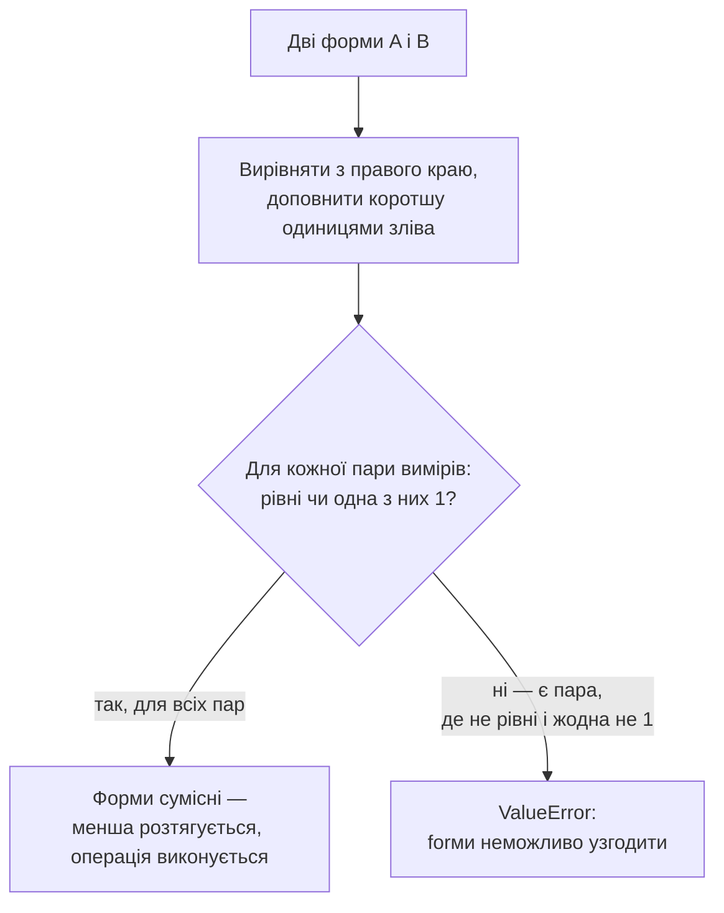

# Лекція 1. NumPy: масиви і векторизовані обчислення

*NumPy — бібліотека, на якій побудований увесь науковий Python-стек:
pandas зберігає дані у вигляді масивів NumPy, Matplotlib малює графіки за
масивами чисел, SciPy й statsmodels рахують на них статистику. Розуміння
масиву NumPy — це розуміння того, як усередині влаштоване практично все,
що буде далі в курсі.*

## Що таке NumPy і де його використовують

NumPy (Numerical Python) — базова бібліотека Python для роботи з
числовими масивами, ядро якої (сам масив `ndarray` і операції над ним)
написане на C, а не на Python, — саме тому вона й здатна бути швидшою
за звичайний Python на порядки, про що детально йдеться нижче.
З'явилась у сучасному вигляді 2006 року (Тревіс Олівант об'єднав дві
попередні, конкуруючі бібліотеки — Numeric і Numarray), і з того часу є
фактичним стандартом для будь-яких числових обчислень у Python: жодна
інша бібліотека для роботи з таблицями, графіками чи статистикою не
вигадує власний масив — усі використовують саме `ndarray` NumPy як
спільну основу.

Застосування виходить далеко за межі одного курсу з аналізу даних:
наукові обчислення й інженерні симуляції (фізика, хімія, обробка
сигналів), обробка зображень (кольорове зображення — це просто
тривимірний масив чисел: висота × ширина × канали кольору),
геопросторовий аналіз, фінансовий аналіз (обчислення на масивах цін чи
прибутковостей). А в межах цього курсу — це фундамент, на якому
побудовані буквально всі бібліотеки, що з'являться далі: pandas
(Лекція 2), Matplotlib (Лекція 6), SciPy (Лекції 10, 19) і statsmodels
(Лекція 17) усі внутрішньо зберігають дані саме в масивах NumPy й
викликають ту саму векторизовану математику, лише під зручнішим
інтерфейсом.

## Чому не звичайний список Python

Список Python (`list`) — універсальний контейнер: у ньому можуть лежати
елементи різних типів, і кожен елемент — окремий об'єкт у пам'яті, на
який список зберігає лише посилання. Це зручно, але для великих
однотипних числових наборів — повільно і громіздко.

```python
temps = [-4, -3, 2, 9, 15, 19, 21, 20, 14, 8, 2, -2]

# щоб перевести кожне значення у Фаренгейти, потрібен цикл або list comprehension
temps_f = [t * 9 / 5 + 32 for t in temps]
```

Масив NumPy зберігає однотипні елементи в одному суцільному блоці пам'яті
(як у мовах C/Fortran) і виконує операції не по одному елементу через
цикл Python, а всією операцією одразу над усім блоком:

```python
import numpy as np

temps = np.array([-4, -3, 2, 9, 15, 19, 21, 20, 14, 8, 2, -2])
temps_f = temps * 9 / 5 + 32   # без циклу — вся операція одразу над масивом
```

Такий підхід називається **векторизацією**: операція записується так,
наче застосовується до одного числа, а виконується одразу над усім
набором.

### Наскільки це швидше

На маленьких масивах різниця непомітна, але на великих — принципова.
Порівняння на мільйоні елементів:

```python
import time

n = 1_000_000
data = list(range(n))

start = time.time()
squared_loop = [x ** 2 for x in data]
print(f"List comprehension: {time.time() - start:.4f} с")

arr = np.array(data)
start = time.time()
squared_vec = arr ** 2
print(f"NumPy векторизація: {time.time() - start:.4f} с")
```

Точні секунди залежать від комп'ютера, але порядок різниці — приблизно
10–50 разів на користь NumPy. Причина: цикл Python на кожній ітерації
перевіряє типи, створює новий об'єкт `int`, звертається до нього через
посилання; векторизована операція NumPy виконується одним викликом
низькорівневого коду на C над суцільним блоком пам'яті, без цих
накладних витрат на кожен елемент.

## Створення масивів

```python
np.array([1, 2, 3])          # з існуючого списку
np.zeros(5)                  # [0. 0. 0. 0. 0.]
np.ones((2, 3))              # матриця 2×3 з одиниць
np.full((2, 2), 7)           # матриця 2×2, заповнена числом 7
np.arange(0, 10, 2)          # [0 2 4 6 8] — як range(), але масив
np.linspace(0, 1, 5)         # [0. 0.25 0.5 0.75 1.] — 5 точок рівномірно від 0 до 1
```

| Функція | Що створює |
|---|---|
| `np.array(list)` | масив із наявних даних (найчастіший випадок — дані вже десь є) |
| `np.zeros(n)` / `np.ones(n)` | масив-заглушка з нулів/одиниць потрібного розміру |
| `np.full(shape, value)` | масив-заглушка, заповнений довільним значенням |
| `np.arange(start, stop, step)` | послідовність чисел із заданим кроком |
| `np.linspace(start, stop, num)` | `num` точок, рівномірно розподілених у межах |

`np.zeros`, `np.ones`, `np.arange` рідко потрібні для реальних даних (їх
частіше завантажують з файлу через pandas), але саме на них найпростіше
показати форму та тип масиву — два ключові поняття, які варто зафіксувати
одразу.

## Форма і тип масиву

Кожен масив має:

- **`shape`** — форму: скільки елементів по кожному вимірі (кортеж);
- **`dtype`** — тип елементів (усі елементи масиву мають бути одного типу);
- **`ndim`** — кількість вимірів;
- **`size`** — загальна кількість елементів.

```python
a = np.array([[1, 2, 3], [4, 5, 6]])
a.shape   # (2, 3) — 2 рядки, 3 стовпці
a.dtype   # dtype('int64')
a.ndim    # 2 — кількість вимірів
a.size    # 6 — усього елементів (2 × 3)

b = np.array([1, 2, 3])
b.shape   # (3,) — одновимірний масив із 3 елементів
```

Одновимірний масив (`shape == (3,)`) — це не те саме, що рядок або
стовпець матриці (`shape == (1, 3)` або `(3, 1)`); різниця здається
дрібницею, поки не почне впливати на broadcasting (нижче) чи на те, що
саме повертає індексація.

### Усі рядки мають бути однакової довжини

Для одновимірного масиву кількість елементів може бути будь-якою. Але
щойно створюєте **двовимірний** масив зі списку списків, кожен внутрішній
список стає одним рядком — і всі рядки обов'язково мають бути однакової
довжини:

```python
np.array([[1, 2, 3], [4, 5]])
# ValueError: setting an array element with a sequence.
# The requested array has an inhomogeneous shape after 1 dimensions.
```

**Чому так:** `shape` — це завжди чіткий прямокутник (наприклад, `(2,
3)`), а рядки різної довжини такого прямокутника не утворюють — NumPy
просто не може визначити єдину форму для всього масиву. Якщо побачите цю
помилку, перевіряти варто самі дані, а не код: десь один рядок довший чи
коротший за інші.

### Чому тип буває несподіваним

Усі елементи масиву обов'язково мають один спільний тип — тому, коли в
один масив потрапляють значення різної природи, NumPy підвищує (upcast)
увесь масив до найширшого типу, який здатен вмістити всі значення:

```python
np.array([1, 2, 3]).dtype             # int64      — усе ціле
np.array([1, 2, 3.5]).dtype           # float64    — з'явилось дробове → усе стало float
np.array([1, "два", 3]).dtype         # '<U21'     — з'явився текст → усе стало рядком
```

`'<U21'` означає: рядок Unicode (`U`), максимальною довжиною 21 символ
(NumPy підбирає це число автоматично за найдовшим елементом). Якщо
масив несподівано має текстовий `dtype`, хоча очікувались числа — це
майже завжди ознака, що туди потрапило нечислове значення, і варто
перевірити джерело даних.

## Індексація і зрізи

Індексація масивів працює як у списків Python (з нуля, зрізи через `:`),
але додатково підтримує координати для кількох вимірів і вибір за умовою.

```python
a = np.array([10, 20, 30, 40, 50])

a[0]        # 10 — перший елемент
a[-1]       # 50 — останній елемент
a[1:4]      # [20 30 40] — зріз, межа праворуч НЕ включно
a[::2]      # [10 30 50] — крок 2: кожен другий елемент
a[::-1]     # [50 40 30 20 10] — весь масив у зворотному порядку
```

Для двовимірних масивів координати вказуються через кому: `a[рядок,
стовпець]`.

```python
m = np.array([[1, 2, 3], [4, 5, 6]])
m[0, 2]     # 3 — рядок 0, стовпець 2
m[:, 1]     # [2 5] — усі рядки, стовпець 1
m[1, :]     # [4 5 6] — рядок 1, усі стовпці
```

### Булева індексація

Замість того, щоб писати `if` у циклі, умова записується прямо всередині
квадратних дужок і одразу повертає лише елементи, які їй відповідають:

```python
a[a > 25]           # [30 40 50] — тільки елементи більші за 25
a[(a > 15) & (a < 45)]   # [20 30 40] — кілька умов одразу
```

Кілька умов об'єднуються через `&` («і») і `|` («або») **в дужках навколо
кожної умови**, а не через `and`/`or` — звичайні `and`/`or` Python
працюють з одним булевим значенням, тоді як `a > 15` — це вже цілий
масив `True`/`False`, і Python не знає, як звести масив до одного
`True`/`False`:

```python
a[a > 15 and a < 45]     # ValueError: The truth value of an array
                          # with more than one element is ambiguous
```

### Що насправді відбувається: `__gt__` і `__getitem__`

`a > 25` і `a[mask]` — не магія мови, а звичайні методи Python, які
NumPy перевизначив для `ndarray`. `a > 25` — це виклик `a.__gt__(25)`,
який повертає новий булевий масив тієї самої форми (а не одне
`True`/`False`, як для звичайного числа). `a[mask]` — це виклик
`a.__getitem__(mask)`: коли всередині дужок булевий масив тієї ж форми,
NumPy розпізнає це як запит на відбір за маскою, а не як звичний доступ
за позицією.

## Агрегатні функції та `axis`

Замість того, щоб рахувати суму чи середнє в циклі, NumPy надає готові
агрегатні функції:

```python
temps = np.array([-4, -3, 2, 9, 15, 19, 21, 20, 14, 8, 2, -2])

temps.sum()    # 101
temps.mean()   # 8.42
temps.std()    # стандартне відхилення
temps.min()    # -4
temps.max()    # 21     — саме значення
temps.argmax() # 6      — індекс (позиція) цього значення, а не саме значення
```

Для двовимірних масивів параметр `axis` вказує, **вздовж якої осі**
рахувати — і саме тут найчастіше виникає плутанина, тож розберемо
детально.

```python
m = np.array([[1, 2, 3], [4, 5, 6]])
m.shape          # (2, 3): вісь 0 — рядки (розмір 2), вісь 1 — стовпці (розмір 3)

m.sum(axis=0)   # [5 7 9]  — по одному числу на СТОВПЕЦЬ
m.sum(axis=1)   # [6 15]   — по одному числу на РЯДОК
```

Це не означає, що «вісь 0 — це стовпець»: `axis=0` — вісь **рядків**
(перший індекс `m[i, ...]`), `axis=1` — вісь **стовпців** (другий індекс
`m[..., j]`). Коли рахуєте суму **вздовж** осі, ви складаєте значення,
що відрізняються саме за цим індексом (наприклад, вздовж осі рядків —
складаєте значення з різних рядків одного стовпця), і ця вісь після
підсумку **зникає**. Те, що залишається — розмір іншої осі — і стає
довжиною результату:

- `sum(axis=0)` — зникає вісь рядків → лишається розмір осі стовпців (3)
  → **результат по стовпцях**;
- `sum(axis=1)` — зникає вісь стовпців → лишається розмір осі рядків (2)
  → **результат по рядках**.



## Broadcasting: операції між масивами різної форми

Векторизовані операції працюють не тільки між масивом і одним числом, а
й між двома масивами різної форми — якщо їхні форми «сумісні». Це
називається **broadcasting**: менший масив уявно розтягується до форми
більшого, без реального копіювання даних.

**Правило:** форми порівнюються **з правого краю**. Якщо вимірів
менше — коротша форма доповнюється одиницями зліва. Дві осі сумісні,
якщо вони рівні або одна з них дорівнює 1.



```python
prices = np.array([100, 200, 300])
prices * 0.9                 # [90. 180. 270.] — число розтягується на весь масив

matrix = np.array([[1, 2, 3], [4, 5, 6]])   # shape (2, 3)
row = np.array([10, 20, 30])                 # shape (3,) → доповнюється до (1, 3)
matrix + row
# [[11 22 33]
#  [14 25 36]]  — row додається до КОЖНОГО рядка
```

Порівняння тут: `(2, 3)` і `(1, 3)` (після доповнення) — останні осі
`3 == 3` ✓, перші осі `2` і `1` → `1` розтягується до `2` ✓. Обидві пари
сумісні, тож усе спрацьовує.

А якщо потрібно додати вектор не до кожного **рядка**, а до кожного
**стовпця** матриці `(2, 3)` — вектор довжини 2 (по одному числу на
рядок) сам собою не підійде, бо його форма `(2,)` вирівняється як `3`
проти `2`, і `2 ≠ 3`:

```python
col = np.array([100, 200])       # shape (2,) — по одному числу на рядок
matrix + col                      # ValueError: shapes (2,3) (2,) не узгоджуються
```

Щоб це спрацювало, `col` треба явно перетворити на стовпець форми
`(2, 1)` — тоді останні осі стануть `3` і `1`, і `1` розтягнеться
правильно:

```python
matrix + col.reshape(2, 1)
# [[101 102 103]
#  [204 205 206]]
```

Той самий результат дають `col.reshape(-1, 1)` (NumPy сам обчислює
розмір замість `2`), `col[:, np.newaxis]` і `np.expand_dims(col, axis=1)`
— три рівнозначні способи додати вісь розміром 1 у потрібне місце.

## Типові помилки

**Плутанина `shape (n,)` і `(1, n)`.** Візуально це «той самий» ряд
чисел, але це різні форми: `(n,)` не бере участі в broadcasting так, як
`(1, n)`, і `a[0]` для кожної з них поверне різне — число проти цілого
рядка.

**`and`/`or` замість `&`/`|`.** У булевій індексації `and`/`or`
працюють лише з одним булевим значенням, а `a > 5` — це масив; звідси
`ValueError: The truth value of an array … is ambiguous`. Кожну умову
слід брати в дужки: `(a > 5) & (a < 20)`.

**Тихе підвищення типу.** Один текстовий чи дробовий елемент серед
цілих чисел перетворює `dtype` **усього** масиву — і про це легко не
помітити, поки математичні операції не почнуть давати дивний результат
(наприклад, конкатенацію рядків замість суми чисел).

**Плутанина напрямку `axis`.** `axis=N` — це вісь, яка **зникає** після
агрегації; результат описує решту вимірів, а не саму вісь `N`. Якщо
результат виглядає «навпаки» — це найчастіша причина.

**Зріз — це «вигляд» (view), а не копія.** Зміна елемента в зрізі змінює
й оригінальний масив, бо вони фізично використовують ту саму пам'ять:

```python
a = np.array([1, 2, 3, 4, 5])
b = a[1:3]
b[0] = 99
print(a)   # [1 99 3 4 5] — оригінал змінився!
```

Якщо потрібна справді незалежна копія — `b = a[1:3].copy()`.

## Чому це важливо для решти курсу

pandas `DataFrame` — це, по суті, таблиця з масивів NumPy, по одному на
кожен стовпець, плюс іменований індекс і заголовки стовпців. Тому:

- операції над стовпцем `DataFrame` (додати, помножити, порівняти) — це
  ті самі векторизовані операції NumPy;
- булева індексація `df[df["col"] > 10]` у pandas — той самий принцип,
  що й `a[a > 25]` тут, з тим самим правилом `&`/`|` замість `and`/`or`;
- `axis` у `df.sum(axis=1)` — те саме поняття, що й тут;
- Matplotlib і statsmodels усередині також працюють із масивами NumPy —
  pandas лише додає над ними зручний шар імен і таблиць.

## Підсумок

- Масив NumPy зберігає однотипні дані компактно і дозволяє **векторизовані
  обчислення** — без явних циклів по елементах, і суттєво швидше за них.
- У кожного масиву є **форма** (`shape`), **тип елементів** (`dtype`) і
  кількість вимірів (`ndim`); тип мовчки підвищується до найширшого,
  коли в масиві опиняються різнорідні значення.
- Індексація, зрізи й особливо **булева індексація** (`&`/`|`, не
  `and`/`or`) — основний спосіб дістати потрібну частину даних; зріз
  повертає вигляд (view), а не копію.
- Агрегатні функції з параметром `axis` рахують підсумки вздовж заданої
  осі — і саме ця вісь зникає з результату.
- **Broadcasting** узгоджує масиви різної форми, порівнюючи їх з правого
  краю; коли автоматичне вирівнювання не те, що потрібно за змістом —
  вісь розставляють вручну через `reshape`, `newaxis` або
  `expand_dims`.
- Усе це — фундамент, на якому побудовані pandas, Matplotlib, SciPy й
  statsmodels.

**Практика до цієї лекції:** [Практика 1. Робоче середовище і NumPy](../practice/01-numpy-env.md)
