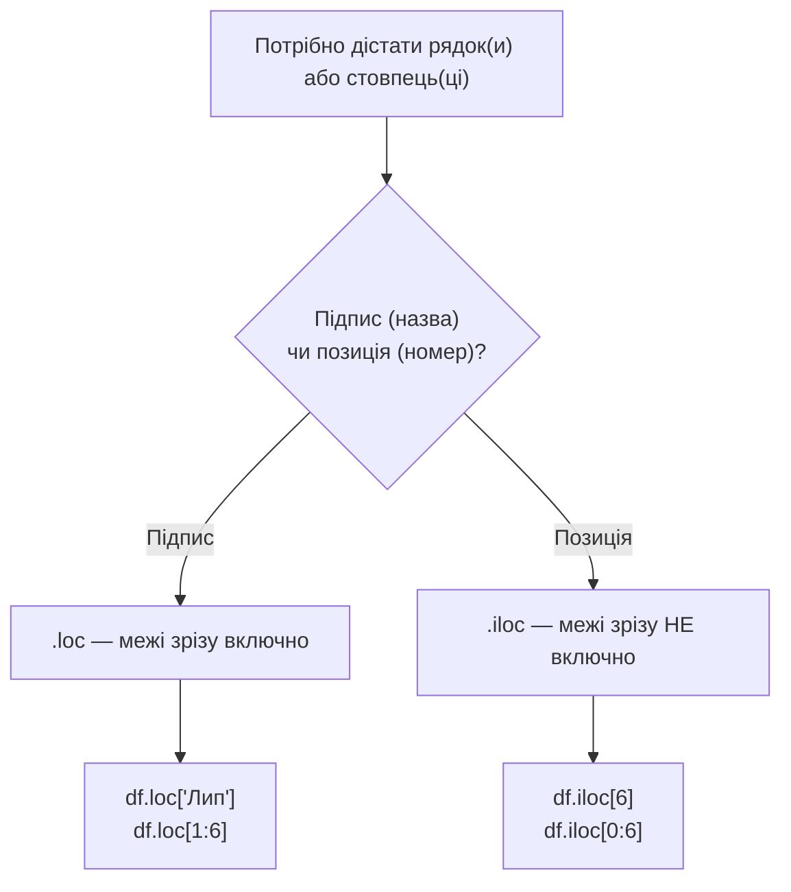

# Лекція 2. pandas: Series, DataFrame, індекс, відбір і обчислювані стовпці

*NumPy дає масиви й векторизовані обчислення, але масив — це просто набір
чисел без імен і підписів. pandas додає над масивом NumPy шар імен: назви
стовпців, підписані рядки, різні типи даних в одній таблиці. Саме pandas
буде основним інструментом роботи з даними до кінця курсу.*

## Навіщо pandas, якщо вже є NumPy

Масив NumPy вимагає, щоб усі елементи мали один тип, і не має вбудованого
способу підписати, що означає кожен рядок чи стовпець. Реальні дані —
майже завжди таблиця зі змішаними типами (текст, числа, дати) і
змістовними підписами:

```python
import numpy as np
import pandas as pd

# NumPy: просто числа, без підписів
temps = np.array([-4, -3, 2, 9, 15, 19, 21, 20, 14, 8, 2, -2])

# pandas: те саме, але з підписами
months = ["Січ","Лют","Бер","Кві","Тра","Чер","Лип","Сер","Вер","Жов","Лис","Гру"]
s = pd.Series(temps, index=months)
```

`pandas.Series` і `pandas.DataFrame` — два основні типи даних pandas, і
саме вони весь курс будуть представляти «дані» на практиці.

## Series — один підписаний стовпець

`Series` — це один стовпець даних плюс **індекс**: підпис для кожного
значення.

```python
s = pd.Series([-4, -3, 2, 9], index=["Січ", "Лют", "Бер", "Кві"])

s["Бер"]     # 2 — доступ за підписом індексу
s.values     # array([-4, -3,  2,  9]) — під капотом це звичайний масив NumPy
s.mean()     # ті самі агрегатні методи, що й у NumPy
```

Якщо індекс не вказати явно, pandas створює його автоматично: числа від
0 (`RangeIndex`) — це той стан, у якому `Series` найбільше схожий на
звичайний масив.

`Series` можна створити і зі словника — тоді ключі стають індексом
автоматично:

```python
s2 = pd.Series({"Січ": -4, "Лют": -3, "Бер": 2})
```

### Арифметика між `Series` вирівнюється за індексом

Це важлива відмінність від NumPy: коли складають два `Series`, pandas
узгоджує значення **за підписом індексу**, а не за позицією:

```python
a = pd.Series([1, 2, 3], index=["x", "y", "z"])
b = pd.Series([10, 20, 30], index=["y", "z", "w"])

a + b
# x     NaN   (є тільки в a)
# y    12.0   (2 + 10 — збіглись за підписом "y")
# z    33.0   (3 + 20 — збіглись за підписом "z")
# w     NaN   (є тільки в b)
```

Значення, підпис яких є лише в одному з двох `Series`, стають `NaN`
(«немає даних»), а не відкидаються і не викликають помилку. Це поведінка
принципово інша, ніж додавання масивів NumPy за позицією, і саме вона
часто пояснює несподівані `NaN` там, де їх не очікували.

## DataFrame — таблиця

`DataFrame` — таблиця: кілька `Series` (стовпців) з однаковим індексом.
Способів побудови кілька:

```python
# зі словника — ключі стають назвами стовпців
df = pd.DataFrame({
    "month": months,
    "avg_temp": temps,
    "days": [31,28,31,30,31,30,31,31,30,31,30,31],
})

# зі списку словників — кожен словник це один рядок
rows = pd.DataFrame([
    {"month": "Січ", "avg_temp": -4},
    {"month": "Лют", "avg_temp": -3},
])

# з CSV-файлу (детально — на наступних заняттях)
# df = pd.read_csv("data.csv")
```

```python
df.head()      # перші 5 рядків
df.shape       # (12, 3) — 12 рядків, 3 стовпці
df.columns     # Index(['month', 'avg_temp', 'days'], dtype='object')
df.dtypes      # тип кожного стовпця окремо
df.info()      # зведена інформація: типи, кількість непорожніх значень
df.describe()  # статистичний підсумок числових стовпців: count, mean, std, min, max…
```

На відміну від масиву NumPy, кожен стовпець `DataFrame` може мати свій
власний тип: текст в одному, ціле число в іншому, дата в третьому — і це
нормальна, очікувана ситуація.

## Індекс

Індекс — це підписи рядків. За замовчуванням це просто номери рядків
(`RangeIndex`), але його можна замінити на змістовний стовпець:

```python
df.set_index("month", inplace=True)
df.loc["Лип"]          # рядок за назвою місяця, а не за номером
df.reset_index(inplace=True)   # повернути звичайну нумерацію, month знову стовпець
```

Індекс — не просто підпис для краси: саме за ним pandas узгоджує дані
під час арифметики між `Series` (як вище) і об'єднання таблиць (тема
наступних занять), і саме через нього працює `.loc`.

## Відбір рядків і стовпців: `.loc` і `.iloc`

pandas свідомо розділяє два способи звернутись до даних:

- **`.loc[рядок, стовпець]`** — за **підписом** (назвою індексу чи
  стовпця);
- **`.iloc[рядок, стовпець]`** — за **позицією** (номером, як у списку
  Python, з нуля).

```python
df = pd.DataFrame({
    "month": months, "avg_temp": temps,
}, index=range(1, 13))     # індекс — номер місяця від 1 до 12

df.loc[7]                   # рядок з індексом (підписом) 7 — липень
df.iloc[6]                   # рядок на позиції 6 (з нуля) — теж липень, бо індекс з 1

df.loc[:, "avg_temp"]        # весь стовпець avg_temp — те саме, що df["avg_temp"]
df.loc[1:3, "avg_temp"]      # avg_temp для рядків із підписом від 1 до 3 включно
df.iloc[0:3, 1]              # avg_temp для перших трьох позицій (0, 1, 2)
```

**Важлива відмінність:** зріз `.loc[1:3]` включає обидва краї (1, 2 і 3),
а зріз `.iloc[0:3]` — ні (0, 1, 2, без 3), як звичний зріз списку
Python. Це одна з найчастіших причин помилок «на одну позицію».

Для одного значення (не рядка й не стовпця, а конкретної клітинки)
швидші аналоги — `.at` (за підписом) і `.iat` (за позицією); вони не
підтримують зрізи, але працюють дещо швидше за `.loc`/`.iloc` для
доступу до одного елемента.

## Фільтрація за умовою (булева індексація)

Той самий принцип булевої індексації з NumPy працює й тут:

```python
warm = df[df["avg_temp"] > 15]                      # тільки теплі місяці
warm_and_short = df[(df["avg_temp"] > 15) & (df["days"] < 31)]
```

Кожна умова в дужках — окремий `Series` з `True`/`False`; кілька умов
об'єднуються через `&` (і) та `|` (або), а не через `and`/`or` Python —
з тієї самої причини, що й у NumPy: `and`/`or` розраховані на одне
булеве значення, а не на цілий стовпець.

Той самий фільтр можна записати через `.query()` — рядком, який часом
читається природніше:

```python
df.query("avg_temp > 15 and days < 31")   # тут "and" — звичний текст запиту, не оператор Python
```

## Обчислювані стовпці

Новий стовпець можна створити векторизованою операцією над уже
існуючими стовпцями — так само, як операції над масивами NumPy:

```python
df["avg_temp_f"] = df["avg_temp"] * 9 / 5 + 32
df["is_warm"] = df["avg_temp"] > 15
df["temp_per_day"] = df["avg_temp"] / df["days"]
```

Той самий результат можна отримати через `.assign()` — він не змінює
таблицю на місці, а повертає нову, що зручно у ланцюжку операцій:

```python
df = df.assign(avg_temp_f=lambda d: d["avg_temp"] * 9 / 5 + 32)
```

Для складніших перетворень, які не записати однією арифметичною
формулою, використовується `.apply()` з власною функцією — повільніший
шлях, бо функція викликається окремо для кожного значення, і його варто
застосовувати лише коли векторизована формула справді неможлива:

```python
def category(t):
    if t < 0: return "морозно"
    elif t < 15: return "прохолодно"
    else: return "тепло"

df["category"] = df["avg_temp"].apply(category)
```

`.apply()` можна викликати й на весь `DataFrame` з `axis=1`, щоб
обробляти рядок цілком (наприклад, коли логіка залежить від кількох
стовпців одночасно):

```python
df["summary"] = df.apply(lambda row: f"{row['month']}: {row['avg_temp']}°C", axis=1)
```

## Типові помилки

**`and`/`or` замість `&`/`|`.** Та ж причина, що й у NumPy: умова —
цілий стовпець `True`/`False`, а не одне значення.

**Плутанина `.loc` і `.iloc`.** `.loc[1:6]` включає межу праворуч,
`.iloc[0:6]` — ні. Якщо індекс числовий і збігається з позиціями (як
`RangeIndex` за замовчуванням), різниця в кількості рядків легко
проходить непоміченою, доки індекс не стане, наприклад, не з нуля.

**Ланцюгове індексування при записі.** Спроба відфільтрувати й одразу
змінити значення одним ланцюжком часто не працює, як очікується, і
pandas попереджає про це `SettingWithCopyWarning`:

```python
df[df["avg_temp"] > 15]["category"] = "тепло"   # SettingWithCopyWarning — може не спрацювати
df.loc[df["avg_temp"] > 15, "category"] = "тепло"   # правильно — один виклик .loc
```

**Порівняння з відсутнім значенням через `==`.** `NaN == NaN` завжди
дає `False` — тому фільтр `df[df["col"] == np.nan]` ніколи нічого не
знайде. Правильно — `df[df["col"].isna()]`.

## Зв'язок із NumPy

Кожен стовпець `DataFrame` усередині — масив NumPy (`df["avg_temp"].values`
поверне саме його), тому все, що працювало для масивів на лекції 1 —
векторизовані операції, булева індексація, агрегати з `axis` —
переноситься сюди майже без змін. pandas додає над цим лише імена,
індекс і зручні методи для роботи з таблицею як цілим.



## Підсумок

- `Series` — підписаний стовпець; `DataFrame` — таблиця з кількох `Series`
  з одним спільним індексом. Арифметика між `Series` вирівнюється саме
  за індексом, а не за позицією.
- **Індекс** — підписи рядків; за ним pandas узгоджує дані.
- **`.loc`** — доступ за підписом (межі зрізу включно), **`.iloc`** —
  доступ за позицією (межі зрізу не включно, як у списках Python);
  `.at`/`.iat` — швидші аналоги для одного значення.
- Фільтрація за умовою — та ж булева індексація, що й у NumPy, з `&`/`|`
  замість `and`/`or`; `.query()` — альтернативний, текстовий спосіб
  записати той самий фільтр.
- Обчислювані стовпці найкраще створювати векторизованою формулою або
  `.assign()`; `.apply()` — запасний варіант для нетривіальної логіки,
  повільніший, бо викликається для кожного значення окремо.
- Найчастіші пастки — плутанина `and`/`or` з `&`/`|`, межі `.loc`/`.iloc`
  та зміна значень через ланцюгове індексування.

**Практика до цієї лекції:** [Практика 2. pandas: побудова DataFrame](../practice/02-pandas.md)
