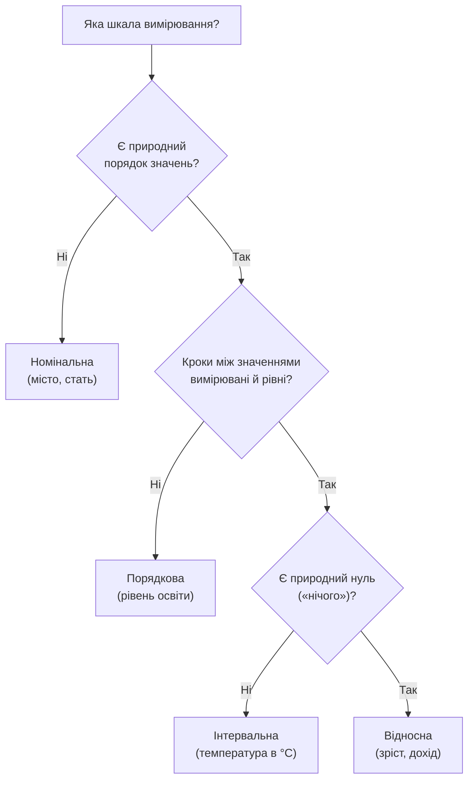

# Лекція 3. Шкали вимірювання і tidy data

*До цього моменту курс мовчазно припускав, що дані вже лежать у зручній
таблиці. Насправді перш ніж рахувати середнє чи будувати графік, потрібно
відповісти на два питання: що за тип має кожна змінна (а отже — які
операції з нею мають сенс) і чи саму таблицю взагалі можна вважати
"даними в правильній формі". Це заняття — про обидва питання.*

## Шкали вимірювання

Не всі числа й категорії "рівні". Психолог Стенлі Стівенс запропонував
чотири шкали вимірювання, і те, до якої шкали належить змінна, визначає,
які статистики й графіки для неї мають сенс — а які дають число, яке
рахується, але нічого не означає.

**Номінальна шкала** — категорії без порядку: місто, стать, група крові,
марка автомобіля. Єдине, що з ними можна робити змістовно — рахувати
частоту й визначати моду (найпоширенішу категорію). Середнє від "Київ,
Львів, Одеса" не має сенсу, навіть якщо закодувати міста числами 1, 2, 3.

**Мода** — значення (чи категорія), яке трапляється в наборі даних
найчастіше. Це єдина "типова" характеристика, яку законно рахувати
для номінальної шкали — вона не потребує ні порядку, ні відстані між
значеннями, лише підрахунку частоти. У наборі може не бути моди
(усі значення різні), може бути одна (унімодальний розподіл), а
може бути й кілька одразу, якщо кілька категорій ділять перше місце
за частотою (мультимодальний розподіл).

**Порядкова шкала** — категорії з порядком, але без вимірюваної відстані
між ними: рівень освіти, оцінка задоволеності "1–5", військове звання.
Можна порівнювати ("вище/нижче") і рахувати медіану чи моду, але кроки
між сусідніми значеннями не обов'язково рівні — різниця між "подобається"
і "дуже подобається" не гарантовано така сама, як між "не подобається" і
"байдуже". Середнє арифметичне тут — спірна практика: на нього часто
йдуть заради простоти (наприклад, середній бал опитування), але варто
усвідомлювати, що це наближення, а не точний розрахунок.

**Медіана** — значення, яке опиняється точно посередині
впорядкованого (відсортованого) ряду: половина спостережень менша
за нього, половина — більша. Для непарної кількості спостережень це
серединне значення напряму; для парної — умовно беруть середнє двох
серединних (хоча для порядкової шкали навіть це "середнє двох" —
уже наближення, бо крок між сусідніми категоріями не гарантовано
однаковий).

**Середнє арифметичне** — сума всіх значень, поділена на їх
кількість; це повноцінна арифметична операція, яка вимагає, щоб
різниці між значеннями щось означали (тобто щонайменше інтервальної
шкали). **Медіана** — суто позиційна характеристика: вона лише
впорядковує значення, нічого не додає й не ділить, тому працює й
там, де саме додавання не має сенсу (порядкова шкала).

Ключова практична різниця — **чутливість до викидів**. Додайте до
групи людей із зарплатами 20, 22, 25, 23 тис. одну людину із
зарплатою 500 тис. — середнє підскочить у кілька разів і вже не
описуватиме "типову" людину з групи, а медіана майже не зрушить: їй
байдуже, наскільки далеко відхилилось одне екстремальне значення,
важливо лише, що воно за порядком лишається останнім.

**Інтервальна шкала** — рівні інтервали між значеннями, але без
природного нуля: температура в °C, рік за календарем. Різниці мають
сенс (20°C − 10°C = 10°C, і це та сама різниця, що й 30°C − 20°C), але
відношення — ні: сказати, що 20°C "удвічі тепліше" за 10°C, некоректно,
бо нуль шкали Цельсія не означає "відсутність тепла".

**Відношення** ("удвічі більше", "утричі менше") має сенс лише
тоді, коли нуль шкали означає **справжню відсутність величини** —
тоді саме число показує, скільки одиниць величини є. У шкалі
Цельсія 0°C — довільна точка (замерзання води), а не "відсутність
тепла" (справжній нуль тепла — це –273.15°C, абсолютний нуль за
Кельвіном). Тому 20°C не "удвічі тепліше" за 10°C — щоб відношення
було коректним, нуль має бути природним орієнтиром, а не умовним,
як у шкалі відношень нижче (зріст, вага, дохід).

**Шкала відношень** — рівні інтервали й природний нуль, що означає
справжню відсутність величини: зріст, вага, вік, дохід, температура в
Кельвінах. Тут коректні всі операції, включно з відношеннями: людина
масою 80 кг важча за людину масою 40 кг рівно вдвічі.



**Чому це важливо не тільки в теорії.** У Лекції 5 (частотний розподіл) і
Лекції 6 (міри розсіювання й форма розподілу) вибір статистики й графіка
залежить саме від цієї класифікації: гістограма й середнє мають сенс для
шкали відношень, а для номінальної змінної коректний інструмент —
таблиця частот і стовпчикова діаграма. Побудувати "середнє місто" —
технічно можливо (pandas не заважає), але це помилка розуміння даних, а
не помилка коду.

## Кількісні й якісні змінні

Паралельно до шкал вимірювання є простіший, грубіший поділ, яким часто
користуються на практиці:

- **Якісні (категоріальні)** змінні — відповідають номінальній чи
  порядковій шкалі: місто, стать, рівень освіти.
- **Кількісні (числові)** змінні — відповідають інтервальній чи шкалі
  відношень, і додатково діляться на:
    - **дискретні** — лише окремі значення, зазвичай цілі числа, які
      можна перелічити: кількість дітей у сім'ї, кількість покупок за
      місяць;
    - **неперервні** — можуть набувати будь-якого значення в діапазоні:
      зріст, час, температура.

Це розрізнення напряму впливає на вибір графіка: для дискретної змінної
з невеликою кількістю значень підійде стовпчикова діаграма частот, для
неперервної — гістограма з розбиттям на інтервали (детальніше в Лекції
5).

## Джерела й формати даних

Дані для аналізу рідко з'являються вже у вигляді зручного `DataFrame`.
Найчастіші джерела:

- **Файли** — CSV, Excel, JSON, текстові файли з фіксованою шириною
  стовпців;
- **Бази даних** — реляційні (SQL: PostgreSQL, MySQL, SQLite) або
  документо-орієнтовані (MongoDB);
- **API та веб** — дані, які повертає сервер у відповідь на запит,
  найчастіше у форматі JSON.

pandas уміє читати й записувати всі поширені формати практично
однаковим за структурою викликом:

```python
df_csv = pd.read_csv("data.csv")
df_excel = pd.read_excel("data.xlsx", sheet_name="Sheet1")
df_json = pd.read_json("data.json")

df.to_csv("result.csv", index=False)
df.to_excel("result.xlsx", index=False)
```

Кожен формат має свої особливості: CSV не зберігає типи даних (усе — це
текст, доки pandas не спробує вгадати тип), Excel може містити кілька
листів і форматування, яке не має аналога в таблиці, а JSON природно
описує вкладені структури (список списків, словник у клітинці), які
довелося б "розплющувати" для табличного вигляду. Детальна робота з
читанням і записом — на Практиці 3.

## Структура табличного набору: принцип tidy data

Мати таблицю — не те саме, що мати дані в зручній для аналізу формі.
Дослідник Хедлі Вікхем сформулював принцип **tidy data** трьома
правилами:

1. кожна **змінна** — окремий стовпець;
2. кожне **спостереження** — окремий рядок;
3. кожен тип спостережень — окрема таблиця.

Різниця між "просто таблицею" і tidy-таблицею найкраще видно на
прикладі. Ось той самий факт — середня температура по містах за роки —
у двох формах:

**Неохайна (wide) форма** — роки розтягнуті в стовпці:

| Місто | 2022 | 2023 | 2024 |
|---|---|---|---|
| Київ | 11.2 | 11.6 | 11.9 |
| Львів | 9.8 | 10.1 | 10.3 |

**Tidy (long) форма** — рік став значенням, а не назвою стовпця:

| Місто | Рік | Температура |
|---|---|---|
| Київ | 2022 | 11.2 |
| Київ | 2023 | 11.6 |
| Київ | 2024 | 11.9 |
| Львів | 2022 | 9.8 |
| Львів | 2023 | 10.1 |
| Львів | 2024 | 10.3 |

Wide-таблиця зручна для читання людиною, але не для pandas: "рік" тут —
не значення однієї змінної, а частина назви трьох різних стовпців. Якщо
запитати "яка середня температура за роками", у wide-формі відповідь
вимагає окремо обробити кожен із трьох стовпців; у tidy-формі —
звичайний `groupby("Рік")`.

Перехід між формами робить одна пара методів:

```python
long_df = wide_df.melt(id_vars="Місто", var_name="Рік", value_name="Температура")
wide_df_back = long_df.pivot(index="Місто", columns="Рік", values="Температура")
```

`melt` "розплющує" стовпці назад у значення (wide → long, tidy), `pivot`
робить обернену операцію (long → wide, зручно для звіту чи презентації,
але вже не tidy). Детальна практика з обома напрямками — на Практиці 3.

**Чому це не просто питання смаку.** Практично всі інструменти аналізу
й візуалізації — `groupby`, `pivot_table`, Matplotlib/Seaborn — очікують
дані саме в tidy-формі: кожна функція, яка "групує за стовпцем" чи
"малює по осі X одну змінну", працює правильно тільки тоді, коли ця
змінна дійсно є одним стовпцем, а не розсіяна по назвах кількох
стовпців. Це стане особливо наочним у Лекції 8 (групування і зведені
таблиці), де `groupby` і `pivot_table` — фактично зворотні операції до
`melt`/`pivot` цієї лекції.

## Типові помилки

**Середнє для номінальної чи порядкової змінної.** Технічно
`df["місто"].mean()` не спрацює (pandas не вміє усереднити текст), але
закодувавши категорії числами (1 = Київ, 2 = Львів), легко забути, що
середнє "1.5" не означає нічого реального.

**Wide-формат, який "виглядає як таблиця", але не tidy.** Роки, місяці
чи інші категорії, розтягнуті в назви стовпців — найчастіша причина,
чому `groupby` "не працює як очікувалось": групувати нема за чим, бо
потрібна змінна закодована в назвах стовпців, а не в їх значеннях.

**Кілька змінних в одному стовпці.** Наприклад, стовпець `"вік_стать"` зі
значеннями `"25_Ж"` — це насправді дві змінні, склеєні в одну; перш ніж
аналізувати, їх потрібно розділити (`str.split`).

**Одна змінна, розбита на кілька стовпців.** Обернена ситуація: окремі
стовпці `"温度_січ"`, `"температура_лют"` замість одного стовпця
"температура" й окремого стовпця "місяць" — той самий випадок, що й
wide-таблиця вище.

## Підсумок

- Чотири шкали вимірювання (номінальна, порядкова, інтервальна,
  відносна) визначають, які статистики й графіки коректні для змінної —
  це фундамент для решти описової статистики курсу.
- Якісні змінні відповідають номінальній/порядковій шкалі; кількісні —
  інтервальній/відносній і додатково діляться на дискретні й неперервні.
- Дані приходять із файлів, баз даних чи API у форматах CSV, Excel,
  JSON, SQL — pandas читає й записує їх однотипними викликами
  `pd.read_*`/`df.to_*`.
- **Tidy data** — коли кожна змінна є стовпцем, а кожне спостереження —
  рядком; `melt` переводить wide у tidy, `pivot` — назад.
- Найчастіша практична помилка — таблиця, яка виглядає впорядкованою,
  але не є tidy, через що стандартні інструменти аналізу дають
  неочікуваний результат.

**Практика до цієї лекції:** [Практика 3. Приведення до tidy data](../practice/03-tidy-data.md)
