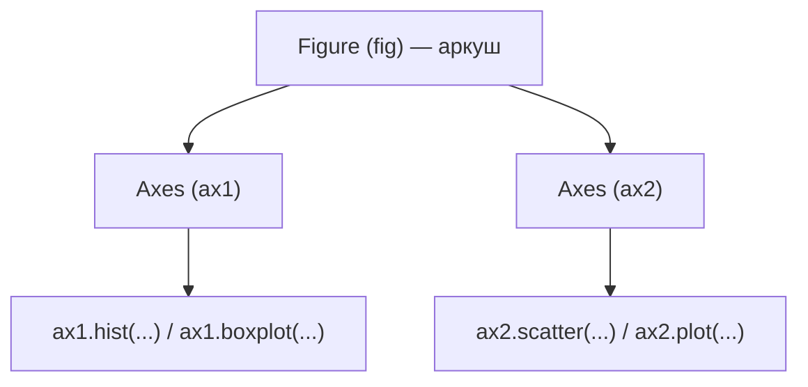

# Лекція 6. Міри розсіювання і форма розподілу

*Середнє чи медіана відповідають на питання "де приблизно центр даних?",
але саме по собі це неповна відповідь. Дві вибірки можуть мати однакове
середнє й геть різний характер: в одній усі значення тісняться навколо
центру, в іншій розкидані на весь діапазон. Міри розсіювання — розмах,
дисперсія, стандартне відхилення, міжквартильний розмах — вимірюють саме
цю різницю. А форма розподілу підказує, якій із мір положення й
розсіювання варто довіряти в конкретному наборі даних.*

## Чому однієї міри положення недостатньо

Розгляньмо дві групи студентів із однаковим середнім балом за тест — 70:

```python
group_a = [68, 69, 70, 71, 72]
group_b = [40, 55, 70, 85, 100]
```

Середнє в обох групах дорівнює рівно 70, але групи описують геть різну
реальність: у групі A всі результати практично однакові, у групі B —
розкидані від "провалив" до "максимум". Якщо звіт про тест повідомить
лише середнє, ця відмінність зникне повністю. Міри розсіювання існують
саме для того, щоб зробити цю різницю видимою й вимірюваною.

## Розмах, дисперсія і стандартне відхилення

**Розмах (range)** — найпростіша міра: різниця між максимумом і
мінімумом.

```python
group_b_range = max(group_b) - min(group_b)   # 100 - 40 = 60
```

Розмах обчислюється миттєво, але залежить лише від двох крайніх значень
— одне випадкове екстремальне спостереження здатне повністю визначити
результат, тому розмах ненадійний як єдина міра для звіту.

**Дисперсія (variance)** враховує всі значення одразу: це середній
квадрат відхилення кожного значення від середнього.

```python
import numpy as np
import pandas as pd

scores = np.array([60, 62, 58, 65, 90])
mean = scores.mean()                 # 67.0
deviations = scores - mean           # [-7, -5, -9, -2, 23]
squared = deviations ** 2            # [49, 25, 81, 4, 529]
squared.sum()                        # 688
```

Чому саме квадрат відхилення, а не, наприклад, сам модуль відхилення?
Сума відхилень від середнього завжди дорівнює нулю (додатні й від'ємні
відхилення скасовують одне одного) — щоб отримати змістовне число,
знаки потрібно прибрати. Піднесення до квадрата робить це і водночас
надає більшої "ваги" великим відхиленням: значення, що відхиляється в
5 разів сильніше за інше, впливає на суму в 25 разів сильніше. Це і є
причина, чому дисперсія (а отже й стандартне відхилення) чутлива до
викидів набагато сильніше, ніж медіана чи IQR, про які йдеться нижче.

Далі суму квадратів відхилень треба поділити на кількість спостережень
— і тут з'являється деталь, яку легко пропустити:

```python
scores.var()                 # ddof=0 у NumPy за замовчуванням -> 137.6
pd.Series(scores).var()      # ddof=1 у pandas за замовчуванням -> 172.0
```

`ddof` (delta degrees of freedom) визначає, на що ділити суму квадратів
відхилень: на `n` (`ddof=0`, "генеральна" дисперсія — якщо у вас справді
**всі** дані, які цікавлять) чи на `n - 1` (`ddof=1`, "вибіркова"
дисперсія — якщо ваші дані лише вибірка з більшої генеральної
сукупності). Ділення на `n - 1` — поправка Бесселя: дисперсія, обчислена
відносно вибіркового середнього (яке саме підлаштувалось під ці дані),
у середньому недооцінює справжню дисперсію генеральної сукупності;
ділення на менше число цю недооцінку компенсує. У курсі майже завжди
працюєте з вибіркою (даними обстеження, а не всією генеральною
сукупністю), тому типово доречний саме `ddof=1` — стандарт pandas за
замовчуванням. Ця різниця стане принциповою знову в Лекції 14, коли
йтиметься про порівняння дисперсій двох груп формальним критерієм.

**Стандартне відхилення (std)** — корінь із дисперсії:

```python
scores.std(ddof=1)   # 13.11
```

Дисперсія має одиниці вимірювання, піднесені в квадрат (якщо вихідні
дані в гривнях, дисперсія — у "гривнях у квадраті", що незручно
інтерпретувати); корінь повертає результат в одиницях самих вихідних
даних, тому саме std, а не var, зазвичай наводять у звітах і саме std
показують на графіках поруч із середнім.

**Заповнення пропуску середнім і те, як воно спотворює std.** У
Лекції 4 було сказано, що заповнення пропуску середнім штучно зменшує
розкид даних. Тепер можна побачити механіку цього ефекту на числах.
Нехай реальні виміри такі:

```python
temp = np.array([18, 20, 19, 22, 21])
temp.mean()          # 20.0
temp.var(ddof=1)      # 2.5   (сума квадратів відхилень = 10, поділена на n-1=4)
```

Припустімо, що насправді був ще один вимір, але він пропущений, і за
рецептом із Лекції 4 його заповнили середнім (20.0):

```python
temp_filled = np.array([18, 20, 19, 22, 21, 20])
temp_filled.mean()        # 20.0  -- середнє не змінилось
temp_filled.var(ddof=1)   # 2.0   (сума квадратів відхилень лишилась 10, але поділена на n-1=5)
```

Механіка тут точна: додане значення дорівнює середньому, тож його
власне відхилення — рівно нуль, і сума квадратів відхилень **не
зростає взагалі** (лишається 10). А знаменник (`n - 1`) зростає з 4 до
5, бо спостережень стало більше. Ділення того самого числівника на
більший знаменник неминуче дає менший результат — дисперсія (а за нею
й std) падає, хоча жодного реального нового спостереження, яке
підтверджувало б менший розкид, у даних немає. Це не побічний ефект
конкретного набору даних, а неминучий наслідок того, що заповнене
значення завжди має нульове відхилення від середнього.

## Міжквартильний розмах (IQR)

Міжквартильний розмах — це вже знайомий з Лекції 4 інструмент, тільки
тепер у ролі міри розсіювання, а не критерію виявлення викидів:

```python
q1, q3 = pd.Series(scores).quantile([0.25, 0.75])
iqr = q3 - q1
```

IQR — це ширина "середніх 50%" вибірки (від 25-го до 75-го перцентиля).
На відміну від std, він ігнорує 25% найменших і 25% найбільших значень
повністю, тому одне екстремальне значення майже не змінює результат —
саме ця стійкість і робить IQR придатним критерієм для пошуку викидів
у Лекції 4: якщо сам розмах, за яким шукають викиди, було б легко
зіпсувати самим викидом, критерій втратив би сенс.

## Коефіцієнт варіації

Std має одиниці вихідних даних, і це створює проблему при порівнянні
розкиду величин **різного масштабу**. Порівняймо:

```python
income_std = 4000     # std місячного доходу, грн; середнє 25000
temp_std = 4           # std середньомісячної температури, °C; середнє 18
```

Сказати "доход розкидається сильніше, бо 4000 > 4" — некоректно: це
порівняння різних одиниць вимірювання, як порівнювати кілограми з
кілометрами. **Коефіцієнт варіації** — std, поділене на середнє (часто
у відсотках) — прибирає одиниці вимірювання і робить розкид
порівнюваним:

```python
income_cv = 4000 / 25000 * 100   # 16.0%
temp_cv = 4 / 18 * 100            # 22.2%
```

Відносно свого власного масштабу температура насправді варіює
сильніше за доход, хоча її абсолютний std у сотні разів менший.
Застереження: коефіцієнт варіації стає ненадійним, коли середнє близьке
до нуля (для величини, що може набувати від'ємних значень, наприклад
температури за Цельсієм у холодну пору року, середнє за рік може
опинитись поблизу нуля, і тоді CV різко "вибухає" або втрачає сенс) —
застосовувати CV варто лише для величин зі стабільно додатним і
достатньо далеким від нуля середнім.

## Форма розподілу: симетрія і модальність

Дві вибірки можуть мати однакове середнє і навіть однаковий std, але
геть різну форму розподілу значень.

**Симетричний проти скошеного.** У симетричному розподілі значення
розташовані більш-менш однаково зліва і справа від центру (типовий
приклад — зріст людей). У **скошеному** розподілі є довгий "хвіст" в
один бік: скошеність вправо (right-skewed) — коли є небагато дуже
великих значень (типово для доходів: більшість заробляє в межах
подібного діапазону, але є невелика частка з набагато вищим доходом,
яка "тягне" хвіст розподілу вправо); скошеність вліво — дзеркальна
ситуація (наприклад, оцінки на простому тесті, де більшість здають
добре, а невелика частка отримує дуже низький бал).

**Унімодальний проти мультимодального.** Унімодальний розподіл має один
чіткий "пік" — найтиповіше значення. Мультимодальний має два або більше
піки, і це майже завжди сигнал, що вибірка змішує кілька різних груп
об'єктів:

```python
salaries = [18000, 19000, 18500, 19500, 20000,
            42000, 45000, 44000, 46000, 43000]

pd.Series(salaries).mean()   # 31500.0
```

Це зарплати молодших і старших спеціалістів, об'єднані в один список.
Середнє (31500) не потрапляє в жодну з двох реальних груп — воно описує
значення, якого фактично не існує в жодного працівника. Гістограма цих
даних показала б два окремих піки приблизно біля 19000 і 44000, а не
один пік біля 31500, і саме гістограма (Лекція 5) — перший інструмент,
що виявляє мультимодальність, яку легко пропустити, дивлячись лише на
середнє й std.

**Чому форма визначає, яка міра репрезентативніша.** Для симетричного
унімодального розподілу без сильних викидів середнє й std добре
описують дані. Для сильно скошеного розподілу середнє зсувається в бік
хвоста (кілька дуже великих значень тягнуть його вгору сильніше, ніж
типове значення), а std роздувається тими самими значеннями (нагадаємо
— через квадрат відхилення). Медіана й IQR ігнорують крайні 25% з
кожного боку і тому набагато стійкіші до скошеності — саме тому для
доходів, цін на нерухомість чи будь-яких величин з "довгим хвостом"
зазвичай наводять медіану, а не середнє.

## Matplotlib: Figure і Axes

### Що таке Matplotlib і де її використовують

Matplotlib — базова бібліотека Python для побудови графіків, яку 2003
року створив Джон Гантер: тоді — нейробіолог, якому потрібен був
інструмент на кшталт MATLAB для аналізу сигналів мозку в Python, звідси
й назва — "MATLAB-подібна бібліотека". Попри вік і появу пізніших,
"красивіших з коробки" бібліотек (seaborn, plotly), Matplotlib і досі
лежить в основі більшості з них: і seaborn, і навіть вбудований
`DataFrame.plot()` самого pandas будуються прямо над Matplotlib, а не
замінюють її, тож розуміння Figure й Axes нижче знадобиться навіть
тим, хто пізніше користуватиметься зручнішими надбудовами над нею.

Застосовується для будь-якої візуалізації числових даних: дослідницький
аналіз (швидко подивитись на форму розподілу чи зв'язок змінних, як у
цій лекції та Лекції 16), графіки до наукових статей і звітів
(стандарт де-факто в наукових публікаціях на Python), інженерні та
наукові вимірювання (графіки сигналів, показів приладів), фінансові
графіки цін і показників.

Matplotlib будує будь-який графік через дворівневу архітектуру:
**Figure** — це весь "аркуш" чи вікно, а **Axes** — конкретна область
координат усередині нього, на якій власне малюються дані.

```python
import matplotlib.pyplot as plt

fig, ax = plt.subplots()
```

Це не "ще один спосіб намалювати графік" замість `plt.plot(...)`
напряму — це свідомий вибір архітектури, яка одразу масштабується на
складніші випадки. Один `Figure` може містити кілька `Axes` одразу
(сітку графіків), і кожен `Axes` — незалежна область зі своїми осями,
підписами й даними:



Коли `plt.plot()` викликається напряму, без явного `fig, ax`,
Matplotlib непомітно створює обидва об'єкти "за кадром" — це зручно для
однієї швидкої команди в консолі, але як тільки потрібно два графіки
поруч (наприклад, гістограма і boxplot тієї самої змінної для
порівняння форми й розкиду одночасно) — без явного `ax` для кожної
області це стає незручним. У Лекції 7 сітка `fig, axes =
plt.subplots(1, 2)` — саме такий випадок кількох `Axes` в одній
`Figure`.

**Основні методи `Axes` для одновимірних і двовимірних даних:**

```python
hours = [1, 2, 2, 3, 4, 4, 5, 6, 7, 8]              # години підготовки
test_scores = [52, 58, 61, 65, 70, 74, 78, 82, 88, 91]  # бал за тест

fig, ax = plt.subplots()
ax.scatter(hours, test_scores)         # діаграма розсіювання -- зв'язок двох змінних
ax.set_xlabel("Години підготовки")
ax.set_ylabel("Бал за тест (з 100)")
ax.set_title("Результат тесту залежно від часу підготовки")
```

- `ax.plot()` — лінія (типово для послідовних даних, наприклад
  часового ряду);
- `ax.hist()` — гістограма частот однієї змінної (детальніше — Лекція 5);
- `ax.boxplot()` — "ящик з вусами", про який нижче;
- `ax.scatter()` — діаграма розсіювання для пари змінних, як у прикладі
  вище.

**Підписи осей і заголовок — не декоративна деталь.** `ax.set_xlabel()`,
`ax.set_ylabel()` і `ax.set_title()` перетворюють графік із набору
абстрактних точок на самодостатнє повідомлення. Графік без підписів
осей і одиниць вимірювання практично марний поза контекстом коду, що
його побудував: число "70" на осі може означати бал з 100, гривні,
відсотки чи що завгодно — без підпису читач звіту змушений вгадувати
або питати автора, а це саме та інформація, яку графік мав донести без
додаткових запитань.

## Boxplot: як читати

Boxplot (діаграма "ящик з вусами") — це графічне зображення тих самих
величин, що вже обговорювались вище: медіани та IQR.

```python
wait_times = [12, 14, 13, 15, 11, 14, 13, 60, 12, 15]

fig, ax = plt.subplots()
ax.boxplot(wait_times)
ax.set_ylabel("Час очікування, хв")
ax.set_title("Час очікування відповіді підтримки")
```

Елементи графіка мають точну відповідність числовим мірам:

- **лінія всередині ящика** — медіана;
- **межі самого ящика** — Q1 (нижня) і Q3 (верхня), тобто висота ящика
  дорівнює саме IQR;
- **"вуса"** — відрізки, що тягнуться від ящика до найдальшого
  значення, яке ще не вважається викидом за критерієм із Лекції 4:
  межа `Q1 - 1.5 * IQR` знизу і `Q3 + 1.5 * IQR` зверху;
- **окремі точки за межами вусів** — значення поза цими межами, тобто
  ті самі викиди, які Лекція 4 виявляла формулою; boxplot просто малює
  цей самий критерій наочно, без ручного обчислення `lower`/`upper`.

У прикладі вище значення `60` (аномально довге очікування серед
значень навколо 11–15 хв) на графіку буде показане окремою точкою за
верхнім вусом — так виглядає той-таки IQR-критерій із Лекції 4, лише
намальований, а не обчислений формулою.

## Типові помилки

**Порівняння std величин у різних одиницях або масштабах без
нормування.** "У групи A std більший, тому вона розкидана сильніше" —
некоректний висновок, якщо групи вимірюються в різних одиницях або
мають дуже різні середні; для такого порівняння потрібен коефіцієнт
варіації, а не сирий std.

**Графік без підписів осей і одиниць вимірювання.** Числа на осях без
підпису, що саме вони означають (гривні? відсотки? кількість?), роблять
графік непридатним для звіту — його неможливо інтерпретувати без
доступу до коду, який його побудував.

**Boxplot із замало точок.** На вибірці з 3–5 спостережень boxplot
намалює ідеально рівний ящик і виглядатиме так, ніби розкид дуже
акуратний і викидів немає — але це просто наслідок того, що для такої
малої кількості точок формальний критерій IQR майже нічого не встигає
позначити як викид. Візуальна "чистота" такого графіка — артефакт
малого обсягу даних, а не властивість самих даних.

## Підсумок

- Розмах, дисперсія, стандартне відхилення та IQR вимірюють розкид
  даних із різних боків: розмах найпростіший, але вразливий до
  екстремальних значень; дисперсія і std враховують кожне значення, але
  через квадрат відхилення чутливі до викидів; IQR ігнорує крайні 25% з
  кожного боку і тому стійкий до них.
- Заповнення пропуску середнім (Лекція 4) механічно зменшує std: додане
  значення має нульове відхилення від середнього, тож сума квадратів
  відхилень не зростає, а знаменник (`n` чи `n - 1`) зростає — результат
  неминуче падає.
- Коефіцієнт варіації (`std / mean`) дозволяє порівнювати розкид величин
  різного масштабу чи в різних одиницях, але втрачає сенс, коли середнє
  близьке до нуля.
- Форма розподілу (симетрична/скошена, унімодальна/мультимодальна)
  визначає, якій мірі положення й розсіювання довіряти: для скошеного чи
  мультимодального розподілу медіана й IQR зазвичай репрезентативніші за
  середнє й std.
- Архітектура Matplotlib (`Figure` містить один або кілька `Axes`) — не
  стилістична деталь, а основа, що дозволяє будувати сітки графіків;
  `ax.plot()`, `ax.hist()`, `ax.boxplot()`, `ax.scatter()` — базові
  методи для одно- й двовимірних даних, а підписи осей і заголовок
  роблять графік самодостатнім поза контекстом коду.
- Boxplot — це наочне зображення медіани, IQR і меж викидів за тим самим
  критерієм `1.5 * IQR`, що вже застосовувався в Лекції 4.

**Практика до цієї лекції:** [Практика 6. Описова статистика: міри положення і розсіювання, describe, порівняння груп](../practice/06-descriptive-stats.md)
