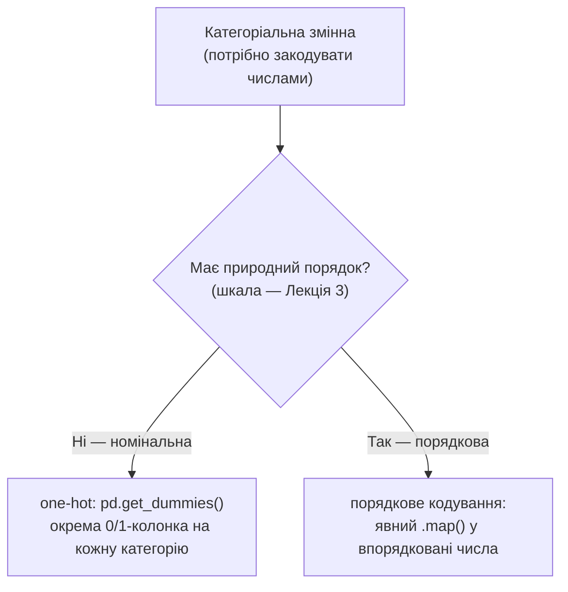

# Лекція 8. Похідні змінні: дискретизація, масштабування, кодування категорій

*До цього моменту стовпці `DataFrame` здебільшого приходили готовими — узяті
з файлу, API чи побудовані напряму з вимірювань. Але аналіз, а особливо
математичні моделі, з якими курс працюватиме в модулі 3 (регресія,
класифікація), майже завжди дають кращий результат не на "сирих" стовпцях, а
на змінних, свідомо побудованих із них: об'єднаних у показник із більшим
сенсом, розбитих на групи, приведених до спільного масштабу чи перекодованих
у формат, який метод здатний коректно обробити. Це заняття — про чотири такі
систематичні перетворення.*

## Похідні змінні: чому не просто "ще один стовпець"

**Похідна (обчислювана) змінна** — нова змінна, побудована формулою з уже
наявних стовпців. Механіка тут не нова — це той самий обчислювальний
стовпець із Лекції 2 (`df["новий"] = ...` векторизованою формулою або
`.assign()`). Класичний приклад — індекс маси тіла з зросту й ваги:

```python
df["ІМТ"] = df["вага_кг"] / (df["зріст_см"] / 100) ** 2
```

або вікова група з дати народження:

```python
df["вік"] = (pd.Timestamp("2026-01-01") - df["дата_народження"]).dt.days // 365
```

Питання цієї лекції не "як обчислити стовпець" (це вже відомо), а **навіщо
робити це систематично, а не залишати вихідні складники окремо**. Похідна
змінна часто несе змістовно більше сенсу для аналізу чи моделі, ніж кожен її
складник сам по собі. Людина вагою 90 кг може бути або огрядною, або просто
дуже високою — саме *вага з урахуванням зросту* (тобто ІМТ) розрізняє ці два
випадки, тоді як окремо взяті "вага" чи "зріст" такого розрізнення не дають.
Так само частка доходу, витрачена на певну категорію товарів, — значуща
метрика сама по собі, тоді як "дохід" і "сума витрат" окремо лише натякають
на неї, вимагаючи від читача самому порахувати відношення в голові.

Це не суто теоретичне зауваження: у модулі 3, коли курс дійде до множинної
регресії (Лекція 17) і класифікації математичних моделей (Лекція 18),
свідоме конструювання таких змінних-предикторів (у машинному навчанні це
називають *feature engineering*) — стандартний і часто вирішальний крок
перед побудовою моделі, а не необов'язкове прикрашання набору даних.

## Дискретизація: `pd.cut()` проти `pd.qcut()`

**Дискретизація** — перетворення числової змінної в категоріальну через
розбиття діапазону значень на інтервали ("біни"). Навіщо: іноді для аналізу
потрібні саме групи, а не точні числа — наприклад, щоб порівняти витрати
"молодих" і "старших" клієнтів через `groupby` (Лекція 7) чи `crosstab`,
замість того, щоб працювати з кожним віком окремо.

pandas дає два методи, які на перший погляд роблять те саме, але за різним
принципом.

**`pd.cut()`** ділить весь діапазон значень на інтервали **однакової
довжини**:

```python
ages = pd.Series([22, 25, 27, 29, 31, 34, 36, 40, 62, 65])

pd.cut(ages, bins=3).value_counts().sort_index()
# (21.957, 36.333]    7
# (36.333, 50.667]    1
# (50.667, 65.0]      2
```

Три інтервали тут однакової ширини (≈14.3 роки кожен), але кількість
спостережень у них дуже нерівна: майже всі значення скупчені в наймолодшому
інтервалі, середній — майже порожній. Це не помилка коду, а прямий наслідок
того, що вихідний розподіл скошений (більшість значень малі, кілька —
набагато більші).

**`pd.qcut()`** розв'язує саме цю проблему навпаки — ділить дані так, щоб у
кожному інтервалі опинилась **однакова кількість спостережень** (межі
визначаються квантилями):

```python
pd.qcut(ages, q=3).value_counts().sort_index()
# (21.999, 29.0]    4
# (29.0, 36.0]      3
# (36.0, 65.0]      3
```

Тепер групи майже рівні за розміром (3–4 спостереження кожна), але межі
інтервалів нерівної довжини: останній інтервал розтягнутий від 36 до 65
років, щоб "забрати" достатньо спостережень для рівного розміру групи.

**Явний "чому" і коли який обирати.** `cut` дає інтервали, зручні для
**інтерпретації** — межі можна встановити самому й прив'язати до
змістовних, "круглих" порогів (`bins=[0, 18, 35, 60, 100]`, з підписами
через `labels=`), але якщо розподіл скошений, частина груп ризикує
опинитися практично порожньою, втрачаючи здатність щось розрізняти.
`qcut` гарантує змістовно порівнянні за розміром групи (корисно, коли
потрібно, наприклад, розбити клієнтів на "нижню", "середню" і "верхню"
третину за витратами для порівняння їхньої поведінки), але межі виходять
довільними десятковими числами, які важче пояснити змістовно ("клієнт із
доходом 14 382,5 грн" як межа групи не має природного сенсу).

```python
pd.cut(ages, bins=[0, 18, 35, 60, 100],
       labels=["дитина", "молодий", "середній", "старший"])
```

## Масштабування: нормалізація проти стандартизації

Коли кілька змінних різного масштабу використовуються разом (наприклад,
дохід клієнта в гривнях, що вимірюється тисячами, і вік у роках, що
вимірюється десятками), методи, **чутливі до масштабу**, "бачать" відмінності
саме в абсолютних числах: зміна доходу на 100 гривень і зміна віку на 100
років для такого методу формально однакового розміру, хоча змістовно друге
взагалі неможливе. У результаті змінна з більшими абсолютними значеннями
непропорційно домінує в розрахунку, хоча жодна зі змінних не важливіша за
іншу апріорі. Це стане прямо релевантним пізніше в курсі: дистанційні методи
(які рахують "відстань" між спостереженнями) і регресія з регуляризацією
(модуль 3, Лекції 17–18) обидва чутливі до масштабу вхідних змінних саме
таким чином.

**Нормалізація (min-max)** переводить змінну в фіксований діапазон
`[0, 1]`:

```python
df["дохід_norm"] = (df["дохід"] - df["дохід"].min()) / (df["дохід"].max() - df["дохід"].min())
```

Найменше значення стає 0, найбільше — 1, решта — пропорційно між ними.
Зручно, коли потрібен саме обмежений діапазон, але один-єдиний екстремальний
викид (Лекція 4) стискає всі інші значення в вузьку смужку біля 0 чи 1,
спотворюючи відносні відмінності між "звичайними" спостереженнями.

**Стандартизація (z-оцінка)** переводить змінну так, щоб середнє стало 0, а
стандартне відхилення — 1:

```python
df["дохід_z"] = (df["дохід"] - df["дохід"].mean()) / df["дохід"].std()
```

Результат — не обмежений жорстким діапазоном (значення можуть бути й від'ємні,
і більші за 1 за модулем), але кожне число одразу читається як "на скільки
стандартних відхилень значення відхиляється від середнього" — шкала, спільна
для будь-якої змінної незалежно від її вихідних одиниць. Обидва способи
однаково чутливі до того, що середнє й розкид самі рахуються з тих-таки
даних, тож екстремальний викид впливає і тут (та ж логіка чутливості
середнього до викидів, що й у Лекції 5), лише дещо м'якше, ніж на min-max.

## Кодування категорій: індикаторне проти порядкового

Більшість методів аналізу й майбутнього моделювання працює лише з числами,
тож категоріальну змінну (Лекція 3) потрібно перетворити в числовий вигляд.
Спосіб перетворення залежить від того, до якої шкали належить змінна — і
тут помилка коштує змістовно дорого.

**Індикаторне (one-hot) кодування** — для **номінальних** змінних (без
порядку: місто, стать, категорія товару). Кожна категорія отримує власний
бінарний стовпець ("належить" / "не належить"):

```python
pd.get_dummies(df["місто"], prefix="місто")
#    місто_Київ  місто_Львів  місто_Одеса
# 0           1            0            0
# 1           0            1            0
# 2           0            0            1
```

**Порядкове кодування** — для **порядкових** змінних (з порядком, але без
рівних відстаней між сходинками: рівень освіти, оцінка задоволеності).
Явний мапінг категорій у впорядковані числа:

```python
df["рівень_задоволеності_код"] = df["рівень_задоволеності"].map(
    {"низький": 1, "середній": 2, "високий": 3}
)
```

**Чому саме так, а не навпаки — пряме продовження Лекції 3.** Порядкове
кодування номінальної змінної хибно вносить порядок і відстань, яких у
даних немає. Закодувавши "Київ" → 1, "Львів" → 2, "Одеса" → 3, отримуємо
число, яке будь-який метод, що працює з числами буквально (регресія,
відстань між точками), сприйме як реальний порядок і реальний крок: "Одеса
віддалена від Києва вдвічі більше, ніж Львів" — твердження, яке не має
жодного змісту для назви міста. Це той самий принцип, що в Лекції 3
пояснював, чому середнє від "Київ, Львів, Одеса" не рахується навіть після
кодування числами 1, 2, 3 — тут та сама помилка виникає не в підрахунку
середнього, а вже на етапі підготовки даних для моделі. Тому для номінальної
змінної — завжди one-hot, незалежно від того, скільки в неї категорій; для
порядкової — порядкове кодування, яке свідомо зберігає наявний порядок (і
теж не гарантує рівних відстаней між сходинками, але принаймні не вигадує
порядок там, де його не було).



## Типові помилки

**Порядкове чи просто числове кодування номінальної категорії.** Найчастіша
й найдорожча помилка розділу: закодувати місто чи категорію товару числами
1, 2, 3 "для зручності" й забути, що метод сприйме ці числа буквально, як
реальний порядок і відстань. Якщо категорій багато (наприклад, десятки
міст), one-hot дає багато нових стовпців — це нормальна властивість методу,
а не привід повернутись до порядкового кодування для номінальної змінної.

**Забути масштабувати перед методом, чутливим до масштабу.** Дохід у
гривнях і вік у роках, подані в дистанційний метод чи регресію з
регуляризацією без масштабування, змушують модель фактично ігнорувати вік —
його абсолютні числа настільки менші за дохід, що будь-яка різниця в доході
"переважує" будь-яку різницю у віці.

**Дискретизація із занадто малою кількістю груп.** Розбиття неперервної
змінної на 2 інтервали, коли природна структура даних вимагає щонайменше
4–5, стирає майже всю інформацію, яка була в вихідній змінній: два клієнти з
дуже різним доходом опиняються в одній групі "низький/високий", і подальший
аналіз за такими групами вже не здатний побачити різницю, яка в сирих даних
була очевидною.

## Підсумок

- **Похідна змінна** будується тією самою механікою обчислюваних стовпців
  із Лекції 2, але свідомо: вона часто несе більше сенсу для аналізу чи
  моделі, ніж вихідні складники окремо (ІМТ проти "вага" і "зріст" окремо).
- **`pd.cut()`** дає інтервали однакової довжини, але може дати нерівну
  кількість спостережень у групах при скошеному розподілі; **`pd.qcut()`**
  гарантує однакову кількість спостережень у кожній групі за рахунок
  нерівних меж інтервалів. Перший зручний, коли межі мають бути змістовними
  й наперед заданими, другий — коли потрібні порівнянні за розміром групи.
- **Масштабування** потрібне, коли змінні різного масштабу (дохід і вік)
  використовуються разом у методі, чутливому до абсолютних чисел.
  **Min-max нормалізація** дає фіксований діапазон `[0, 1]`, але чутлива до
  викидів; **z-оцінка (стандартизація)** дає середнє 0 і std 1, без
  жорсткого діапазону, і читається як "кількість стандартних відхилень від
  середнього".
- **Індикаторне (one-hot) кодування** — для номінальних змінних, **порядкове
  кодування** — для порядкових; порядкове кодування номінальної змінної
  хибно вносить порядок і відстань, яких у даних немає (пряме продовження
  Лекції 3 про шкали вимірювання).

**Практика до цієї лекції:** [Практика 9. Перетворення даних: похідні змінні, дискретизація, масштабування, індикаторне кодування](../practice/09-feature-transform.md)
