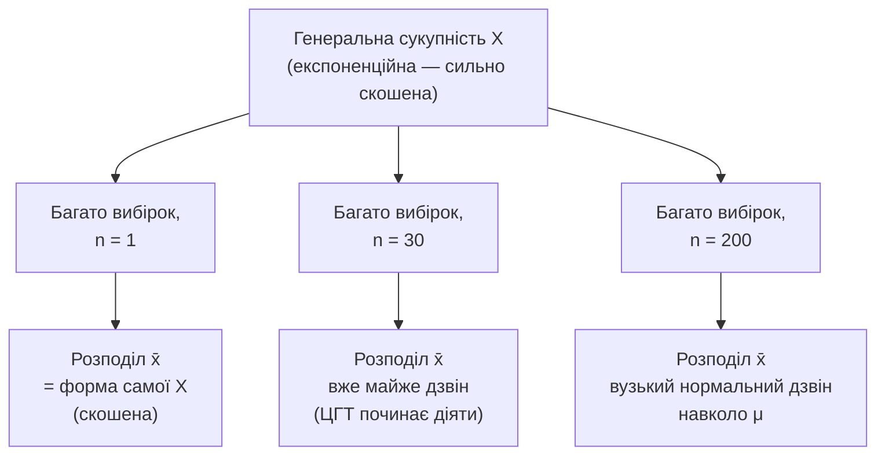

# Лекція 11. Закон великих чисел і центральна гранична теорема

*Лекція 9 закінчилась відкритим питанням, яке свідомо залишили без
відповіді: вибіркове середнє x̄, яке рахували ще в Лекції 5, явно "має
стосунок" до математичного сподівання E[X] з Лекції 9 — але яке саме?
Чому взагалі можна довіряти x̄ як оцінці E[X], і що відбувається з цією
довірою, коли вибірка більшає? Ця лекція дає точну відповідь — закон
великих чисел і центральну граничну теорему — два факти, на яких потім
буквально побудовані довірчі інтервали (Лекція 12) і перевірка гіпотез
(Лекція 13): жодної нової магії там не буде, лише механічне застосування
того, що доведено тут.*

## Закон великих чисел: чому x̄ можна довіряти

**Механіка.** Візьмемо випадкову величину X із фіксованим, але
невідомим на практиці математичним сподіванням E[X]. Закон великих
чисел (ЗВЧ) стверджує: якщо взяти вибірку з n незалежних спостережень
цієї величини й обчислити вибіркове середнє x̄ₙ, то зі збільшенням n
x̄ₙ наближається до E[X]:

```
x̄ₙ → E[X]        при n → ∞
```

Це не метафора "стає схожим", а конкретне твердження про ймовірність:
чим більше n, тим менша ймовірність того, що x̄ₙ відхилиться від E[X]
більш ніж на будь-яку наперед задану відстань. Перевірити це можна прямо
кодом — візьмемо експоненційний розподіл (Лекція 10) з параметром
λ = 0.5, у якого E[X] = 1/λ = 2, і подивимось, як x̄ₙ веде себе зі
зростанням n:

```python
import numpy as np

rng = np.random.default_rng(42)
lam = 0.5
true_mean = 1 / lam                       # E[X] = 2, теоретичне значення

for n in [5, 30, 200, 2_000, 50_000]:
    sample = rng.exponential(scale=1 / lam, size=n)
    print(f"n={n:>6}   x̄ = {sample.mean():.4f}   |x̄ - E[X]| = {abs(sample.mean() - true_mean):.4f}")
```

Кожен запуск дає трохи інші числа, але загальна тенденція стійка: при
n=5 вибіркове середнє може відхилятись від 2 на 0.5 і більше, а при
n=50 000 відхилення зазвичай не перевищує соту частку. Це саме та
"довіра до x̄", яку Лекція 9 залишила без обґрунтування — тепер вона
має точну математичну підставу, а не лише інтуїцію "більше даних —
краще".

**Чому це відбувається.** Причина — не магія великих чисел, а проста
властивість дисперсії суми незалежних величин. Дисперсія вибіркового
середнього дорівнює:

```
Var(x̄ₙ) = Var(X) / n
```

Зі зростанням n знаменник росте, а дисперсія x̄ₙ падає — розподіл
можливих значень x̄ₙ стає дедалі вужчим навколо E[X]. При n=1 вибіркове
середнє — це просто одне спостереження X, з усією його розкиданістю;
при n=1000 випадкові відхилення окремих спостережень у більшості
випадків компенсують одне одного (надто велике значення в одному
спостереженні зрівноважується надто малим в іншому), і сума "гладшає".
ЗВЧ — це формальний наслідок того, що Var(x̄ₙ) → 0 при n → ∞: величина
зі спадною до нуля дисперсією й фіксованим середнім неминуче
концентрується навколо цього середнього.

**Де це реально корисно.** ЗВЧ — це підстава для практично кожного
"чим більша вибірка, тим краще" в цьому курсі: A/B-тест на 50
відвідувачах сайту менш надійний, ніж той самий тест на 50 000, не
через якісь окремі гарні властивості великих чисел, а тому, що
дисперсія оцінки середнього ефекту прямо падає з ростом n. Це також
точне обґрунтування того, чому в Практиці 1–10 вибіркове середнє
взагалі використовувалось як розумна оцінка теоретичного параметра —
до цієї лекції це приймалось на віру, тепер це доведений факт.

## Центральна гранична теорема: яка саме форма в x̄

ЗВЧ каже, що x̄ₙ наближається до E[X], але не каже нічого про **форму**
розподілу можливих значень x̄ₙ навколо цього центру. Відповідь на це —
центральна гранична теорема (ЦГТ), і вона дивовижна: **незалежно від
форми розподілу самої X** — навіть якщо X сильно скошена (як
експоненційний розподіл із Лекції 10) чи взагалі рівномірна — розподіл
x̄ₙ при достатньо великому n наближається до **нормального** розподілу
(Лекція 10) із параметрами:

```
x̄ₙ ~ N(μ, σ / √n)      приблизно, при достатньо великому n
```

де μ = E[X] — те саме теоретичне середнє, а σ — стандартне відхилення
самої X. Симуляція показує це прямо: беремо той самий скошений
експоненційний розподіл, повторюємо взяття вибірки розміру n багато
тисяч разів, кожного разу рахуємо x̄, і дивимось на розподіл усіх
отриманих x̄:

```python
import numpy as np
import matplotlib.pyplot as plt

rng = np.random.default_rng(0)
lam = 0.5
n_repeats = 20_000

fig, axes = plt.subplots(1, 4, figsize=(16, 3.2), sharey=False)
for ax, n in zip(axes, [1, 5, 30, 200]):
    # n_repeats незалежних вибірок розміру n, середнє кожної -- один x̄
    sample_means = rng.exponential(scale=1 / lam, size=(n_repeats, n)).mean(axis=1)
    ax.hist(sample_means, bins=50, density=True, alpha=0.75)
    ax.set_title(f"n = {n}\nstd(x̄) = {sample_means.std():.3f}")
plt.tight_layout()
plt.show()
```

При n=1 гістограма — це просто форма самого експоненційного розподілу:
скошена, з довгим хвостом праворуч. Уже при n=30 форма помітно
симетризується й нагадує дзвін, а при n=200 — майже ідеальний вузький
дзвін навколо μ=2. Ось інтуїція одним поглядом:



**Чому це відбувається.** Інтуїція (формальний доказ — за межами
курсу): x̄ₙ — це сума n випадкових доданків (кожне спостереження,
поділене на n). Кожен доданок сам собою може мати будь-яку форму
розподілу, але коли багато незалежних "шумів" додаються разом,
особливості форми кожного окремого доданка (скошеність, гострі піки)
взаємно згладжуються — жоден один доданок не домінує над сумою, і сума
багатьох незалежних внесків "за конструкцією" тяжіє до симетричної
дзвоноподібної форми. Це той самий принцип, чому стільки природних
вимірювань (зріст, помилки вимірювання) виглядають приблизно
нормальними — вони самі є результатом додавання багатьох дрібних
незалежних факторів.

**Стандартна похибка (standard error, SE)** — це і є σ/√n, стандартне
відхилення розподілу x̄ₙ, тобто типовий розмір розкиду вибіркового
середнього навколо E[X]. Це не те саме, що σ (розкид окремих значень X)
— SE завжди менше σ (при n > 1), і саме ця величина показує, наскільки
точно конкретна вибірка розміру n здатна "влучити" в E[X].

**Чому саме √n, а не n — і чому це практично важливо.** Формула SE = σ/√n
означає, що для зменшення похибки вдвічі потрібно **у чотири рази**
більше даних, а не вдвічі більше: щоб зменшити SE ще вдвічі, потрібно
знову вчетверо збільшити n. Це видно з симуляції вище: std(x̄) при
n=200 не в 200 разів менший за std(x̄) при n=1, а приблизно в √200 ≈ 14
разів. Практичний висновок — **закон убуваючої віддачі**: перехід з
30 спостережень до 120 дає таке ж покращення точності, як перехід із
120 до 480 (в обох випадках n зростає в 4 рази → SE падає вдвічі).
Збільшувати вибірку варто, але кожна наступна "порція" точності
коштує дедалі дорожче — це прямий аргумент проти інтуїції "просто
зберемо вдесятеро більше даних і похибка впаде вдесятеро".

## Точкове оцінювання: незміщеність і спроможність

**Оцінка (estimator)** — це будь-яке правило, яке з вибірки обчислює
число, що претендує бути наближенням теоретичного параметра. x̄ —
оцінка E[X]; s² (Лекція 6) — оцінка Var(X). Не кожне правило, що
"якось" рахує число з вибірки, однаково добре — курсу потрібні дві
конкретні властивості, щоб відрізняти хорошу оцінку від поганої.

**Незміщеність (unbiasedness).** Оцінка незміщена, якщо її математичне
сподівання (якщо повторити взяття вибірки нескінченну кількість разів
і усереднити саму оцінку) дорівнює істинному параметру — оцінка "в
середньому" не завищує й не занижує ціль. x̄ незміщена оцінка E[X] за
конструкцією. А от чому вибіркова дисперсія рахується з діленням на
n−1 (`ddof=1`), а не на n (Лекція 6) — це саме питання незміщеності:
дисперсія, обчислена відносно вибіркового x̄ (яке само підлаштувалось
під ці конкретні дані, а не є справжнім μ), при діленні на n **у
середньому недооцінює** справжню Var(X). Поділ на n−1 (поправка
Бесселя) точно компенсує цю систематичну недооцінку, роблячи s²
незміщеною оцінкою Var(X). Це не довільна умовність бібліотек — це
математичний наслідок того, що x̄ "витрачає" один ступінь свободи на
підлаштування під саму вибірку.

**Спроможність (consistency).** Оцінка спроможна, якщо зі збільшенням
n вона стає дедалі точнішою — наближається до істинного параметра за
ймовірністю. Це — прямий переказ ЗВЧ мовою точкового оцінювання: x̄
спроможна оцінка E[X] саме тому, що ЗВЧ гарантує збіжність x̄ₙ до
E[X] при n → ∞. Незміщеність і спроможність — незалежні властивості:
оцінка може бути незміщеною при кожному n, але недостатньо
спроможною (повільно збігатись), або спроможною, але зміщеною при
малих n і лише асимптотично правильною. Для x̄ і s² (з `ddof=1`) курс
має обидві властивості одночасно — саме тому це "стандартні" оцінки
середнього й дисперсії, а не довільний вибір.

## Де це реально корисно: фундамент для Лекцій 12–13

Усе, що встановлено вище, — не самоціль, а прямий будівельний матеріал
для двох наступних тем курсу, і варто побачити цей зв'язок явно, а не
як "ще одна лекція про статистику":

- **Довірчі інтервали (Лекція 12).** Формула межі похибки довірчого
  інтервалу для середнього буквально дорівнює критичному значенню,
  помноженому на SE = σ/√n (чи на її вибіркову оцінку s/√n) — тобто це
  та сама стандартна похибка з цієї лекції, без жодної нової ідеї.
  Довірчий інтервал ширший при малому n і вужчий при великому саме
  тому, що SE убуває як 1/√n.
- **Перевірка гіпотез (Лекція 13).** Статистика критерію, з якої
  рахується p-value, у своїй основі — це відстань спостереженого x̄ від
  гіпотетичного значення, вимірена в одиницях тієї самої SE. А те, що
  цю відстань можна оцінити через нормальний розподіл (щоб дістати
  конкретне число p-value), працює саме тому, що ЦГТ гарантує
  нормальність розподілу x̄ при достатньому n — незалежно від форми
  вихідних даних.

Іншими словами: ЗВЧ і ЦГТ не є "теорією для теорії" — це той самий
механізм, який Лекції 12 і 13 просто називають іншими словами
(«похибка», «критерій», «p-value») і застосовують до конкретних задач.


Це та сама діаграма, з якою Лекція 9 закінчилась — тільки тепер
пунктирна стрілка "n → ∞" стала суцільною й точно сформульованою: не
"десь там наближається", а ЗВЧ (до якого значення) і ЦГТ (за якою
формою розкиду) одночасно.

## Типові помилки

**"Розподіл стає нормальним" плутають із "x̄ дорівнює E[X]".** ЗВЧ і ЦГТ
— два різні твердження: ЗВЧ про **центр** (x̄ наближається до E[X]),
ЦГТ про **форму й розкид** розподілу x̄ навколо цього центру. Кажучи
"з великою вибіркою все стає нормальним", часто плутають ці дві різні
речі: сам розподіл X (наприклад, час очікування) з експоненційної
форми в нормальну не перетворюється ніколи, скільки завгодно збирай
даних — нормалізується лише розподіл **середнього** з багатьох
вибірок, а не форма вихідних даних.

**Очікування, що вдвічі більша вибірка дає вдвічі меншу похибку.**
Через √n у знаменнику SE це не так: подвоєння n зменшує похибку лише
в √2 ≈ 1.41 раза. Планування розміру вибірки "на око" без цієї
поправки систематично недооцінює, скільки даних насправді потрібно
для бажаної точності.

**Використання s² з `ddof=0` там, де вибірка — лише частина генеральної
сукупності.** Як показано вище, це дає систематично зміщену (занижену)
оцінку дисперсії — саме тому Лекція 6 і ця лекція наполягають на
`ddof=1` за замовчуванням для вибіркових даних.

## Підсумок

- Закон великих чисел: вибіркове середнє x̄ₙ наближається до
  теоретичного E[X] при зростанні n, тому що дисперсія x̄ₙ (= Var(X)/n)
  спадає до нуля — це точна відповідь на питання, залишене відкритим у
  Лекції 9.
- Центральна гранична теорема: незалежно від форми розподілу X,
  розподіл x̄ₙ наближається до нормального N(μ, σ/√n) — стандартна
  похибка σ/√n убуває саме як корінь із n, тому кожне наступне
  подвоєння точності коштує вчетверо більшої вибірки.
- Точкова оцінка — правило, що обчислює наближення параметра з
  вибірки; незміщеність (правильна "в середньому", звідси `ddof=1` для
  s²) і спроможність (покращується з ростом n, прямий наслідок ЗВЧ) —
  дві властивості, які роблять x̄ і s² "стандартними" оцінками, а не
  довільним вибором.
- Довірчі інтервали (Лекція 12) і перевірка гіпотез (Лекція 13) —
  безпосередні механічні застосування ЦГТ і стандартної похибки, а не
  нові окремі ідеї.

**Практика до цієї лекції:** [Практика 11. Числові характеристики випадкової величини; закон великих чисел і ЦГТ симуляцією](../practice/11-clt-simulation.md)
