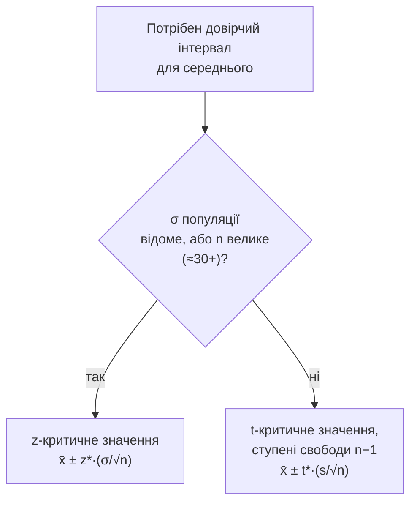

# Лекція 12. Довірчі інтервали

*Лекція 11 показала, що вибіркове середнє x̄ саме по собі — випадкова
величина: кожна нова вибірка з того самого процесу дає інше x̄, а закон
великих чисел і центральна гранична теорема (ЦГТ) точно описують, як
воно розподілене — навколо істинного середнього μ, з розкидом, який
задає стандартна похибка σ/√n. Ця лекція робить наступний логічний крок:
якщо відомо, як "гуляє" x̄ навколо μ, можна не просто назвати одне число
x̄ як оцінку μ, а побудувати **діапазон**, у якому μ, найімовірніше,
міститься — і сказати, наскільки цій заяві можна довіряти. Це і є
довірчий інтервал — головний практичний інструмент статистичного
висновку, на якому будуватиметься й перевірка гіпотез у Лекції 13.*

## Точкова оцінка проти інтервальної оцінки

**Точкова оцінка** — одне число, яким наближають невідомий параметр
популяції: вибіркове середнє x̄ як оцінка μ, вибіркова частка p̂ як
оцінка істинної частки p. Це те, що курс рахував уже багато разів
(Лекції 5–6, Практика 5–6) — і в цьому й проблема точкової оцінки: саме
число x̄ = 23.4 виглядає точним і остаточним, але не несе в собі
жодного натяку на власну надійність. x̄, обчислене за вибіркою з 10
спостережень, і x̄, обчислене за вибіркою з 10 000 спостережень, можуть
бути однаковим числом 23.4 — але друга оцінка набагато надійніша, а
голе число цього не показує.

**Інтервальна оцінка** (довірчий інтервал) виправляє саме цю
прогалину: замість одного числа вона дає діапазон значень **плюс**
явно назване число, що показує, наскільки цьому діапазону можна
довіряти — рівень довіри (найчастіше 90%, 95% або 99%). Замість "μ
приблизно 23.4" довірчий інтервал каже щось на зразок "з рівнем довіри
95% μ лежить у межах від 21.1 до 25.7" — і це друге твердження містить
принципово більше інформації: не лише орієнтовне значення, а й наскільки
широкий діапазон невизначеності навколо нього.

**Механіка.** Довірчий інтервал будується за єдиною логічною схемою,
незалежно від того, який параметр оцінюється:

```
точкова оцінка ± margin of error (похибка оцінки)
```

де похибка оцінки — це критичне значення (з нормального чи
t-розподілу, залежно від ситуації — нижче) помножене на стандартну
похибку самої точкової оцінки. Стандартна похибка для середнього — це
саме σ/√n (або s/√n) з Лекції 11: чим вона менша, тим вужчий і
інформативніший інтервал при тому самому рівні довіри.

**Чому це працює саме так.** ЦГТ (Лекція 11) гарантує, що розподіл x̄
навколо μ наближається до нормального з розкидом σ/√n. А для будь-якого
нормального розподілу відомо (правило 68-95-99.7, Лекція 10), яка частка
значень лежить у межах скількох стандартних відхилень від центру. Отже,
можна взяти конкретне число стандартних похибок навколо x̄ (критичне
значення) так, щоб гарантувано "накрити" певну частку можливих значень
x̄ — а звідси, симетрично, і певну частку можливих значень μ. Це саме
той механізм, який перетворює абстрактний факт ЦГТ у конкретне, придатне
до розрахунку правило.

## Довірчий інтервал для середнього: z чи t

Формула довірчого інтервалу для середнього має два варіанти залежно від
того, чи відоме стандартне відхилення популяції σ.

**Коли σ відоме (або вибірка велика, n ≥ 30 приблизно)** використовують
нормальний розподіл і z-критичне значення:

```
x̄ ± z* · (σ / √n)
```

де z* — z-критичне значення, що відповідає обраному рівню довіри (для
95% це 1.96, для 90% — 1.645, для 99% — 2.576; ці числа — точки
нормального розподілу, що відтинають потрібну центральну частку площі,
той самий CDF/ppf з Лекції 10).

**Коли σ невідоме й n мале** (типовий реальний випадок: майже завжди
відоме лише вибіркове s, а не істинне σ) використовують t-розподіл:

```
x̄ ± t* · (s / √n)
```

де t* — критичне значення t-розподілу з `n - 1` **ступенями свободи**,
а s — вибіркове стандартне відхилення (Лекція 6), яке тут відіграє роль
оцінки невідомого σ.

**Чому саме t-розподіл, а не звичайний нормальний.** Коли σ невідоме й
замінене оцінкою s, у розрахунок додається ще одне джерело
невизначеності: сама s — теж лише оцінка за конкретною вибіркою, яка
для іншої вибірки того самого розміру вийшла б трохи іншою. При малому
n ця додаткова невизначеність істотна (одне-два "нетипові"
спостереження помітно зсувають s), а при великому n вона згладжується
(закон великих чисел працює і для s, наближаючи її до істинного σ).
t-розподіл — це той самий "дзвін", що й нормальний, але з **важчими
хвостами**: він явно закладає більший шанс на "нетипово далекі" від
центру значення саме тому, що частина невизначеності — це невизначеність
не лише x̄, а й самої оцінки розкиду s. Ступені свободи (`n - 1`)
регулюють, наскільки важкі ці хвости: при малому n (мало ступенів
свободи) хвости помітно важчі за нормальний розподіл, а при зростанні n
t-розподіл поступово **збігається** до нормального — при n близько 30 і
більше різниця між z* і t* стає практично неважливою, що й пояснює,
чому "велике n" дозволяє спокійно використовувати простішу
z-формулу навіть коли σ технічно невідоме.

**Де це реально потрібно.** Майже в будь-якому реальному аналізі σ
популяції невідоме — відоме тільше s з конкретної вибірки, тож
t-розподіл, а не нормальний, є **типовим** інструментом для довірчого
інтервалу середнього на практиці; випадок "σ відоме" — переважно
навчальний або теоретичний.

```python
import numpy as np
from scipy import stats

np.random.seed(0)
response_times = np.random.normal(loc=250, scale=40, size=25)  # мс, час відгуку сервера

mean = response_times.mean()
s = response_times.std(ddof=1)        # ddof=1 — вибіркове стандартне відхилення (оцінка σ)
n = len(response_times)
se = s / np.sqrt(n)                    # стандартна похибка (Лекція 11)

ci_95 = stats.t.interval(0.95, df=n - 1, loc=mean, scale=se)
print(mean, s, se)          # 269.0  43.7  8.75
print(ci_95)                 # (250.95, 287.06)
```

`stats.t.interval(0.95, df=n-1, loc=mean, scale=se)` рахує саме
`mean ± t* · se`, де `t*` бібліотека сама знаходить із t-розподілу для
заданого рівня довіри й кількості ступенів свободи — це те саме, що
знайти `t* = stats.t.ppf(0.975, df=n-1)` (0.975, а не 0.95, бо
двобічний інтервал відтинає по 2.5% з кожного "хвоста") і додати/відняти
`t* · se` вручну; функція просто уникає цього ручного кроку.

## Що насправді означає "95% довіри"

Це найчастіше неправильно зрозуміле поняття у всьому курсі, тож варто
розібрати його окремо, максимально явно.

**Неправильно:** "з ймовірністю 95% істинне μ лежить у межах від 250.95
до 287.06". Це звучить природно, але помилково — щойно інтервал
обчислений за конкретною вибіркою, він або містить μ, або не містить
його: це вже не питання ймовірності, μ — фіксоване (хоч і невідоме)
число, а не випадкова величина. Сказати "ймовірність 95%, що фіксоване
число лежить у фіксованому діапазоні" — категорійна помилка: ймовірність
95% чи 0% тут уже визначена самою реальністю, просто невідома нам.

**Правильно:** випадковим є не μ, а сам **інтервал** — тому що він
обчислений за конкретною вибіркою, а вибірка — випадкова. "95% довіри"
означає: якби процес випадкового вибирання вибірки й побудови інтервалу
за формулою вище повторити дуже багато разів (кожного разу — нова
вибірка з тієї самої популяції), приблизно **95% усіх побудованих
таким чином інтервалів** накрили б справжнє μ, а решта 5% — ні. Це
твердження про **процедуру** в довгостроковій перспективі, а не про
одне конкретне число, вже обчислене раз.

Це прямо той самий тип міркування, що симуляція з Лекції 11: там
багаторазове повторення вибирання показувало, як x̄ розсіюється навколо
μ; тут — те саме багаторазове повторення, але тепер дивимось не на
саме x̄, а на побудований навколо нього інтервал і рахуємо, яка частка
цих інтервалів "влучає" в μ. Наочно:

```python
import numpy as np
from scipy import stats

true_mu, true_sigma, n = 100, 15, 30
hits = 0
trials = 2000

for _ in range(trials):
    sample = np.random.normal(true_mu, true_sigma, size=n)
    lo, hi = stats.t.interval(0.95, df=n - 1,
                               loc=sample.mean(),
                               scale=sample.std(ddof=1) / np.sqrt(n))
    if lo <= true_mu <= hi:
        hits += 1

print(hits / trials)   # близько 0.95, а не рівно — тому що це теж вибіркова оцінка частки
```

Кожен окремий інтервал у цьому циклі або "влучає" в `true_mu`, або ні —
рівно так, як і з реальним обчисленим інтервалом. "95% довіри" описує
**частку влучень по всіх запусках**, а не шанс влучення в одному
конкретному запуску, який після побудови інтервалу вже або відбувся,
або не відбувся.

## Довірчий інтервал для частки

Та сама логіка застосовується до частки (proportion) — оцінки того, яка
частка популяції має певну властивість (частка клієнтів, що купують;
частка виборців, що підтримують; частка бракованих деталей). Точкова
оцінка тут — вибіркова частка p̂ = (кількість "успіхів") / n, а довірчий
інтервал:

```
p̂ ± z* · √(p̂(1 - p̂) / n)
```

Структура формули та ж сама — оцінка ± критичне значення × стандартна
похибка, — але сама стандартна похибка виглядає інакше: `√(p̂(1-p̂)/n)`
замість `s/√n`. Це не довільна інша формула, а пряме теоретичне
наслідок: частка p̂ по суті — це середнє індикаторної величини (1 для
"успіху", 0 для "невдачі"), а дисперсія такої індикаторної величини
дорівнює саме `p(1-p)` (той самий факт, що вже виводив дисперсію
біноміального розподілу `n·p·(1-p)` у Лекції 10 — тут та сама дисперсія
поділена на n, як і для будь-якого середнього).

**Коли нормальне наближення для частки коректне.** На відміну від
середнього, де ЦГТ працює практично завжди при не надто малому n, для
частки є додаткова умова: розподіл p̂ добре наближається нормальним лише
якщо і `n·p̂`, і `n·(1-p̂)` — обидва достатньо великі (орієнтовний
поріг — не менше 5–10 для кожного з добутків). Це та сама умова, з якою
курс уже стикався в Лекції 10 при зв'язку біноміального розподілу з
нормальним: біноміальний розподіл симетричний і дзвоноподібний лише
коли `p` не надто близьке до 0 чи 1 (або n достатньо велике, щоб це
компенсувати) — коли `p̂` близьке до крайніх значень, а n мале, розподіл
p̂ помітно скошений, і нормальне наближення (а разом з ним і формула
довірчого інтервалу вище) дає ненадійний результат.

```python
p_hat = 0.62         # частка клієнтів, задоволених сервісом, у вибірці з 200
n = 200

np_hat, n_1_p_hat = n * p_hat, n * (1 - p_hat)
print(np_hat, n_1_p_hat)         # 124.0  76.0 — обидва набагато більші за 10, наближення коректне

se_p = np.sqrt(p_hat * (1 - p_hat) / n)
ci_p = stats.norm.interval(0.95, loc=p_hat, scale=se_p)
print(ci_p)                       # (0.553, 0.687)
```

**Де це реально корисно.** Це саме той розрахунок, що стоїть за фразою
"похибка вибірки ±3%" в будь-якому соціологічному опитуванні — рівень
довіри там майже завжди 95%, а "±3%" — це і є `z* · √(p̂(1-p̂)/n)`,
обчислена похибка оцінки. Це також стандартний спосіб звітувати
результат A/B-тесту (частка користувачів, що клікнули на новий варіант
кнопки, з довірчим інтервалом навколо неї) — саме на цьому будуватиметься
логіка перевірки статистичних гіпотез у Лекції 13, де довірчий інтервал
і двобічний тест значущості на тому самому рівні — це, по суті, два
погляди на один і той самий розрахунок.

## Що визначає ширину інтервалу

Ширина довірчого інтервалу — `2 · margin of error` — залежить рівно від
трьох речей, і кожну варто розуміти окремо, а не як одну загальну
"точність".

**Розмір вибірки n.** Стандартна похибка містить `√n` у знаменнику —
той самий факт з Лекції 11: щоб зменшити ширину інтервалу вдвічі,
потрібно збільшити n у **чотири** рази, а не вдвічі. Ефект спадної
віддачі: перехід від n=10 до n=40 звужує інтервал набагато помітніше,
ніж перехід від n=1000 до n=4000, хоча в обох випадках n зростає в
чотири рази.

**Рівень довіри.** Вищий рівень довіри вимагає більшого критичного
значення (z* чи t*), а отже — ширшого інтервалу при тих самих даних.
Це прямий і невідворотний обмін: щоб бути **більш** упевненим, що
інтервал "накриє" μ, потрібно назвати **ширший** діапазон — вужчий
інтервал із такою самою впевненістю "з нічого" не з'являється. На
прикладі вибірки часу відгуку сервера вище (`n=25`, `s=43.7`):

| Рівень довіри | t* (df=24) | Похибка (±) | Інтервал | Ширина |
|---|---|---|---|---|
| 90% | 1.711 | 14.97 | (254.0, 284.0) | 29.9 |
| 95% | 2.064 | 18.06 | (251.0, 287.1) | 36.1 |
| 99% | 2.797 | 24.46 | (244.5, 293.5) | 48.9 |

Ті самі дані, та сама формула — і чим вища вимога до надійності, тим
ширший (менш інформативний) результат.

**Розкид самих даних (σ чи s).** Стандартна похибка прямо пропорційна σ
(чи s): більш "розкидані" дані дають більшу невизначеність оцінки μ
незалежно від n і рівня довіри, і на це дослідник вплинути не може —
лише виміряти точніше чи взяти більше спостережень, щоб компенсувати
розкид збільшенням n.



## Типові помилки

**"95% ймовірності, що μ в цьому інтервалі".** Розібрано детально вище
— після того, як інтервал обчислено за конкретною вибіркою, він або
містить μ, або ні; "95%" описує надійність **процедури** побудови
багатьох інтервалів, а не шанс для цього одного вже готового числа.

**Використання z-формули замість t при малому n і невідомому σ.** Це
дає інтервал, вужчий за реальний рівень довіри, — z* систематично менше
за t* при малих ступенях свободи, тож заявлений "95% довіри" з
z-формулою насправді покриває істинне μ рідше, ніж у 95% випадків.

**Забуття умови коректності для частки.** Формула для частки коректна
лише коли `n·p̂` і `n·(1-p̂)` обидва достатньо великі; застосування її
до малих n чи p̂ близького до 0 або 1 (наприклад, 2 "успіхи" з 20) дає
формально обчислюване, але статистично ненадійне число.

## Підсумок

- Точкова оцінка (x̄, p̂) — одне число без вбудованого відчуття власної
  надійності; довірчий інтервал додає діапазон і явний рівень довіри.
- Довірчий інтервал для середнього: `x̄ ± z*·(σ/√n)` коли σ відоме чи n
  велике, `x̄ ± t*·(s/√n)` коли σ невідоме й n мале — t-розподіл із
  важчими хвостами компенсує додаткову невизначеність від оцінки s
  замість справжнього σ.
- "95% довіри" — твердження про частку влучень при багаторазовому
  повторенні процедури побудови інтервалу, а не ймовірність для одного
  вже обчисленого інтервалу.
- Довірчий інтервал для частки: `p̂ ± z*·√(p̂(1-p̂)/n)`, коректний лише
  коли `n·p̂` і `n·(1-p̂)` обидва достатньо великі.
- Ширину інтервалу визначають три фактори: розмір вибірки (через √n,
  зі спадною віддачею), рівень довіри (вищий рівень — ширший інтервал,
  прямий обмін) і розкид даних (σ чи s).
- Довірчий інтервал і перевірка статистичної гіпотези (Лекція 13) —
  два погляди на один розрахунок; логіка "±похибка" тут — та сама, що
  й у похибці соціологічних опитувань і звітах про результати A/B-тестів.

**Практика до цієї лекції:** [Практика 12. Довірчі інтервали для середнього і частки](../practice/12-confidence-intervals.md)
