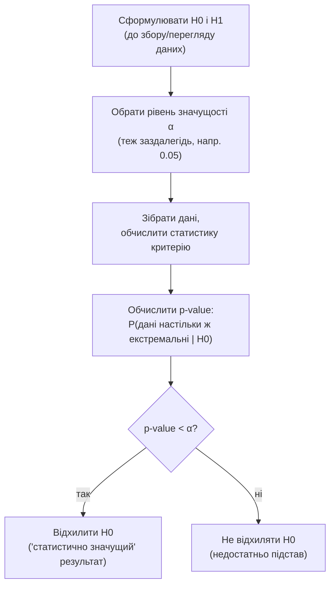

# Лекція 13. Перевірка статистичних гіпотез: логіка, p-value, помилки I і II роду

*Лекція 11 показала, що вибіркове середнє x̄ коливається навколо
істинного μ зі стандартною похибкою σ/√n, а Лекція 12 перетворила це
коливання на довірчий інтервал — діапазон значень μ, сумісних із
фактично спостереженою вибіркою при заданому рівні довіри. Довірчий
інтервал відповідає на питання "які значення μ ймовірні, зважаючи на
ці дані". Ця лекція ставить те саме питання навпаки: маючи одне
конкретне заявлене число (μ0 — "середня вага пачки становить 500 г",
"нова версія сайту не змінює частку покупок") і фактичні дані, чи
узгоджуються ці дані із заявленим числом, чи суперечать йому?
Формальна процедура відповіді на це питання називається перевіркою
статистичних гіпотез, і саме вона стоїть за фразою "результат
статистично значущий" — від клінічних випробувань ліків до
A/B-тестування кнопки на сайті й контролю якості на виробництві.*

## Логіка перевірки гіпотез: H0, H1 і доведення від протилежного

**Нульова гіпотеза (H0)** — це твердження "нічого цікавого не
відбувається": заявлене значення правильне, нова версія сайту не
відрізняється від старої, партія товару відповідає стандарту. H0
завжди формулюється як конкретна рівність (μ = μ0, частка = p0), а не
як розмите "можливо, щось інше" — саме тому її можна перевірити
математично. **Альтернативна гіпотеза (H1)** — те, що ми підозрюємо чи
хочемо показати: середнє насправді інше, нова версія сайту дійсно
покращує конверсію.

Логіка перевірки — це не пряме доведення H1, а **доведення від
протилежного**: ми тимчасово **припускаємо, що H0 істинна**, і
питаємо — якби це було справді так, наскільки дивними (неймовірними)
були б дані, які ми фактично спостерігали? Якщо дані виявляються
занадто дивними для цього припущення, ми відмовляємось від H0; якщо
дані цілком узгоджуються з H0, ми просто не маємо підстав її
відкинути.

**Чому ця логіка не інтуїтивна і варта окремого прикладу.** У суді
діє презумпція невинуватості: обвинувачений вважається невинним (H0),
доки прокурор не надасть доказів, які роблять цю невинуватість
малоймовірною за фактами справи. Суд ніколи не "доводить
невинуватість" — він або визнає, що доказів достатньо для засудження
(відхилити H0), або визнає, що доказів недостатньо (не відхилити H0,
що **не є** доведенням невинуватості — лише відсутністю достатніх
підстав засудити). Так само й статистичний тест: "не відхилити H0" не
означає "H0 доведена й істинна" — це означає лише, що наявні дані не
дають достатніх підстав її відкинути. Це та сама обережність
формулювання, що вже застосовувалась до інтерпретації довірчого
інтервалу в Лекції 12: висновок стосується процедури й даних, а не
остаточної метафізичної істини.

Уся процедура — це чіткий, повторюваний порядок кроків, а не довільна
послідовність дій, і саме порядок тут принциповий (H0/H1 і α обираються
**до** того, як дані відкриті для аналізу — чому це важливо, детально
нижче):



## p-value: точне визначення і найпоширеніша помилка

**p-value** — це ймовірність спостерігати дані **настільки ж або ще
більш екстремальні**, ніж фактично отримані, **за умови, що H0
істинна**. Формально це умовна ймовірність:

```
p-value = P(дані настільки ж або більш екстремальні | H0 істинна)
```

Маленьке p-value означає: "якби H0 була істинною, дані, подібні до
наших, траплялися б рідко" — а отже наявні дані є вагомим аргументом
проти H0. Велике p-value означає: "такі дані (чи ще більш незвичні)
цілком типові, якщо H0 істинна" — тобто дані не дають підстав
сумніватись у H0.

**Найпоширеніша й найшкідливіша помилка — читати p-value як
"ймовірність того, що H0 істинна".** Це геть інше твердження, і от
чому. p-value обчислюється **в припущенні, що H0 вже істинна** — це
умовна ймовірність даних за фіксованої гіпотези, а не ймовірність
гіпотези за фіксованих даних. Порівняння з медичною діагностикою з
Лекції 9 показує різницю наочно: "ймовірність позитivного тесту за
наявності хвороби" і "ймовірність хвороби за позитивним тестом" — це
дві різні числа (P(дані|H0) проти P(H0|дані)), і одне не можна
автоматично переставити на місце іншого. Конкретний приклад: p = 0.03
означає буквально "якби заявлене значення було правильним, лише 3% з
багатьох гіпотетичних повторних вибірок показали б відхилення таке ж
велике чи більше за наше" — це твердження **про дані за умови
гіпотези**, а зовсім не "97% ймовірності, що заявлене значення
неправильне". Останнє твердження вимагало б додаткової інформації
(наприклад, наскільки вірогідною H0 була ще до збору даних), якої
p-value не використовує і не надає.

## Рівень значущості α і правило рішення

Щоб перетворити число p-value на конкретне рішення "відхилити чи ні",
потрібен наперед заданий порогу — **рівень значущості α**, найчастіше
0.05:

```
якщо p-value < α  →  відхилити H0 ("результат статистично значущий")
якщо p-value ≥ α  →  не відхиляти H0 (недостатньо підстав)
```

**Чому саме 0.05, а не якесь інше число обчислене з даних.** α — це
**наперед прийняте управлінське рішення про допустимий ризик
хибного відхилення H0**, а не природний закон і не властивість, що
випливає з формул. 0.05 — це історично закріплена конвенція
(запропонована Р. Фішером ще на початку XX століття), яку прийнято за
замовчуванням, але не єдино можливу: клінічні випробування ліків
часто використовують суворіший α = 0.01 (хибне схвалення неефективного
чи шкідливого препарату коштує дуже дорого), а розвідувальний
пошуковий аналіз іноді допускає м'якший α = 0.10. Ключове — обрати α
**до** проведення тесту, а не підлаштовувати його після того, як
p-value вже відоме, щоб "отримати" бажаний висновок.

## Помилки I і II роду

Рішення "відхилити / не відхилити H0" завжди приймається за неповною
інформацією (вибіркою, а не всією популяцією), тож завжди існує ризик
помилки — і рівно два типи цієї помилки, залежно від того, яка
насправді істина:

| | H0 насправді істинна | H0 насправді хибна |
|---|---|---|
| **Відхилити H0** | Помилка I роду (ймовірність = α) | Правильне рішення (потужність тесту = 1 − β) |
| **Не відхилити H0** | Правильне рішення (ймовірність = 1 − α) | Помилка II роду (ймовірність = β) |

**Помилка I роду** ("хибнопозитивний" результат) — відхилити H0, коли
вона насправді істинна: визнати ефективним препарат, що насправді не
діє; визнати новий дизайн сайту кращим, коли різниці насправді немає.
Ймовірність цієї помилки контролюється безпосередньо через α — це і є
причина, чому α обирають обережно, а не довільно велике число.

**Помилка II роду** ("хибнонегативний" результат) — не відхилити H0,
коли вона насправді хибна: не помітити дійсно ефективний препарат,
пропустити реальне покращення конверсії. Ймовірність цієї помилки
позначають β, а величину (1 − β) називають **потужністю тесту**
(power) — здатністю тесту виявити ефект, якщо він справді існує.
Потужність зростає зі збільшенням розміру вибірки (більша вибірка →
менша стандартна похибка σ/√n з Лекції 11 → легше відрізнити
справжній ефект від шуму) і з величиною самого ефекту (велику різницю
легше виявити, ніж крихітну).

**Чому це справжній компроміс, а не технічна деталь.** Зменшення α
(суворіший порог) автоматично підвищує ризик помилки II роду при
незмінному розмірі вибірки — це той самий компроміс, що в суді: чим
вищий стандарт доказовості для засудження, тим менше хибних вироків
(помилка I роду), але тим більше справді винних залишається на
волі (помилка II роду). У контролі якості виробництва цей же
компроміс має грошовий вимір: суворіший критерій браку означає менше
шансів пропустити дефектну партію (менша помилка II роду), але більше
шансів забракувати справді якісну партію (більша помилка I роду) —
рішення про α тут буквально рішення про те, яка з двох помилок
коштує компанії дорожче.

## Однобічний і двобічний тест

Формулювання H1 визначає, з якого боку шукати "екстремальність" даних.

**Двобічний тест** (H1: μ ≠ μ0) перевіряє, чи відрізняється значення
**в будь-якому напрямку** — і завелике, і замале значення однаково
свідчать проти H0. p-value тут рахується як площа в обох хвостах
розподілу.

**Однобічний тест** (H1: μ > μ0 **або** H1: μ < μ0, але не обидва
одразу) перевіряє відхилення лише в одному, наперед означеному
напрямку — наприклад, "нова версія сайту **збільшує** частку покупок"
(а не просто "відрізняється"). p-value тут рахується як площа лише в
одній хвостовій частині, що для того самого значення статистики дає
приблизно вдвічі менше p-value, ніж двобічний тест.

**Чому вибір типу тесту потрібно робити до, а не після перегляду
даних — і чому це найпряміша дорога до p-hacking.** Якщо спочатку
подивитись на дані (наприклад, побачити, що вибіркове середнє
виявилось більшим за μ0) і **лише після цього** вирішити застосувати
однобічний тест "у той самий бік", p-value штучно й неправомірно
зменшується вдвічі порівняно з чесним двобічним тестом, який мав би
застосовуватись, якби напрямок відхилення не був відомий заздалегідь.
Це форма **p-hacking** — підлаштування процедури аналізу під уже
відомий результат, щоб отримати "статистично значущий" висновок, який
насправді не такий надійний, як здається. Правильний порядок дій:
сформулювати H1 (однобічну чи двобічну) разом із α **до** того, як
дані відкриті для аналізу, виходячи з реального питання дослідження
("чи покращує?" — однобічний; "чи відрізняється взагалі?" —
двобічний), а не з того, що дані вже показали.

## Зв'язок із довірчими інтервалами (Лекція 12): та сама відповідь, два способи запитати

Двобічний тест на рівні значущості α і довірчий інтервал рівня
(1 − α) — це два способи поставити те саме питання. **Якщо заявлене
значення μ0 лежить поза межами (1 − α)-довірчого інтервалу, двобічний
тест H0: μ = μ0 на рівні α відхилить H0** — і навпаки, якщо μ0
потрапляє всередину інтервалу, тест не відхилить H0.

Конкретний приклад. Виробник заявляє, що середня вага пачки продукту
— μ0 = 500 г. Вибірка з n = 36 пачок дала x̄ = 496 г, s = 15 г, звідси
стандартна похибка se = 15/√36 = 2.5 г (Лекція 11). 95%-й довірчий
інтервал (Лекція 12): 496 ± 1.96·2.5 = [491.1; 500.9] — і μ0 = 500 г
**потрапляє всередину** цього інтервалу. Тест дає той самий висновок:
z = (496 − 500)/2.5 = −1.6, двобічне p-value ≈ 0.11, що більше за
α = 0.05 — недостатньо підстав відхилити H0. Якби замість цього вибірка
дала x̄ = 490 г, довірчий інтервал [485.1; 494.9] уже **не містив би**
500, а z = (490 − 500)/2.5 = −4.0 дало б p ≈ 0.0001 < 0.05 — тест
відхилив би H0. Це не збіг: обидві процедури побудовані на тій самій
величині (x̄ − μ0)/se, лише інтерпретують її по-різному.

## Python: як p-value змінюється з величиною ефекту

Код нижче рахує z-статистику й двобічне p-value для того самого
прикладу з вагою пачки, змінюючи лише спостережене x̄, щоб наочно
показати: чим далі x̄ від заявленого μ0 (у одиницях стандартної
похибки), тим менше p-value.

```python
import numpy as np
from scipy import stats

mu0 = 500              # заявлене виробником значення (H0: μ = 500)
s = 15                  # вибіркове стандартне відхилення
n = 36
se = s / np.sqrt(n)     # стандартна похибка, Лекція 11: se = s/√n

for x_bar in [499, 496, 493, 490, 485]:
    z = (x_bar - mu0) / se
    p_two_tailed = 2 * (1 - stats.norm.cdf(abs(z)))
    print(f"x̄={x_bar} г: z={z:.2f}, p={p_two_tailed:.4f}")

# x̄=499 г: z=-0.40, p=0.6892   (типово для H0, не відхиляємо)
# x̄=496 г: z=-1.60, p=0.1096   (не відхиляємо, узгоджується з CI-прикладом вище)
# x̄=493 г: z=-2.80, p=0.0051   (відхиляємо, p < 0.05)
# x̄=490 г: z=-4.00, p=0.0001   (відхиляємо, дуже переконливо)
# x̄=485 г: z=-6.00, p<0.0001   (відхиляємо, майже неможливо під H0)
```

`stats.norm.cdf(abs(z))` дає накопичену ймовірність зліва від |z|;
`1 - stats.norm.cdf(abs(z))` — площу правого хвоста за |z|; множення
на 2 враховує обидва хвости двобічного тесту (наскільки б далеко x̄
не відхилилось, у будь-який бік). Монотонність результату — не
особливість саме цього прикладу: p-value за конструкцією завжди
зменшується, коли спостережене значення стає щораз "дивнішим" з точки
зору H0. У прикладі використана z-статистика (відоме σ, наближене
через s при великому n) — на практиці, коли σ популяції справді
невідоме, використовують t-статистику через `stats.ttest_1samp()`,
яка враховує додаткову невизначеність через оцінене s; це точний
предмет Лекції 14, де t-тест — пряме застосування всієй логіки,
розкритої тут, лише з іншим розподілом статистики. Той самий
принцип "p-value як міра несумісності даних із H0" повторюється й у
Лекції 15 для критерію хі-квадрат — там статистика рахується геть
інакше (через порівняння спостережуваних і очікуваних частот), але
логіка "припусти H0 → оціни, наскільки дивні дані → прийми рішення за
α" лишається тією самою.

## Типові помилки

**p-value плутають з ймовірністю того, що H0 істинна.** Це вже
розібрано детально вище — варто лише зафіксувати: p-value відповідає
на питання "наскільки типові такі дані, якби H0 була вірною", а не
"яка ймовірність, що H0 вірна, зважаючи на дані" — це принципово різні
умовні ймовірності.

**α сприймають як обчислену величину, а не як заздалегідь обране
рішення.** α — вхідний параметр процедури (обирається до аналізу
залежно від допустимого ризику), тоді як p-value — вихідний результат
(обчислюється з конкретних даних). Плутанина цих двох ролей
("я отримав p = 0.05, отже мій рівень значущості 0.05") показує
нерозуміння того, що α ніяк не залежить від конкретної вибірки.

**Вибір однобічного/двобічного тесту "за фактом", уже побачивши
дані.** Розібрано вище як форма p-hacking — варте окремого
попередження, бо це найпряміший спосіб отримати штучно занижене й
ненадійне p-value.

**Статистичну значущість плутають із практичною важливістю.** Дуже
велика вибірка здатна дати статистично значуще (p < 0.05) відхилення
навіть для мізерної, практично неважливої різниці — наприклад,
різниця середньої ваги пачки на 0.3 г при вибірці з 100 000
спостережень майже напевно дасть маленьке p-value, хоча жоден
покупець такої різниці не відчує. Мале p-value каже "ця різниця
навряд чи випадкова", а не "ця різниця варта уваги" — друге питання
вимагає окремої оцінки величини ефекту, а не лише p-value.

## Підсумок

- Перевірка гіпотез — доведення від протилежного: припустити H0
  істинною і оцінити, наскільки дивними були б фактичні дані за цим
  припущенням; "не відхилити H0" не означає "довести H0".
- p-value = P(дані настільки ж чи більш екстремальні | H0 істинна) —
  умовна ймовірність даних за гіпотези, а **не** ймовірність гіпотези
  за даних; це найпоширеніша й найшкідливіша помилка інтерпретації.
- α — наперед обраний порогу допустимого ризику (типово 0.05),
  рішення про політику, не природний закон; правило рішення: відхилити
  H0, якщо p-value < α.
- Помилка I роду — відхилити істинну H0 (хибнопозитивний результат,
  ймовірність α); помилка II роду — не відхилити хибну H0
  (хибнонегативний результат, ймовірність β; 1 − β — потужність
  тесту). Це справжній компроміс, а не незалежні числа.
- Однобічний тест перевіряє відхилення в одному наперед заданому
  напрямку, двобічний — у будь-якому; напрямок обирається до аналізу
  даних, інакше виникає p-hacking.
- Двобічний тест на рівні α і (1 − α)-довірчий інтервал (Лекція 12)
  дають узгоджений висновок: якщо μ0 поза інтервалом — тест відхилить
  H0 на тому самому α.

**Практика до цієї лекції:** [Практика 13. Точкові оцінки та перевірка гіпотез: обчислення p-value, інтерпретація результату](../practice/13-hypothesis-testing.md)
