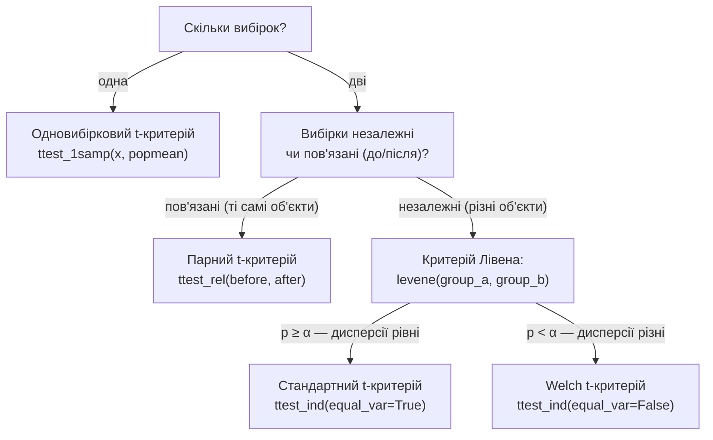

# Лекція 14. Параметричні критерії порівняння середніх і дисперсій

*Лекція 13 дала загальну логіку перевірки статистичних гіпотез: H0, H1,
p-value, рівень значущості α, помилки I і II роду. Ця логіка сама по
собі абстрактна — вона не каже, **яку конкретну формулу** рахувати для
конкретного питання "чи відрізняється середнє від очікуваного значення"
або "чи відрізняються середні двох груп". Цю прогалину закриває родина
**t-критеріїв**: конкретні статистичні тести, які застосовують загальну
логіку Лекції 13 до середніх, спираючись на t-розподіл із Лекції 12.
Заодно ця лекція повертається до питання, яке Лекція 6 свідомо залишила
відкритим: як **формально**, а не "на око" за std, перевірити, чи дві
групи мають однакову дисперсію — і чому це рішення впливає на те, яку
саме версію t-критерію застосовувати.*

## Одновибірковий t-критерій

**Ситуація:** є одна вибірка, і питання — чи її середнє відрізняється
від конкретного відомого числа (нормативу, паспортного значення,
історичного показника). Наприклад: пакування підписане "500 г", і
потрібно перевірити партію з 30 випадкових пакунків — чи середня вага
партії справді дорівнює 500 г, чи виробництво систематично відхиляється.

**Механіка.** Гіпотези за схемою Лекції 13:

```
H0: μ = μ0     (середнє генеральної сукупності дорівнює 500 г)
H1: μ ≠ μ0     (відрізняється — двобічна альтернатива)
```

Тестова статистика:

```
t = (x̄ - μ0) / (s / √n)
```

де `x̄` — вибіркове середнє, `μ0` — референсне значення з H0, `s` —
вибіркове стандартне відхилення (`ddof=1`, Лекція 6), `n` — розмір
вибірки. Чисельник — це та сама різниця "спостережене мінус очікуване",
що завжди лежить в основі будь-якого критерію; знаменник — стандартна
похибка середнього (детально виведена в Лекції 11), яка масштабує цю
різницю до одиниць "скільки стандартних похибок відхилення". Число
ступенів свободи тут `n - 1` — той самий `n - 1`, що й у поправці
Бесселя для дисперсії (Лекція 6): один ступінь свободи "витрачається" на
те, що `s` вже обчислено відносно самого `x̄`, а не відносно справжнього
невідомого `μ`.

**Чому t, а не z.** У Лекції 12 різниця між z- і t-розподілом уже
пояснена: z придатний, коли справжнє σ генеральної сукупності відоме, t
— коли σ невідоме й замінене вибірковою оцінкою `s`. У переважній
більшості реальних задач σ невідоме (немає доступу до всієї генеральної
сукупності), тож t-критерій — стандартний інструмент для середнього, а
не виняток.

```python
import numpy as np
from scipy import stats

weights = np.array([497, 502, 499, 495, 501, 498, 503, 496,
                     500, 494, 499, 502, 497, 501, 498])

t_stat, p_value = stats.ttest_1samp(weights, popmean=500)
print(t_stat, p_value)
```

Результат — конкретні `t_stat` і `p_value`; подальша інтерпретація
точно та сама, що в Лекції 13: якщо `p_value < α` (типово 0.05),
відхиляємо H0 — середня вага партії статистично значуще відрізняється
від 500 г. Якщо `p_value ≥ α` — підстав відхилити H0 немає (це **не**
доводить, що вага точно 500 г, лише що даних недостатньо, щоб
стверджувати відхилення — та сама обережність з формулюванням висновку,
що й у Лекції 13).

**Де корисно.** Контроль якості (відхилення партії від паспортної
характеристики), перевірка нормативу (чи середній час обробки заявки
відповідає обіцяному SLA), порівняння вибіркового результату з
довідковим/історичним значенням.

## Двовибірковий t-критерій для незалежних вибірок

**Ситуація:** дві **різні, незалежні** групи об'єктів (різні клієнти,
різні пацієнти, різні партії товару), і питання — чи їхні середні
відрізняються. Класичний приклад — A/B-тестування: група A бачить один
варіант сторінки, група B — інший, і порівнюється середній час на
сторінці чи середня сума покупки.

```
H0: μA = μB
H1: μA ≠ μB
```

**Механіка (стандартна версія, рівні дисперсії).** Тестова статистика
структурно та сама ідея — різниця, поділена на її стандартну похибку —
але тепер чисельник це `x̄A - x̄B`, а знаменник об'єднує розкид **обох**
груп у єдину оцінку — **об'єднану (pooled) дисперсію**, яка припускає,
що обидві групи мають одну й ту саму справжню дисперсію генеральної
сукупності, лише оцінену двома різними вибірками.

```python
group_a = np.array([82, 79, 85, 88, 81, 84, 80, 86])
group_b = np.array([75, 78, 74, 80, 76, 77, 73, 79])

t_stat, p_value = stats.ttest_ind(group_a, group_b)
```

**Припущення рівності дисперсій — і чому його порушення це серйозна
проблема, а не дрібниця.** Об'єднана дисперсія обчислюється як
зважена середня двох вибіркових дисперсій (більша вибірка отримує
більшу вагу). Якщо справжні дисперсії груп **дійсно приблизно рівні**,
таке об'єднання коректно підвищує точність оцінки стандартної похибки —
дві вибірки разом дають кращу оцінку одного спільного параметра, ніж
кожна окремо. Але якщо дисперсії груп **насправді різні** (одна група
набагато "розкиданіша", ніж інша), об'єднана формула змішує дві різні
величини в одну, ніби вони одна й та сама — і результат систематично
неправильний, а не просто трохи менш точний. Найгірший практичний
випадок — коли розміри вибірок теж різні: якщо менша вибірка має більшу
дисперсію, стандартний критерій **недооцінює** справжню невизначеність і
дає p-value менший, ніж має бути насправді (ризик хибно відхилити H0,
коли насправді відмінності немає — помилка I роду частіше, ніж заявлений
рівень α). Це не рідкісний крайній випадок — нерівні дисперсії при
нерівних розмірах груп трапляються в реальних даних постійно (наприклад,
контрольна група в експерименті часто менша й "чистіша", тестова —
більша й розкиданіша через різноманітність реальних умов).

**Welch-корекція.** Розв'язок — не намагатись об'єднати дисперсії в
одну спільну оцінку, а рахувати стандартну похибку так, ніби дисперсії
груп можуть бути різними, і окремо враховувати внесок кожної групи.
Це і є **t-критерій Велча (Welch's t-test)**: та сама ідея різниці
середніх, поділеної на стандартну похибку, але знаменник обчислюється
без припущення рівності дисперсій, а число ступенів свободи (за
формулою Велча — Саттертвейта) стає нецілим числом, яке автоматично
"штрафує" критерій, коли дисперсії й розміри груп сильно різняться. У
`scipy` це один параметр:

```python
t_stat, p_value = stats.ttest_ind(group_a, group_b, equal_var=False)
```

**Практичний висновок, який варто запам'ятати буквально:** якщо є
сумнів, чи дисперсії груп рівні, — безпечніший варіант **завжди**
Welch-версія (`equal_var=False`), а не стандартна. Коли дисперсії
насправді рівні, Welch-версія дає результат, майже ідентичний
стандартній (втрата точності мінімальна); коли дисперсії насправді
нерівні, стандартна версія може дати помітно неправильний p-value, а
Welch-версія лишається коректною. Тобто ризик використання Welch
замість стандартного критерію майже нульовий, а ризик протилежної
помилки — реальний. Це підстава, чому багато сучасних керівництв зі
статистики радять `equal_var=False` як розумний варіант за замовчуванням,
а не лише "виправлення для особливих випадків". Але формальна перевірка
рівності дисперсій (наступний розділ) усе одно корисна — вона перетворює
це рішення з інтуїтивного "про всяк випадок" на обґрунтоване.

**Де корисно.** A/B-тестування (конверсія, час на сторінці, середній
чек для двох варіантів інтерфейсу), порівняння двох незалежних партій
виробництва, порівняння результату експериментальної й контрольної групи
пацієнтів (коли це різні люди в кожній групі).

## Парний t-критерій

**Ситуація, принципово інша за структурою даних.** Якщо два виміри
зроблено на **тих самих об'єктах** — вага кожної людини до й після
дієти, результат кожного співробітника до й після тренінгу, час
виконання того самого запиту до й після оптимізації бази даних — це вже
не дві незалежні групи, а **пари пов'язаних спостережень**. Застосування
до таких даних незалежного t-критерію — типова й дорога помилка: він
ігнорує саму інформацію про парність і оцінює зайву, не потрібну тут
джерело варіації.

**Механіка.** Замість того, щоб порівнювати два набори значень напряму,
парний критерій спочатку обчислює **різницю для кожної пари**:

```python
before = np.array([82, 79, 85, 88, 81, 84, 80, 86])
after  = np.array([78, 75, 80, 84, 77, 81, 76, 83])

differences = after - before
t_stat, p_value = stats.ttest_rel(before, after)
```

Під капотом `ttest_rel` — це буквально одновибірковий t-критерій
(перший розділ цієї лекції!), застосований до вектора `differences`
проти референсного значення `0`:

```
H0: середня різниця "після - до" = 0     (тренінг/дієта не дав ефекту)
H1: середня різниця ≠ 0
```

**Чому це принципово інший і потужніший тест, а не просто інша
функція.** У незалежного двовибіркового критерію в знаменнику сидить
розкид **обох груп об'єктів між собою** — а люди різняться між собою за
багатьма причинами, що не мають нічого спільного з ефектом дієти чи
тренінгу (вихідна фізична форма, вік, індивідуальні особливості).
Ця "стороння" міжсуб'єктна варіативність потрапляє у стандартну похибку
і робить критерій менш чутливим до самого ефекту, який цікавить.
Парний критерій усуває цю проблему конструктивно: коли рахується різниця
`after - before` **для кожної людини окремо**, усе, що постійне для цієї
конкретної людини (її вихідний рівень, зріст, вік), скасовується
автоматично при відніманні — лишається тільки те, що змінилось. Тому
парний критерій здатний виявити реальний ефект там, де незалежний
критерій на тих самих сирих числах його "не помітить": варіативність
у знаменнику менша, отже, стандартна похибка менша, отже, t-статистика
більша за модулем при тому самому ефекті.

**Де корисно.** Будь-яке вимірювання "до/після" на тих самих об'єктах:
ефективність тренінгу співробітників, дієти чи медичного втручання,
результат оптимізації того самого процесу (час обробки заявки до й
після зміни регламенту, вимірюваний на тих самих типах заявок).

## Порівняння дисперсій: критерій Лівена

У Лекції 6 було зазначено: різниця між `ddof=0` і `ddof=1` "стане
принциповою знову в Лекції 14, коли йтиметься про порівняння дисперсій
двох груп формальним критерієм" — і саме зараз цей момент настав. Вибір
між стандартним і Welch-варіантом двовибіркового t-критерію вище
залежав від того, чи дисперсії груп рівні — але дотепер це рішення
приймалось "на око", просто порівнянням чисел `.std()` двох груп. Тепер
це можна перевірити формальним статистичним критерієм, з власним H0,
p-value й тим самим апаратом Лекції 13.

**F-критерій (класичний варіант).** Найпростіша ідея — порівняти
дисперсії напряму через їхнє відношення:

```
F = s1² / s2²     (більша дисперсія в чисельнику)
```

Якщо H0 (дисперсії рівні) правильна, це відношення має відомий
теоретичний розподіл (F-розподіл), і занадто велике чи занадто мале
значення F — підстава відхилити H0. Проблема F-критерію — він сильно
чутливий до порушення нормальності вихідних даних: якщо розподіл груп
навіть трохи скошений або має важкі хвости (Лекція 6), F-критерій
починає хибно "бачити" відмінність дисперсій там, де її насправді
немає, просто через форму розподілу, а не через реальний розкид.

**Критерій Лівена (Levene's test) — стійкіша альтернатива.** Замість
роботи напряму з квадратами відхилень (як дисперсія й F-критерій),
критерій Лівена спочатку рахує **абсолютні відхилення** кожного
спостереження від медіани (чи середнього) його групи, а потім перевіряє,
чи середні цих абсолютних відхилень статистично однакові між групами.
Робота з абсолютними відхиленнями від медіани, а не з квадратами
відхилень від середнього, робить критерій значно менш вразливим до
викидів і відхилень від нормальності — саме тому критерій Лівена
практично витіснив класичний F-критерій як інструмент "перевірки перед
t-критерієм" у сучасній практиці.

```python
stat, p_value = stats.levene(group_a, group_b)

if p_value < 0.05:
    # дисперсії статистично значуще різні -> Welch
    t_stat, p_ttest = stats.ttest_ind(group_a, group_b, equal_var=False)
else:
    # немає підстав відхилити рівність дисперсій -> стандартний варіант
    t_stat, p_ttest = stats.ttest_ind(group_a, group_b, equal_var=True)
```

Це замикає коло, відкрите в Лекції 6: там `ddof=0` проти `ddof=1` — це
питання "яка формула правильна для однієї вибірки", тут — "чи дві
вибірки описують один і той самий параметр розкиду генеральної
сукупності", і відповідь на друге питання вже прямо визначає, яку
формулу t-критерію застосовувати вище.

## Дерево рішень: який критерій обрати



Це не довільна послідовність кроків, а точне відображення логіки трьох
попередніх розділів: спершу структура даних (одна вибірка? пов'язані чи
незалежні пари?) визначає, який тест взагалі застосовний, а лише
всередині "незалежні вибірки" з'являється друге питання — про
дисперсії — яке визначає конкретну формулу.

## Типові помилки

**Стандартний `ttest_ind` без перевірки дисперсій "за замовчуванням".**
Найпоширеніша помилка на практиці — виклик `ttest_ind(a, b)` без жодної
перевірки, чи дисперсії груп справді близькі. Параметр `equal_var=True`
— значення за замовчуванням у `scipy`, а не свідомо перевірене
припущення; якщо групи мають помітно різний розкид (і особливо різний
розмір), це може дати системно неправильний p-value, як пояснено вище.

**Незалежний t-критерій на парних даних.** Застосування `ttest_ind` до
вимірювань "до/після" тих самих об'єктів замість `ttest_rel` — критерій
технічно виконається і видасть якесь число, але воно ігнорує пов'язаність
спостережень, применшує потужність тесту і може не показати реальний
ефект, який пар­ний критерій виявив би.

**Плутанина напряму нерівності в H1 з двобічним тестом.** Якщо заздалегідь
відома лише можливість "група A краща за B" (а не просто "відрізняється"),
доречний однобічний тест (`alternative="greater"` у `scipy.stats`), і
двобічний тест за замовчуванням у такому разі дає завищений p-value
відносно точного питання, яке насправді ставиться — той самий принцип
однобічних/двобічних альтернатив, що й у Лекції 13.

## Підсумок

- Одновибірковий t-критерій (`ttest_1samp`) перевіряє, чи середнє однієї
  вибірки відрізняється від конкретного референсного значення —
  безпосередній застосунок логіки H0/p-value Лекції 13 з t-розподілом
  Лекції 12.
- Двовибірковий t-критерій для незалежних груп (`ttest_ind`) порівнює
  середні двох різних сукупностей; стандартна версія припускає рівність
  дисперсій, а порушення цього припущення (особливо при різних розмірах
  груп) систематично спотворює p-value — виправлення це Welch-критерій
  (`equal_var=False`).
- Парний t-критерій (`ttest_rel`) для вимірювань "до/після" на тих самих
  об'єктах — фундаментально інший, потужніший тест: різниця для кожної
  пари усуває міжсуб'єктну варіативність, яка в незалежному критерії
  лише "заважає" побачити реальний ефект.
- Критерій Лівена (`scipy.stats.levene`) формально перевіряє рівність
  дисперсій двох груп і стійкіший до порушень нормальності, ніж класичний
  F-критерій — саме він визначає обґрунтований вибір між стандартним і
  Welch-варіантом t-критерію, замикаючи питання, відкрите в Лекції 6.
- Наступна лекція (15) переходить до критеріїв **узгодженості** й
  хі-квадрат — інструменту порівняння вже не середніх чисельних величин,
  а розподілів **категоріальних** змінних.

**Практика до цієї лекції:** [Практика 14. Параметричні критерії: t-критерій для однієї та двох вибірок, порівняння дисперсій](../practice/14-t-test.md)
