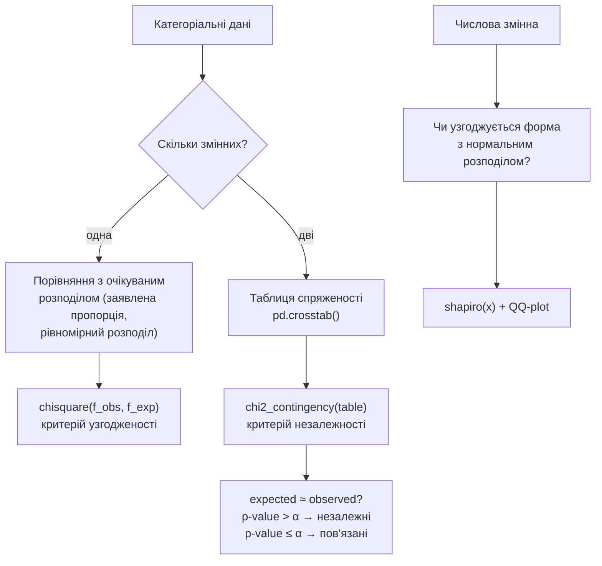

# Лекція 15. Критерії узгодженості й перевірка нормальності

*Лекція 13 ввела загальну логіку перевірки статистичних гіпотез (H0, H1,
p-value, рівень значущості α), а Лекція 14 застосувала цю логіку до
числових даних: t-критерій перевіряє гіпотези про середні. Ця лекція —
та сама логіка, застосована до **категоріальних** даних: чи узгоджується
спостережений розподіл частот за категоріями з очікуваним, і чи
пов'язані між собою дві категоріальні змінні. Статистика тут інша
(хі-квадрат замість t), і дані інші (частоти замість чисел), але
питання, яке задає H0, і спосіб ухвалення рішення через p-value —
абсолютно ті самі, що в Лекціях 13–14. Насамкінець лекція повертається
до числових даних з іншого боку: як формально перевірити, чи вибірка
узгоджується з нормальним розподілом, — те, що в Лекції 10 робилося
лише "на око" за гістограмою.*

## Дві задачі під однією назвою

"Критерій узгодженості" (goodness-of-fit) — загальна назва для тестів,
які перевіряють, наскільки добре спостережені дані узгоджуються з
певною очікуваною моделлю. У цій лекції розглядаються дві конкретні
задачі з однаковою механікою підрахунку, але різним змістовним
питанням:

1. **Хі-квадрат критерій узгодженості** — чи відповідає розподіл **однієї**
   категоріальної змінної заявленому (очікуваному) розподілу. Наприклад:
   чи випадає кожна грань грального кубика приблизно однаково часто, чи
   структура відповідей у опитуванні відповідає заявленій пропорції
   "40% / 35% / 25%".
2. **Хі-квадрат критерій незалежності** — чи пов'язані між собою **дві**
   категоріальні змінні, чи вони незалежні. Наприклад: чи залежить
   вибір способу оплати від міста, чи залежить результат A/B-тесту
   (купив / не купив) від того, яку версію сторінки бачив користувач.

Обидві задачі використовують ту саму статистику й ту саму таблицю
розподілу для перевірки, тож зручно розібрати механіку спершу на
простішій — першій — задачі, а потім перенести її на таблицю
спряженості.

## Статистика хі-квадрат: механіка й чому саме так

**Механіка.** Для кожної категорії рахується спостережена частота `O`
(observed — скільки насправді трапилось) і очікувана частота `E`
(expected — скільки мало би трапитись, якби H0 була точно правильна).
Статистика хі-квадрат — сума за всіма категоріями:

```
χ² = Σ (O - E)² / E
```

Приклад: кубик кидають 60 разів, і якщо він чесний, кожна грань має
випасти рівно `60 / 6 = 10` разів (E = 10 для кожної з шести категорій).
Спостережено: 8, 12, 9, 15, 7, 9.

```python
observed = [8, 12, 9, 15, 7, 9]
expected = [10, 10, 10, 10, 10, 10]

chi2 = sum((o - e) ** 2 / e for o, e in zip(observed, expected))
print(chi2)   # (8-10)²/10 + (12-10)²/10 + ... = 4.8
```

**Чому саме квадрат відхилення і саме ділення на очікуване** — це не
довільний вибір, а пряме продовження логіки дисперсії з Лекції 6.
Квадрат відхилення `(O - E)²` там прибирав знаки (щоб відхилення "+3" і
"-3" не скасовували одне одного в сумі) і водночас підсилював вагу
великих розбіжностей — грань, що відхилилась від очікуваного вдвічі
сильніше за іншу, впливає на суму вчетверо сильніше. Ділення на `E` тут
робить те, що в дисперсії робило ділення на кількість спостережень:
**нормалізує** відхилення відносно масштабу категорії. Відхилення "+5"
для категорії з очікуваними 1000 спостережень — дрібниця (0.5% від
очікуваного); те саме відхилення "+5" для категорії з очікуваними 10
спостереженнями — це категорія вдвічі перевищила очікування. Без
ділення на `E` обидва відхилення дали б однаковий внесок у суму, хоча
змістовно вони абсолютно нерівноцінні; ділення на `E` виправляє це,
зважуючи кожне абсолютне відхилення відносно того, наскільки великим
воно є **порівняно з базовим рівнем цієї категорії**.

**Чому χ² загалом велике означає "не узгоджується".** Якщо H0 правильна
й спостережені частоти — просто випадкове коливання навколо очікуваних
(як у прикладі з кубиком: жодна грань не випала рівно 10 разів, але всі
близько), χ² виходить невеликим числом. Якщо ж розбіжності систематичні
й великі (наприклад, одна грань випала 40 разів із 60), χ² стає великим.
Розподіл статистики χ² під H0 відомий (це саме розподіл "хі-квадрат", що
дав назву критерію), і `scipy` за значенням χ² та кількістю категорій
одразу повертає p-value — точно за тією логікою з Лекції 13: мале
p-value означає, що спостережена розбіжність настільки велика, що при
істинній H0 вона була б малоймовірною випадковістю, і H0 відхиляється.

```python
from scipy.stats import chisquare

result = chisquare(f_obs=observed, f_exp=expected)
print(result.statistic, result.pvalue)
# statistic ≈ 4.8, pvalue ≈ 0.44

# при α = 0.05: pvalue (0.44) > α, підстав відхилити H0 немає —
# розбіжність узгоджується з чесним кубиком і випадковим коливанням
```

**Де корисно.** Маркетингове дослідження заявляє, що клієнти діляться
на сегменти в пропорції 50% / 30% / 20% — новий опитаний зразок дає
дещо іншу пропорцію; критерій узгодженості відповідає, чи це відхилення
в межах випадкового шуму, чи справжня зміна структури. Так само —
перевірка, чи розподіл відповідей у формі "рейтинг 1–5" відповідає
заявленому дизайну шкали, чи виробничий процес випускає бракований
товар у заявленій частці категорій дефектів.

## Хі-квадрат критерій незалежності: пряма відповідь на обіцянку з Лекції 7

Лекція 7 ввела `pd.crosstab()` — функцію, що рахує частоту кожної
комбінації значень двох категоріальних змінних у **таблицю спряженості**
(contingency table), і прямо пообіцяла: саме така таблиця стане вхідними
даними для критерію хі-квадрат у цій лекції. Ось цей момент.

**Механіка.** Нехай є таблиця спряженості "місто × спосіб оплати":

```python
import pandas as pd

orders = pd.DataFrame({
    "місто":          ["Київ"]*50 + ["Львів"]*50,
    "спосіб_оплати":  (["картка"]*35 + ["готівка"]*15) + (["картка"]*20 + ["готівка"]*30),
})

table = pd.crosstab(orders["місто"], orders["спосіб_оплати"])
print(table)
#          готівка  картка
# місто
# Київ          15      35
# Львів         30      20
```

H0 для цього тесту — "місто і спосіб оплати незалежні" (у точному сенсі
Лекції 9: `P(A ∩ B) = P(A) · P(B)`). Тест рахує ту саму статистику χ², що
й вище, але тепер `O` — це фактичні клітинки таблиці спряженості, а `E`
— очікувані частоти клітинок **за умови, що H0 (незалежність) правильна**.

**Як рахується очікувана частота клітинки й чому саме так.** Для
клітинки (Київ, картка) очікувана частота під H0 —

```
E = (сума рядка "Київ") × (сума стовпця "картка") / (загальна сума)
```

Механіка цієї формули напряму випливає з визначення незалежності подій
із Лекції 9. Якщо доля клієнтів, що платять карткою, серед **усіх**
клієнтів — це `P(картка) = (сума стовпця "картка") / (загальна сума)`,
то за незалежності ця сама доля має зберігатись **всередині кожного
міста окремо** — незалежність і означає, що знання міста нічого не
змінює щодо ймовірності способу оплати. Тож очікувана кількість клієнтів
із Києва, що платять карткою, — це просто "скільки клієнтів у Києві" ×
"яка частка карткою платить загалом":

```
E(Київ, картка) = (сума рядка "Київ") × P(картка)
                = (сума рядка "Київ") × (сума стовпця "картка") / (загальна сума)
```

Це та ж формула `P(A ∩ B) = P(A) · P(B)`, лише переписана в частотах, а
не в частках, — і саме тому ця формула, а не будь-яка інша, коректна
під припущенням незалежності. Якщо фактичні `O` в таблиці систематично
відрізняються від цих `E`, це означає, що частка способу оплати **не**
однакова для різних міст — тобто змінні пов'язані, а не незалежні.

```python
from scipy.stats import chi2_contingency

chi2, pvalue, dof, expected = chi2_contingency(table)
print(chi2, pvalue)
print(expected)
#          готівка  картка
# Київ        22.5    27.5
# Львів       22.5    27.5
```

Зверніть увагу: `chi2_contingency()` повертає **чотири** значення, і
`expected` — четверте — це саме та таблиця очікуваних частот, обчислена
за формулою вище. Це не побічна деталь: порівняння фактичної таблиці
`table` з поверненою `expected` — найкращий спосіб побачити **напрямок**
зв'язку, а не тільки факт його наявності. У прикладі вище Київ фактично
дав 35 карткових платежів проти очікуваних 27.5 — тобто в Києві карткою
платять помітно частіше, ніж середня частка по обох містах, а це і є
зміст "місто й спосіб оплати не незалежні".

**Прямий зв'язок із Лекцією 9.** Там був сформульований принцип: "незалежність
— це властивість, яку потрібно обґрунтувати чи перевірити, а не
припускати заради простоти розрахунку" — і прямо вказано, що перевірка
незалежності на реальних даних розглядатиметься критерієм хі-квадрат
саме тут. Лекція 9 наводила приклад "дощ і хмарність" як залежні події,
встановлені логічно; критерій незалежності хі-квадрат — інструмент для
випадків, коли залежність чи незалежність не очевидна з міркувань, а
потребує перевірки на конкретній вибірці даних: чи справді результат
A/B-тесту (купив/не купив) залежить від варіанту сторінки, чи це лише
випадкове коливання в межах однієї й тієї самої, насправді однакової
для обох варіантів, конверсії.

**Де корисно.** Таблиця спряженості "варіант сторінки × купив/не купив"
у A/B-тестуванні — це саме та ситуація, де перевірка незалежності
відповідає на головне бізнес-питання експерименту. "Сегмент клієнта ×
обраний тарифний план", "регіон × скарга на певний тип дефекту" — будь-яка
пара категоріальних змінних, де потрібно формально відповісти на
питання "чи є тут зв'язок, чи це лише шум вибірки", а не просто
подивитись на таблицю й здогадуватись.



## Умови застосовності: чому потрібні достатньо великі очікувані частоти

**Механіка.** Формула `χ² = Σ (O - E)² / E` спирається на те, що
розподіл статистики χ² під H0 добре наближається відомим теоретичним
розподілом хі-квадрат. Це наближення надійне, коли очікувана частота `E`
в кожній клітинці (чи категорії) достатньо велика — прийняте практичне
правило: **E ≥ 5** у кожній клітинці. Якщо, наприклад, у таблиці
спряженості одна з категорій дуже рідкісна (скажімо, "оплата
криптовалютою" — усього 3 випадки з 500), очікувана частота для цієї
категорії може вийти суттєво меншою за 5, і тест стає ненадійним:
p-value, який він повертає, може систематично не відповідати справжній
ймовірності помилки.

**Чому саме дрібні очікувані частоти — проблема, а не дрібні
спостережені.** Наближення хі-квадрат-розподілу — асимптотичне: воно
стає точним при достатньо великих числах, так само як і багато інших
статистичних результатів курсу (нагадаємо логіку закону великих чисел,
Лекція 11). Коли `E` мале, дискретність можливих значень `O` (ціле
число: 0, 1, 2, ...) стає відносно грубою порівняно з `E`, і сума
`Σ (O-E)²/E` погано апроксимується неперервним розподілом хі-квадрат —
особливо чутливо це для однієї клітинки з дуже малим `E`.

**Що робити, якщо умова порушена.**

- **Об'єднати категорії.** Рідкісні категорії (наприклад, кілька
  нечастих способів оплати) об'єднати в одну збірну категорію "інше" —
  це піднімає її очікувану частоту вище порогу за рахунок втрати
  деталізації, яка й так статистично ненадійна при малих числах.
- **Критерій Фішера (Fisher's exact test).** Для таблиць спряженості
  2×2 з малими частотами існує точний тест — `scipy.stats.fisher_exact`
  — який не спирається на асимптотичне наближення хі-квадрат-розподілу
  взагалі, а рахує точну ймовірність напряму. У цьому курсі достатньо
  знати, що такий інструмент існує саме для випадку малих очікуваних
  частот у таблиці 2×2 — детальний розгляд механіки лишається поза
  межами цієї лекції.

## Перевірка нормальності: формалізація "погляду на гістограму"

Лекція 10 у "Типових помилках" попереджала: перш ніж підбирати параметри
нормального розподілу під реальні дані, варто подивитись на гістограму —
помітно скошений розподіл чи розподіл із двома скупченнями нормальною
моделлю описується погано. Це працює, але суб'єктивно: різні люди
по-різному оцінять "виглядає достатньо дзвоноподібно" на межі. Ця
секція дає формальний, відтворюваний спосіб відповісти на те саме
питання.

**Навіщо взагалі перевіряти нормальність.** Параметричні критерії
Лекції 14 (t-критерій) і багато інших статистичних методів курсу
спираються на припущення, що дані (чи, точніше, похибки чи середні)
розподілені приблизно нормально. Це припущення — не формальність для
галочки: якщо реальний розподіл сильно скошений чи має важкі хвости,
висновки t-критерію (довірчі інтервали, p-value) можуть бути
систематично неточними. Перевірка нормальності — це перевірка, чи
взагалі доречно застосовувати інструмент, побудований під це
припущення.

**Критерій Шапіро-Вілка.** Формальний тест, чия H0 — "дані походять із
нормального розподілу":

```python
from scipy.stats import shapiro

data = [23.1, 24.5, 22.8, 25.0, 23.9, 24.1, 22.5, 26.3, 23.6, 24.8]
stat, pvalue = shapiro(data)
print(stat, pvalue)

# при α = 0.05: якщо pvalue > 0.05 — підстав відхилити нормальність немає
# якщо pvalue ≤ 0.05 — форма даних значуще відхиляється від нормальної
```

Механіка самого критерію Шапіро-Вілка складніша за просту суму
квадратів (вона порівнює впорядковані спостереження з очікуваними
позиціями за нормальним розподілом), і в цьому курсі достатньо знати
логіку входу й виходу: H0 = "нормальний розподіл", p-value за тією ж
логікою Лекції 13, а не відтворювати формулу вручну.

**QQ-plot — візуальний двійник того самого питання.** Quantile-Quantile
графік відкладає квантилі вибірки проти квантилів теоретичного
нормального розподілу (та сама квантильна функція з Лекції 10): якщо
дані справді нормальні, точки лягають приблизно на пряму лінію;
систематичне відхилення від прямої (вигин на кінцях, S-подібна форма)
показує саме той тип відхилення від нормальності (скошеність, важкі
хвости), який числовий p-value не деталізує.

```python
import matplotlib.pyplot as plt
from scipy import stats

fig, ax = plt.subplots()
stats.probplot(data, dist="norm", plot=ax)
ax.set_title("QQ-plot: перевірка нормальності")
```

**Чому потрібні обидва — і тест, і графік.** Критерій Шапіро-Вілка дає
однозначну відповідь "так/ні" з конкретним p-value, але не показує **як
саме** дані відхиляються від нормальності. QQ-plot показує форму
відхилення наочно, але не дає формального порогу для рішення. Разом
вони повторюють ту саму пару "неформальна перевірка на гістограмі
(Лекція 10) + формальний тест", тільки тепер обидва інструменти точні:
графік показує форму відхилення, тест дає число, на основі якого можна
ухвалити рішення без суб'єктивної оцінки "на око".

**Де корисно.** Перед t-критерієм для малої вибірки (Лекція 14) —
переконатись, що припущення про нормальність похибок хоча б наближено
виконане. Перед побудовою довірчого інтервалу для середнього при малому
n (Лекція 12) — та ж перевірка. У контролі якості — переконатись, що
вимірювана характеристика деталі (діаметр, вага) справді розподілена
нормально, перш ніж застосовувати правило 68-95-99.7 (Лекція 10) для
визначення межі браку.

## Типові помилки

**Застосування хі-квадрат критерію узгодженості до чисел, а не частот.**
`chisquare()` очікує на вході **кількість спостережень у кожній
категорії**, а не самі значення змінної. Плутанина трапляється, коли
студент передає у `f_obs` сирі виміряні числа замість того, щоб спершу
згрупувати їх у категорії й порахувати частоти (наприклад, через
`value_counts()`).

**Ігнорування умови E ≥ 5.** Запуск `chi2_contingency()` на таблиці з
кількома клітинками, де очікувана частота — 1–2, і трактування
отриманого p-value так само впевнено, як при великих частотах. Перед
інтерпретацією результату варто явно перевірити повернуту матрицю
`expected`, а не тільки p-value.

**"p-value > α" читають як доказ незалежності, а не як "немає підстав
відхилити".** Це загальна пастка перевірки гіпотез з Лекції 13, яка
особливо часто трапляється саме тут: велике p-value в тесті на
незалежність не доводить, що змінні незалежні — воно лише означає, що
наявних даних недостатньо, щоб виявити зв'язок, якщо він є. Малий обсяг
вибірки й слабкий, але реальний, зв'язок часто дають саме такий
результат.

## Підсумок

- Хі-квадрат критерій узгодженості перевіряє, чи розподіл однієї
  категоріальної змінної відповідає заявленому (очікуваному) розподілу;
  статистика `Σ (O-E)²/E` — та ж логіка, що дисперсія з Лекції 6:
  квадрат прибирає знаки й підсилює великі відхилення, ділення на `E`
  нормалізує відхилення відносно масштабу категорії.
- Хі-квадрат критерій незалежності перевіряє H0 "дві категоріальні
  змінні незалежні" на таблиці спряженості, побудованій `pd.crosstab()`
  (Лекція 7); очікувані частоти клітинок обчислюються за формулою
  `рядок × стовпець / загальна сума` — прямим наслідком визначення
  незалежності подій `P(A∩B) = P(A)·P(B)` з Лекції 9.
- `chi2_contingency()` повертає й статистику з p-value, і таблицю
  очікуваних частот — порівняння `observed` з `expected` показує не
  тільки факт, а й напрямок зв'язку.
- Умова застосовності — очікувана частота кожної клітинки ≥ 5; при
  порушенні — об'єднати рідкісні категорії або застосувати точний тест
  Фішера для таблиць 2×2.
- Критерій Шапіро-Вілка (`scipy.stats.shapiro`) формально перевіряє H0
  "дані нормально розподілені"; QQ-plot — візуальний двійник того самого
  питання, що показує форму відхилення. Разом вони формалізують те, що
  Лекція 10 радила робити "на око" за гістограмою.

**Практика до цієї лекції:** [Практика 15. Критерії узгодженості й таблиці спряженості: критерій хі-квадрат](../practice/15-chi-square.md)
