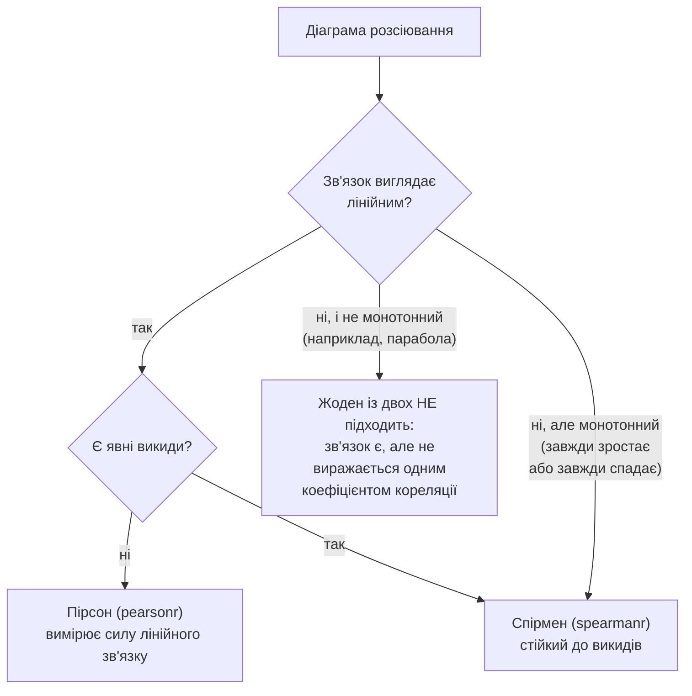
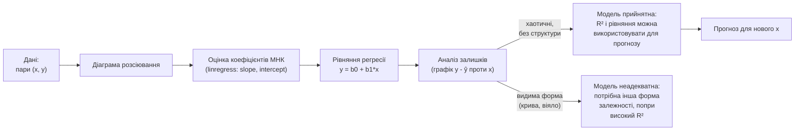

# Лекція 16. Кореляційний аналіз: Пірсон, Спірмен і обмеження застосування

*Лекція 15 навчила перевіряти зв'язок між двома **категоріальними**
змінними: таблиця спряженості й критерій хі-квадрат відповідають на
питання "чи пов'язані місто і спосіб оплати" через порівняння
спостережених і очікуваних частот. Ця лекція ставить те саме питання
про зв'язок — але для **числових** змінних, де порівняння частот
комбінацій уже не працює: значень занадто багато й кожне унікальне,
тож зв'язок потрібно виміряти одним числом, що відображає і напрямок,
і силу. Лекція 6 вже намалювала діаграму розсіювання годин підготовки
й балу за тест (`ax.scatter(hours, test_scores)`), але лише як
ілюстрацію двовимірних даних — тут з'являється число, яке формалізує
те, що на тому графіку видно на око, і, що не менш важливо, формальні
застереження щодо того, коли цьому числу не варто вірити. Друга
половина заняття йде на крок далі: якщо зв'язок є, яке точне рівняння
його описує і як за одним значенням X передбачити Y — метод
найменших квадратів, той самий принцип "піднести відхилення до
квадрата, щоб прибрати знаки й покарати великі помилки", що вже
працював у дисперсії (Лекція 6) і статистиці хі-квадрат (Лекція 15),
застосований тепер не до перевірки гіпотези, а до побудови рівняння.*

## Частина 1. Кореляційний аналіз

### Діаграма розсіювання: перший крок перед будь-яким числом

**Механіка.** Діаграма розсіювання (scatter plot) відкладає кожне
спостереження як точку в координатах (x, y) — одна вісь на одну
змінну. Це найпростіший і водночас найважливіший інструмент перед
обчисленням будь-якого коефіцієнта кореляції: форма хмари точок одразу
підказує, чи зв'язок лінійний, чи вигнутий, чи його взагалі немає, чи
є окремі точки, що випадають із загальної картини.

```python
import matplotlib.pyplot as plt

hours = [1, 2, 2, 3, 4, 4, 5, 6, 7, 8]                  # години підготовки
test_scores = [52, 58, 61, 65, 70, 74, 78, 82, 88, 91]  # бал за тест

fig, ax = plt.subplots()
ax.scatter(hours, test_scores)
ax.set_xlabel("Години підготовки")
ax.set_ylabel("Бал за тест (з 100)")
ax.set_title("Результат тесту залежно від часу підготовки")
```

Цей самий код і цей самий набір уже з'являлися в Лекції 6 як приклад
`ax.scatter()` — тоді йшлося тільки про синтаксис Matplotlib. Тепер той
самий графік читається змістовно: точки лягають майже на пряму лінію,
що піднімається зліва вправо — явний позитивний, приблизно лінійний
зв'язок. Саме це "майже на пряму лінію" зараз перетвориться на
конкретне число.

!!! note "Чому погляд на графік не можна пропускати: квартет Ансткомба"
    У 1973 році статистик Френсіс Ансткомб побудував чотири зовсім
    різні за формою набори даних (лінійний зв'язок, чітко вигнута
    крива, ідеальна пряма з одним викидом, що її ламає, і хмара без
    жодного зв'язку крім одного викиду), для яких коефіцієнт кореляції
    Пірсона, середні, дисперсії — усі до другого знаку **однакові**.
    Це навмисно сконструйований, але дуже наочний застережний приклад:
    те саме число `r` може стояти під чотирма геть різними картинками,
    і лише погляд на діаграму розсіювання відрізняє "справді лінійний
    зв'язок" від "число, яке формально обчислилось, але нічого
    змістовного не описує".

### Коефіцієнт кореляції Пірсона: механіка

**Механіка.** Коефіцієнт кореляції Пірсона `r` вимірює, наскільки
узгоджено дві змінні відхиляються від своїх середніх. Спочатку
потрібна **коваріація** — пряме узагальнення дисперсії (Лекція 6) на
пару змінних: замість добутку відхилення значення на само себе
`(x - x̄)²`, тут береться добуток відхилень **двох** змінних
`(x - x̄)(y - ȳ)`, усереднений за всіма спостереженнями:

```
cov(x, y) = Σ (xᵢ - x̄)(yᵢ - ȳ) / (n - 1)
```

Якщо `x` і `y` зростають узгоджено (коли `x` вище середнього, `y`
теж вище середнього), добутки `(x-x̄)(y-ȳ)` здебільшого додатні, і
коваріація виходить додатною. Якщо один зростає, коли інший
спадає — добутки здебільшого від'ємні, коваріація від'ємна. Якщо
відхилення не узгоджені взагалі (додатні й від'ємні добутки
трапляються майже однаково часто) — вони скасовують одне одного в
сумі, і коваріація близька до нуля.

Проблема коваріації — вона має одиниці вимірювання, добуток одиниць
`x` і `y` (наприклад, "години × бали"), і її абсолютна величина
залежить від масштабу обох змінних, а не тільки від сили зв'язку.
Коефіцієнт кореляції Пірсона прибирає цю залежність, поділивши
коваріацію на добуток стандартних відхилень обох змінних:

```
r = cov(x, y) / (sx · sy)
```

Це той самий прийом нормування, що коефіцієнт варіації (Лекція 6)
застосовував до одної змінної (`std / mean`, щоб прибрати одиниці
вимірювання) — тут нормується коваріація двох змінних відносно їхніх
власних розкидів, і результат — завжди число в діапазоні **[-1; 1]**,
незалежне від того, в яких одиницях вимірювались `x` і `y`.

```python
import numpy as np

hours = np.array([1, 2, 2, 3, 4, 4, 5, 6, 7, 8])
scores = np.array([52, 58, 61, 65, 70, 74, 78, 82, 88, 91])

cov = np.mean((hours - hours.mean()) * (scores - scores.mean())) * len(hours) / (len(hours) - 1)
r_manual = cov / (hours.std(ddof=1) * scores.std(ddof=1))
print(r_manual)   # 0.991
```

**Сучасний scipy: результат-об'єкт, а не лише пара чисел.** Ручний
розрахунок вище — щоб побачити механіку; на практиці кореляцію рахує
`scipy.stats.pearsonr`, який повертає об'єкт результату з іменованими
атрибутами `.statistic` і `.pvalue` (а не лише кортеж, який доводиться
розпаковувати за позицією):

```python
from scipy.stats import pearsonr

result = pearsonr(hours, scores)
print(result.statistic, result.pvalue)
# statistic ≈ 0.991, pvalue ≈ 2.7e-08

ci = result.confidence_interval(confidence_level=0.95)
print(ci.low, ci.high)
# приблизно (0.962, 0.998) -- довірчий інтервал для істинного r
```

`result.pvalue` — це p-value того самого сорту, що в Лекції 13: H0 тут
— "справжня кореляція в генеральній сукупності дорівнює нулю", і мале
p-value (як тут, ≈ 2.7·10⁻⁸) означає, що спостережений зв'язок майже
напевно не є випадковим шумом на такій вибірці. `.confidence_interval()`
(метод, доступний з SciPy 1.9) дає діапазон значень істинного `r`,
сумісних із цими даними — та ж логіка довірчого інтервалу з Лекції 12,
застосована тепер до коефіцієнта кореляції, а не до середнього.

**Чому саме такий діапазон і такий знак.** `r = 1` означає ідеальний
позитивний лінійний зв'язок (усі точки лежать точно на прямій із
позитивним нахилом); `r = -1` — ідеальний негативний; `r = 0` — жодного
**лінійного** узгодження (це застереження — ключове, і розкривається
детально нижче). Значення `r = 0.99`, як у прикладі з годинами
підготовки, означає дуже сильний, майже ідеальний лінійний зв'язок;
`r = 0.3` означало б слабкий, але не нульовий лінійний зв'язок.

**Де корисно.** Перша перевірка практично будь-якої пари числових
змінних у розвідувальному аналізі: чи зростає зарплата з досвідом
роботи, чи пов'язана витрата на рекламу з обсягом продажів, чи корелює
температура повітря з витратами на опалення. Коефіцієнт Пірсона — це
швидкий, стандартний перший крок, після якого вирішують, чи варто
будувати регресійну модель (частина 2 цієї ж лекції).

### Чотири обмеження застосування коефіцієнта Пірсона

Число `r` легко обчислити одним викликом функції — і саме тому з ним
пов'язано найбільше практичних помилок інтерпретації. Чотири
обмеження нижче — не рідкісні винятки, а типові пастки, у які варто
свідомо не потрапити щоразу, коли `r` обчислюється на нових даних.

**1. Пірсон виявляє лише лінійний зв'язок.** Це пряме продовження
механіки формули: `r` рахує, наскільки добре пряма лінія описує
залежність. Якщо реальний зв'язок — чітка, детермінована, але
**нелінійна** крива, `r` може вийти близьким до нуля, хоча зв'язок
насправді сильний і навіть точний.

```python
import numpy as np
from scipy.stats import pearsonr, spearmanr

x = np.arange(-10, 11)     # -10, -9, ..., 10
y = x ** 2                  # ідеальна, повністю детермінована парабола

r = pearsonr(x, y)
rho = spearmanr(x, y)
print(r.statistic, rho.statistic)
# r.statistic ≈ 0.0    -- Пірсон "не бачить" зв'язку взагалі
# rho.statistic ≈ 0.0  -- і Спірмен теж (детально нижче -- чому)
```

`y` тут визначається `x` абсолютно точно (це не шум, а формула!), але
`r ≈ 0`, бо парабола симетрична: для кожного `x` зі значенням `y`
вище середнього при зростанні `x` є симетричний `x` з тим самим `y`,
але при **спадному** напрямку — додатні й від'ємні внески в чисельник
формули `r` скасовують один одного. Висновок "зв'язку немає" за
`r ≈ 0` тут був би прямо неправильним: діаграма розсіювання (перший
крок цього розділу!) миттєво показала б чітку параболу, яку число `r`
приховало.

**2. Пірсон чутливий до викидів.** Формула `r` побудована на сумах
добутків відхилень — точно як дисперсія (Лекція 6), вона підсилює
вплив далеких від середнього точок через сам механізм множення великих
відхилень.

```python
x = np.array([1, 2, 3, 4, 5, 6, 7, 8, 9, 10])
y = np.array([2, 4, 5, 8, 9, 12, 13, 16, 18, 20])

print(pearsonr(x, y).statistic)   # ≈ 0.997 -- майже ідеальний лінійний зв'язок

x_out = np.append(x, 11)
y_out = np.append(y, 200)          # один аномальний випадок
print(pearsonr(x_out, y_out).statistic)   # ≈ 0.585 -- одне значення обвалило r
```

Одне-єдине аномальне спостереження зі 11 знизило `r` з 0.997 до 0.585
— не тому, що зв'язок насправді слабший, а тому, що формула `r`
буквально зважує внесок кожної точки квадратом (а тут — добутком)
відхилення від середнього, і викид домінує в цій сумі. Перед тим, як
довіряти обчисленому `r`, варто перевірити діаграму розсіювання на
наявність точок, що явно випадають (за критерієм IQR з Лекції 4).

**3. Кореляція не означає причинність.** Навіть сильний і стабільний
`r` не доводить, що одна змінна впливає на іншу — обидві можуть бути
наслідком третьої, спільної причини (конфаундера). Класичний приклад:

```python
np.random.seed(21)
n = 30
temperature = np.random.uniform(15, 35, n)     # °C -- справжня спільна причина
ice_cream = 20 + 3.5 * temperature + np.random.normal(0, 15, n)
drownings = 1 + 0.35 * temperature + np.random.normal(0, 2, n)
drownings = np.clip(drownings, 0, None)

print(pearsonr(ice_cream, drownings).statistic)    # ≈ 0.62, p < 0.001 -- статистично значущо!
print(pearsonr(temperature, ice_cream).statistic)   # ≈ 0.81
print(pearsonr(temperature, drownings).statistic)   # ≈ 0.76
```

Продажі мороженого й кількість випадків утоплення корелюють на рівні
`r ≈ 0.62` зі статистично значущим p-value — але мороженим ніхто не
топить нікого. Обидві змінні окремо сильно корелюють із температурою
повітря (`r ≈ 0.81` і `r ≈ 0.76`): у спекотні дні більше людей купує
мороженко **і** більше людей купається (а отже й більше нещасних
випадків на воді) — температура тут і є справжня спільна причина
(конфаундер), а зв'язок між морозивом і утопленнями — побічний,
"пасажирський" наслідок того, що обидва пов'язані з тим самим третім
фактором. Правило, яке варто застосовувати щоразу: побачивши сильну
кореляцію, спитати "чи є третя змінна, яка правдоподібно впливає на
обидві?", перш ніж робити висновок про вплив однієї змінної на іншу.

**4. Пірсон вимагає даних бодай приблизно інтервальної/неперервної
шкали.** Формула `r` рахує середні, відхилення від середнього й добутки
цих відхилень — усі ці операції змістовні лише тоді, коли різниця між
значеннями означає щось стабільне (Лекція 3: інтервальна чи
відносна шкала). Якщо змінна — це номер категорії, закодований числом
(наприклад, "рівень задоволеності" опитаних записаний як 1, 2, 3 без
гарантії, що відстань між "1" і "2" психологічно та сама, що між "3" і
"4"), формальне обчислення `r` дасть число, але його інтерпретація як
"сили лінійного зв'язку" буде некоректною — саме для таких порядкових
(ординальних) даних призначений коефіцієнт Спірмена нижче.

### Коефіцієнт кореляції Спірмена: механіка

**Механіка.** Коефіцієнт кореляції Спірмена рахує **той самий**
коефіцієнт Пірсона, але не на самих значеннях `x` і `y`, а на їхніх
**рангах** — порядкових номерах, які отримає кожне значення, якщо
вибірку впорядкувати від найменшого до найбільшого (найменше значення
отримує ранг 1, наступне — ранг 2, і так далі).

```python
import pandas as pd

x = pd.Series([15, 8, 42, 4, 23])
print(x.rank())
# 0    3.0
# 1    2.0
# 2    5.0
# 3    1.0
# 4    4.0
```

**Чому заміна значень на ранги робить коефіцієнт стійким до викидів і
здатним вловлювати монотонні нелінійні зв'язки.** Ранг фіксує лише
**порядок**, а не саму величину значення: чи буде найбільше
спостереження рівним 100 чи 100 000, воно однаково отримає найбільший
ранг і жодного більше впливу на суму, ніж будь-яке інше "найбільше"
значення. Саме тому один екстремальний викид (Обмеження 2 вище) для
Спірмена не катастрофічний — він просто стає ще одним "найбільшим"
рангом, а не значенням, що бере в квадрат непропорційно велике
відхилення. А оскільки ранг зростає монотонно разом зі значенням для
будь-якої монотонної залежності (не обов'язково лінійної — досить,
щоб `y` завжди зростав чи завжди спадав разом з `x`), Спірмен здатний
виявити й такий, нелінійний, але монотонний зв'язок, який Пірсон
недооцінює.

```python
from scipy.stats import pearsonr, spearmanr

wait_minutes = np.array([1, 2, 3, 5, 8, 12, 18, 25, 35, 50])
satisfaction = 100 / (1 + wait_minutes)     # монотонно спадає, але не лінійно

r = pearsonr(wait_minutes, satisfaction)
rho = spearmanr(wait_minutes, satisfaction)
print(r.statistic, rho.statistic)
# r.statistic   ≈ -0.71  -- Пірсон недооцінює: крива не пряма лінія
# rho.statistic ≈ -1.00  -- Спірмен бачить ідеальну монотонність
```

Задоволеність клієнта спадає з часом очікування за кривою з "насиченням"
(перші хвилини очікування дратують сильніше, ніж різниця між 35-ю і
50-ю хвилиною) — не по прямій лінії. Пірсон, вимірюючи саме лінійність,
дає лише `-0.71`; Спірмен, вимірюючи монотонність, коректно показує
`-1.00` — цей зв'язок ідеально монотонний (більше очікування завжди дає
не вищу задоволеність), навіть якщо він і не лінійний.

`scipy.stats.spearmanr` рахує це саме, повертаючи той самий сучасний
результат-об'єкт:

```python
result = spearmanr(wait_minutes, satisfaction)
print(result.statistic, result.pvalue)
# statistic ≈ -1.0, pvalue дуже мале
```

**Де корисно.** Порядкові (ординальні) шкали — рейтинги задоволеності
1–5, місце в турнірній таблиці, рівень освіти за категоріями "середня
/ бакалавр / магістр / докторський ступінь", закодований числами
умовно; ситуації, де діаграма розсіювання показує чіткий, але вигнутий
монотонний зв'язок; вибірки з підозрою на викиди, де хочеться
відповіді, стійкої до одного аномального спостереження.

### Коли Пірсон, коли Спірмен, коли жоден



Останній варіант діаграми — не рідкісний технічний випадок, а прямий
наслідок Обмеження 1: якщо зв'язок є (детермінований чи майже
детермінований), але не монотонний (як парабола `y = x²` вище), ні
Пірсон, ні Спірмен його не покажуть числом, близьким до ±1 — обидва
дадуть значення, близькі до нуля, попри реальний і навіть точний
зв'язок. У такому випадку висновок "змінні незалежні" був би прямою
помилкою — коректний висновок: "лінійного й монотонного зв'язку немає,
але діаграма розсіювання показує інший тип залежності, який потребує
іншого інструменту (наприклад, нелінійної регресії, коротко згаданої в
Лекції 17)".

### Кореляційна матриця для кількох змінних одночасно

**Механіка.** Коли числових змінних більше двох, `pandas` рахує всі
попарні коефіцієнти кореляції одним викликом `.corr()` — результат
квадратна таблиця, симетрична (кореляція `x` з `y` та сама, що `y` з
`x`), з одиницями на діагоналі (кореляція змінної із самою собою
завжди 1):

```python
sleep = np.array([7.5, 7.2, 6.8, 7.0, 6.5, 6.0, 6.2, 5.8, 6.0, 5.5])  # годин сну

df = pd.DataFrame({
    "години_підготовки": hours,
    "сон_годин": sleep,
    "бал_за_тест": scores,
})
print(df.corr().round(2))
#                     години_підготовки  сон_годин  бал_за_тест
# години_підготовки                1.00      -0.93         0.99
# сон_годин                       -0.93       1.00        -0.95
# бал_за_тест                      0.99      -0.95         1.00
```

За замовчуванням `.corr()` рахує саме коефіцієнт Пірсона; параметр
`method="spearman"` перемикає всю матрицю на ранговий варіант одним
аргументом, без переписування коду для кожної пари окремо.

**Чому корисно бачити всі пари одразу, а не по одній.** Матриця
відкриває структуру зв'язків, яку легко пропустити, дивлячись на пари
по одній: тут студенти, що готуються більше годин, водночас сплять
менше (`r ≈ -0.93`) — і обидві змінні пов'язані з балом за тест.
**Важливе застереження, що прямо веде до Лекції 17–18:** матриця
показує лише **попарні** зв'язки — вона не каже, чи вплив
"годин підготовки" на бал лишається таким же значущим, якщо
одночасно врахувати "сон". Розділити внесок кількох предикторів, що
самі пов'язані між собою, — саме задача множинної регресії, а не
кореляційної матриці.

**Де корисно.** Розвідувальний аналіз нового набору даних із
десятками числових стовпців: перш ніж будувати будь-яку модель,
матриця кореляцій одним поглядом показує, які пари змінних варто
дослідити глибше, а які майже не пов'язані взагалі; часто її
показують візуально як теплову карту (`ax.imshow(df.corr())`), де
колір кодує силу й напрямок зв'язку.

## Частина 2. Проста лінійна регресія і метод найменших квадратів

### Від "є зв'язок?" до "яке саме рівняння?"

Коефіцієнт кореляції відповідає на питання "чи пов'язані `x` і `y`, і
наскільки сильно" — але навіть `r = 0.99` не дає жодного конкретного
числа для передбачення: скільки балів очікувати за 6.5 годин
підготовки? Регресія відповідає саме на це: вона підбирає конкретне
рівняння прямої лінії, яке найкраще описує зв'язок, і за цим рівнянням
можна обчислити прогноз для будь-якого нового значення `x`.

### Модель y = b0 + b1·x + ε і метод найменших квадратів

**Механіка.** Проста лінійна регресія описує залежність формулою:

```
y = b0 + b1·x + ε
```

де `b0` — перетин (значення `y`, коли `x = 0`), `b1` — нахил (на
скільки одиниць змінюється `y` при збільшенні `x` на одну одиницю), а
`ε` — залишок (residual), різниця між фактичним `y` і тим, що передбачає
пряма лінія для цього `x`. Жодна пряма лінія не проходить через усі
точки одразу (крім вигаданого ідеального випадку), тож завдання —
підібрати саме ту пряму (тобто саме ті `b0` і `b1`), для якої залишки
загалом найменші.

**Чому саме сума квадратів залишків, а не сума самих залишків чи їхніх
модулів.** Це той самий аргумент, що вже двічі застосовувався в курсі:
сума самих залишків (без квадрата чи модуля) майже завжди близька до
нуля незалежно від якості прямої, бо додатні й від'ємні залишки
скасовують один одного (та сама причина, що в дисперсії, Лекція 6, і в
хі-квадраті, Лекція 15, — потрібно прибрати знаки). Модуль теж прибирає
знаки, але не штрафує великі відхилення сильніше за малі пропорційно;
квадрат — штрафує: залишок удвічі більший за інший вносить у суму
вчетверо більший внесок. Метод, який мінімізує саме суму **квадратів**
залишків, називається **методом найменших квадратів (МНК, ordinary
least squares, OLS)** — і саме ця сума є тим критерієм, за яким з усіх
можливих прямих ліній обирається одна "найкраща".

```
S(b0, b1) = Σ (yᵢ - (b0 + b1·xᵢ))² → мінімум
```

**Формули для b1 і b0.** Розв'язок цієї задачі мінімізації (похідні
`S` за `b0` і `b1`, прирівняні до нуля) дає прямі формули через ту саму
коваріацію й дисперсію, що вже застосовувались для `r`:

```
b1 = cov(x, y) / var(x)
b0 = ȳ - b1 · x̄
```

Нахил `b1` — це коваріація `x` і `y`, нормована не на добуток двох
стандартних відхилень (як у `r`), а лише на розкид самого `x` — тому,
на відміну від `r`, `b1` має одиниці вимірювання ("бали за годину", а
не безрозмірне число в [-1; 1]) і відповідає на змістовне питання "на
скільки одиниць `y` в середньому змінюється при зростанні `x` на одну
одиницю", а не лише "наскільки сильний зв'язок".

```python
import numpy as np

hours = np.array([1, 2, 2, 3, 4, 4, 5, 6, 7, 8])
scores = np.array([52, 58, 61, 65, 70, 74, 78, 82, 88, 91])

cov_xy = np.sum((hours - hours.mean()) * (scores - scores.mean())) / (len(hours) - 1)
var_x = hours.var(ddof=1)

b1 = cov_xy / var_x
b0 = scores.mean() - b1 * hours.mean()
print(b1, b0)   # b1 ≈ 5.61, b0 ≈ 48.32
```

**Сучасний scipy: `linregress`.** На практиці ці коефіцієнти рідко
рахують вручну — `scipy.stats.linregress` повертає одним викликом
результат-об'єкт з іменованими атрибутами `.slope`, `.intercept`,
`.rvalue`, `.pvalue`, `.stderr` і `.intercept_stderr`:

```python
from scipy.stats import linregress

result = linregress(hours, scores)
print(result.slope, result.intercept)
# slope ≈ 5.613, intercept ≈ 48.324

print(result.rvalue, result.rvalue ** 2, result.pvalue)
# rvalue ≈ 0.991, rvalue² ≈ 0.982, pvalue ≈ 2.7e-08

print(result.stderr, result.intercept_stderr)
# стандартні похибки оцінок нахилу й перетину -- ширина невизначеності кожного коефіцієнта
```

Рівняння регресії для цього прикладу: `бал ≈ 48.32 + 5.61 · години`.
Інтерпретація нахилу змістовно: кожна додаткова година підготовки
пов'язана з приростом балу в середньому на ≈5.6 пункти. `.pvalue` тут
— p-value перевірки H0 "b1 = 0" (немає лінійного зв'язку) тією самою
логікою Лекції 13; мале значення означає, що нахил статистично значуще
відрізняється від нуля.

### Коефіцієнт детермінації R²: механіка і зв'язок з r²

**Механіка.** `R²` — частка дисперсії `y`, яку пояснює модель:

```
R² = 1 - SS_залишків / SS_загальна
SS_залишків = Σ (yᵢ - ŷᵢ)²          -- залишкова сума квадратів (те, що НЕ пояснила модель)
SS_загальна  = Σ (yᵢ - ȳ)²          -- загальний розкид y навколо власного середнього
```

Якщо модель передбачає `y` ідеально (усі залишки нульові), `SS_залишків
= 0` і `R² = 1`. Якщо модель не кращa за просте припущення "завжди
передбачати середнє `ȳ`" (найгірший розумний випадок), `SS_залишків ≈
SS_загальна` і `R² ≈ 0`.

```python
predicted = result.intercept + result.slope * hours
ss_res = np.sum((scores - predicted) ** 2)
ss_tot = np.sum((scores - scores.mean()) ** 2)
r_squared = 1 - ss_res / ss_tot
print(r_squared)          # ≈ 0.982
print(result.rvalue ** 2)  # ≈ 0.982 -- те саме число
```

**Чому `R² = r²` саме для простої регресії.** Це не збіг, а математичний
наслідок того, що в моделі з однією-єдиною пояснювальною змінною
`b1` рахується через ту саму коваріацію, що й `r` — квадрат коефіцієнта
кореляції Пірсона й частка поясненої дисперсії виявляються буквально
тим самим числом. (Це рівність спеціально для **простої** регресії з
одним предиктором; щойно предикторів стає кілька — тема Лекції 17 —
`R²` рахується інакше й уже не дорівнює квадрату жодного окремого
парного `r`.)

**Де корисно.** `R² = 0.982` тут означає: 98.2% розкиду балів за тест
пояснюється кількістю годин підготовки (за цією лінійною моделлю);
лише 1.8% розкиду лишається непоясненим (індивідуальні особливості,
складність конкретного тесту того дня тощо). `R²`, наведений без
контексту (наприклад, "модель має R² = 0.4"), незручний для
інтерпретації без порівняння: 0.4 може бути відмінним результатом для
складної, шумної соціальної залежності і посереднім для фізичного
вимірювання з малим шумом — сенс числа залежить від предметної
області.

### Аналіз залишків: чому одного R² недостатньо

**Механіка.** Залишок — це `yᵢ - ŷᵢ`, різниця між фактичним і
передбаченим значенням для кожного спостереження. Графік залишків
(зазвичай залишок на осі Y проти `x` або проти передбаченого `ŷ` на
осі X) — головний діагностичний інструмент простої регресії: якщо
модель обрана правильно (справді лінійна залежність), залишки повинні
розсіюватись **хаотично**, без видимої форми, приблизно однаково по
обидва боки нуля на всьому діапазоні `x`.

**Чому саме графік, а не тільки число R².** Високий `R²` каже "модель
пояснює багато дисперсії", але не каже нічого про **форму** того, що
лишилось непоясненим. Класичний контрприклад — дані зі справжньою
квадратичною залежністю, до яких усе одно підігнана пряма лінія:

```python
np.random.seed(5)
x = np.arange(1, 21)
y = 5 + 2 * x + 0.35 * x ** 2 + np.random.normal(0, 8, size=len(x))

result_bad = linregress(x, y)
print(result_bad.rvalue ** 2)   # R² ≈ 0.923 -- виглядає майже відмінно!

predicted = result_bad.intercept + result_bad.slope * x
residuals = y - predicted
print(np.round(residuals, 1))
# [21.1  8.9  25.5  -0.6  -1.8  6.8  -15.7 -15.1 -10.0 -14.7
#  -21.4 -12.5 -12.2 -2.2 -17.4 -5.9  13.4  24.1  3.0  26.7]
```

`R² ≈ 0.923` виглядає як переконливо хорошa модель. Але залишки не
хаотичні: вони додатні на початку діапазону `x`, стають від'ємними й
дедалі більш від'ємними в середині, а потім знову різко додатні наприкінці
— чітка U-подібна форма. Це саме той сигнал, який `R²` як одне число
приховує: пряма лінія систематично недооцінює `y` в середині діапазону
`x` й переоцінює на краях, бо справжня залежність — крива, а не пряма.
Графік залишків показує це відразу; саме число `R² = 0.923` — ні.

```python
fig, ax = plt.subplots()
ax.scatter(x, residuals)
ax.axhline(0, color="gray", linestyle="--")
ax.set_xlabel("x")
ax.set_ylabel("Залишок (y - ŷ)")
ax.set_title("Графік залишків: чи є прихована структура?")
```

**Де корисно.** Перш ніж довіряти будь-якій регресійній моделі для
прогнозування чи для звіту — виробничий процес, де лінійна модель
"витрата матеріалу від обсягу випуску" виглядає з непоганим `R²`, але
графік залишків показує чітку криву (означає: реальна залежність
нелінійна, і за межами діапазону навчальних даних пряма лінія
прогнозуватиме дедалі гірше); фінансова модель "витрати від обсягу
продажів", де подібна U-подібна структура залишків сигналізує про
пропущений фактор моделі (наприклад, знижки на великий обсяг), який
варто врахувати явно.



### Прогноз і застереження щодо екстраполяції

Маючи рівняння `y = b0 + b1·x`, прогноз для нового значення `x` —
пряма підстановка:

```python
new_hours = 9
predicted_score = result.intercept + result.slope * new_hours
print(predicted_score)   # ≈ 98.8
```

Це коректно для `x`, що лежить **всередині** діапазону навчальних
даних (тут — приблизно від 1 до 8 годин). Підстановка `x`, значно
більшого чи меншого за спостережений діапазон (наприклад, 20 годин
підготовки на добу), — це **екстраполяція**: модель ніяк не перевірена
на такому `x` і формула просто продовжує пряму лінію без жодної
гарантії, що реальна залежність лишається лінійною так далеко за
межами того, що фактично спостерігалось.

## Типові помилки

**"r ≈ 0 означає, що змінні не пов'язані".** Розібрано детально вище:
`r ≈ 0` означає лише "не пов'язані лінійно" — параболічний, синусоїдний
чи будь-який інший немонотонний зв'язок дасть `r`, близький до нуля,
попри реальну й навіть детерміновану залежність. Діаграма розсіювання
— обов'язковий крок перед тим, як довіряти цьому висновку.

**Кореляція автоматично читається як причинно-наслідковий зв'язок.**
"Продажі морозива корелюють з утопленнями" ставало би небезпечним
висновком "морозиво спричиняє утоплення" без пошуку конфаундера.
Сильний і статистично значущий `r` — привід шукати можливе спільне
джерело обох змінних, а не готовий доказ впливу однієї на іншу.

**Довіра до `R²` без погляду на графік залишків.** Контрприклад вище
(`R² ≈ 0.923` при чітко структурованих залишках) показує, чому це
небезпечно: модель із високим `R²` може систематично помилятись саме
там, де прогноз найважливіший, якщо реальна форма зв'язку не лінійна.

**Прогноз далеко за межами спостереженого діапазону `x` без
застереження.** Формула `b0 + b1·x` технічно обчислюється для будь-якого
`x`, але її надійність поза діапазоном навчальних даних не
підтверджена нічим — це завжди варто позначати як екстраполяцію, а не
подавати як рівноцінний із прогнозом усередині діапазону.

## Підсумок

- Діаграма розсіювання — обов'язковий перший крок перед обчисленням
  будь-якого коефіцієнта кореляції: вона показує форму зв'язку, яку
  число може приховати (квартет Ансткомба).
- Коефіцієнт кореляції Пірсона `r = cov(x,y) / (sx·sy)` вимірює силу й
  напрямок **лінійного** зв'язку в діапазоні [-1; 1]; сучасний
  `scipy.stats.pearsonr` повертає `.statistic`, `.pvalue` і метод
  `.confidence_interval()`.
- Чотири обмеження Пірсона: виявляє лише лінійний зв'язок; чутливий до
  викидів; кореляція не означає причинність (потрібно шукати
  конфаундер); вимагає інтервальної/неперервної шкали даних.
- Коефіцієнт кореляції Спірмена рахує Пірсона на **рангах** значень —
  це робить його стійким до викидів і здатним вловлювати монотонні
  нелінійні зв'язки, які Пірсон недооцінює.
- `pandas.DataFrame.corr()` рахує всі попарні кореляції одразу, але
  показує лише попарні зв'язки — розділити внесок пов'язаних між собою
  предикторів вона не вміє (це задача множинної регресії, Лекція 17).
- Проста лінійна регресія `y = b0 + b1·x + ε` підбирає коефіцієнти
  методом найменших квадратів (МНК) — мінімізацією суми квадратів
  залишків, тим самим прийомом "квадрат прибирає знаки й підсилює
  великі відхилення", що вже застосовувався для дисперсії й хі-квадрату.
- `R²` — частка дисперсії `y`, пояснена моделлю; для простої регресії
  `R² = r²` буквально те саме число, обчислене по-різному.
- Графік залишків — обов'язкова перевірка адекватності моделі: навіть
  високий `R²` не гарантує відсутності прихованої нелінійної структури
  в тому, що модель не пояснила.

Множинна регресія (Лекція 17) — той самий принцип МНК і той самий
критерій мінімізації суми квадратів залишків, але одразу з кількома
предикторами: саме вона відповідає на застереження цієї лекції про
кореляційну матрицю — як розділити внесок кількох взаємопов'язаних
пояснювальних змінних, а не оцінювати їх по одній.

**Практики до цієї лекції:** [Практика 16. Кореляційний аналіз: діаграма розсіювання, коефіцієнти Пірсона і Спірмена, кореляційна матриця](../practice/16-correlation.md); [Практика 17. Проста лінійна регресія: побудова моделі, коефіцієнти, залишки, коефіцієнт детермінації](../practice/17-simple-regression.md)
