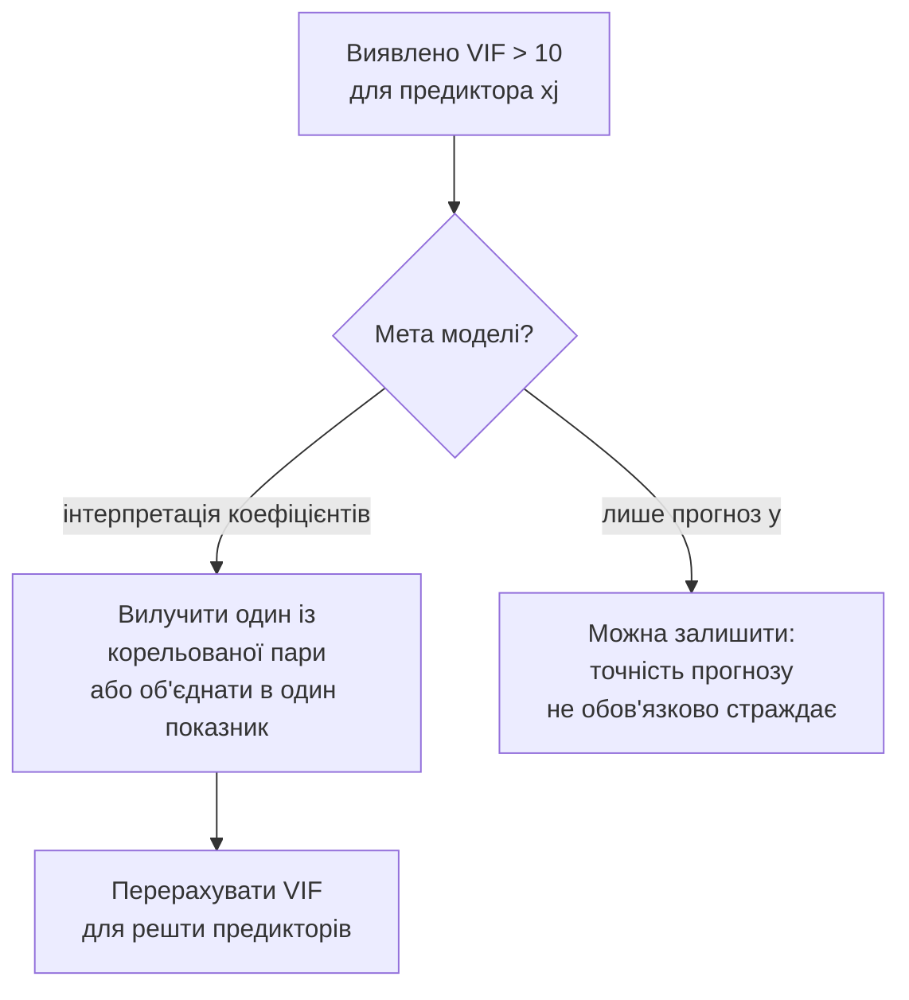
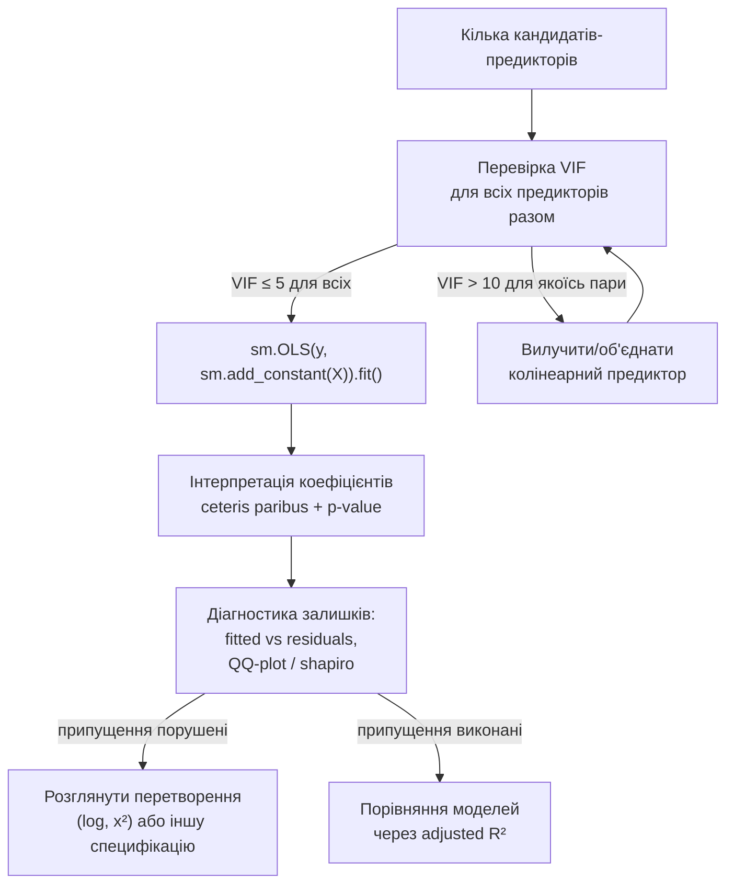

# Лекція 17. Множинна лінійна регресія: побудова, діагностика, інтерпретація

*Лекція 16 ввела просту лінійну регресію: одна пояснювальна змінна `x`,
одна залежна `y`, і метод найменших квадратів (МНК), що підбирає пряму
`y = b0 + b1·x`, мінімізуючи суму квадратів залишків. Ціна за таку
простоту — модель бачить лише один бік реальності. Ціна квартири
залежить не тільки від площі, а й від кількості кімнат, відстані до
центру, поверху, року побудови; результат на екзамені залежить не
тільки від кількості годин підготовки, а й від відвідуваності занять.
Ця лекція не змінює принцип — МНК лишається тим самим методом
мінімізації суми квадратів залишків, — вона узагальнює його на випадок,
коли пояснювальних змінних кілька одночасно. Формула стає довшою, ідея
підбору "найкращої" прямої (тепер — площини чи гіперплощини) лишається
буквально тією самою.*

## Від однієї змінної до кількох: та сама МНК, більше вимірів

**Механіка.** Модель множинної лінійної регресії записується так:

```
y = b0 + b1·x1 + b2·x2 + ... + bk·xk + ε
```

де `y` — залежна змінна (те, що передбачається), `x1, ..., xk` —
`k` пояснювальних змінних (предикторів), `b0` — вільний член (перетин),
`b1, ..., bk` — коефіцієнти при кожному предикторі, а `ε` — випадкова
похибка (те, що модель не пояснює). Це пряме розширення формули простої
регресії з Лекції 16 (`y = b0 + b1·x + ε`) — просто з одним доданком
замість кількох стало кілька доданків, кожен зі своїм коефіцієнтом і
своєю змінною.

Зручно записати ту саму модель компактно в матричній формі:

```
y = X·b + ε
```

Тут `y` — вектор із `n` спостережуваних значень залежної змінної, `X` —
матриця `n × (k+1)`, де кожен рядок — одне спостереження, а стовпці —
всі предиктори плюс стовпець одиниць (для вільного члена `b0`), `b` —
вектор із `(k+1)` невідомих коефіцієнтів, які потрібно оцінити. МНК і
тут шукає той самий мінімум суми квадратів залишків
`Σ(y - X·b)²`, і розв'язок цього завдання оптимізації має відому
замкнену формулу:

```
b̂ = (X'X)⁻¹ X'y
```

(`X'` — транспонована матриця `X`, `⁻¹` — обернена матриця). У цьому
курсі формулу достатньо впізнавати концептуально — вона показує, **що**
рахує МНК (лінійну комбінацію даних, яка мінімізує суму квадратів
відхилень), а не виводити її з нуля через лінійну алгебру. У Лекції 16
для одного предиктора та сама ідея зводилась до простішого вигляду
`b1 = cov(x, y) / var(x)` — це та сама матрична формула, лише записана
для випадку, коли `X` має всього два стовпці (одиниці й `x`). При
кількох предикторах повертатись до окремих формул для кожного `bj`
вручну вже не зручно — саме тому на практиці цю формулу ніколи не
рахують вручну, а довіряють бібліотеці.

**Чому саме "лінійна" при кількох предикторах.** Лінійність означає не
те, що графік `y` від кожного окремого `xj` обов'язково пряма лінія в
складному просторі, а те, що модель лінійна **за коефіцієнтами**: `y`
— це сума доданків, кожен з яких — коефіцієнт, помножений на змінну.
Це залишає місце для гнучкості, яка знадобиться в останньому розділі
цієї лекції (наприклад, доданок `b2·x²` — це все ще лінійна модель
відносно `b2`, хоча й нелінійна відносно `x`).

**Де корисно.** Будь-яка задача, де результат природно залежить від
кількох чинників одночасно: ціна нерухомості (площа, кількість кімнат,
відстань до центру, поверх), результат навчання (години підготовки,
відвідуваність, попередній середній бал), витрати домогосподарства на
опалення (температура, вологість, площа житла). Проста регресія з
Лекції 16 у таких задачах — не помилка, а свідоме спрощення: вона
показує зв'язок з **одним** чинником, ігноруючи решту. Множинна
регресія знімає це спрощення, оцінюючи вплив кожного чинника з
урахуванням інших.

## Побудова моделі в Python: `statsmodels.OLS`

Наскрізний приклад цієї лекції — ціна квартири (`ціна`, у тис. умовних
одиниць) залежно від площі (`площа`, м²), кількості кімнат (`кімнати`) і
відстані до центру міста (`відстань_до_центру`, км), на вибірці з 22
квартир:

```python
import numpy as np
import pandas as pd
import statsmodels.api as sm

apartments = pd.DataFrame({
    "площа": [93.3, 52.8, 96.8, 107.4, 107.9, 69.0, 80.7, 93.2, 83.1, 89.2,
              37.6, 57.4, 39.4, 99.3, 63.0, 86.0, 54.2, 61.1, 35.7, 61.9,
              106.2, 51.3],
    "кімнати": [2, 5, 1, 1, 4, 4, 1, 4, 4, 1, 4, 3, 3, 5, 1, 2, 4, 2, 2, 4, 5, 2],
    "відстань_до_центру": [7.1, 4.2, 6.0, 9.3, 11.7, 1.5, 10.4, 8.4, 2.5, 1.9,
                            4.1, 2.7, 13.9, 10.4, 3.9, 8.7, 8.6, 1.6, 12.7, 6.4,
                            2.6, 3.3],
    "ціна": [114.5, 82.0, 98.0, 109.5, 117.7, 100.6, 86.9, 107.8, 105.5, 98.8,
             73.0, 92.5, 50.4, 120.3, 78.2, 91.9, 71.3, 78.2, 33.3, 79.5,
             135.2, 75.7],
})

X = sm.add_constant(apartments[["площа", "кімнати", "відстань_до_центру"]])
y = apartments["ціна"]

model = sm.OLS(y, X).fit()
print(model.summary())
```

Ключовий рядок — `sm.add_constant(X)`. `statsmodels` за замовчуванням
**не** додає вільний член `b0` сам: без цього викликом `OLS` оцінювалась
би модель, яка примусово проходить через точку `(0, 0, ..., 0)`, що
майже завжди суперечить реальним даним. `sm.add_constant()` додає до
таблиці предикторів стовпець одиниць — саме той стовпець, що в
матричній формі `X·b` відповідає за оцінку `b0`.

Уривок виводу `.summary()` для цієх даних:

```
                            OLS Regression Results
==============================================================================
Dep. Variable:                   ціна   R-squared:                       0.951
Model:                            OLS   Adj. R-squared:                  0.943
Method:                 Least Squares   F-statistic:                     115.8
...
======================================================================================
                         coef    std err          t      P>|t|      [0.025      0.975]
--------------------------------------------------------------------------------------
const                 21.6939      5.215      4.160      0.001      10.737      32.651
площа                  0.9074      0.052     17.456      0.000       0.798       1.017
кімнати                4.4172      0.853      5.179      0.000       2.625       6.209
відстань_до_центру    -1.6564      0.318     -5.214      0.000      -2.324      -0.989
==============================================================================
```

**Чому саме `statsmodels`, а не `sklearn.linear_model.LinearRegression`.**
Обидві бібліотеки під капотом рахують той самий МНК і на тих самих
даних дадуть однакові коефіцієнти `b0, b1, ..., bk`. Різниця — у тому,
що ці бібліотеки вважають "результатом" регресії:

- `sklearn.LinearRegression` створена для задач **прогнозування**:
  `.fit()` підбирає коефіцієнти, `.predict()` дає прогноз для нових
  даних — і все. Вона не рахує стандартні похибки коефіцієнтів,
  p-value чи довірчі інтервали "з коробки", бо для чистого
  прогнозування ці числа не потрібні.
- `statsmodels.OLS` створена для задач **статистичного висновку**:
  `.summary()` одразу дає p-value для кожного коефіцієнта, довірчі
  інтервали, R² і adjusted R² — увесь апарат, який студенти вже бачили
  в Лекціях 12–15 (довірчі інтервали, перевірка гіпотез через p-value).

У цьому курсі мета регресії — **зрозуміти й пояснити** зв'язок між
змінними (чи площа значуще впливає на ціну, і наскільки), а не тільки
максимально точно вгадати число. Тому стандартний інструмент тут —
`statsmodels`. Коли курс дійде до задач, де головна мета —
максимізувати точність прогнозу на нових даних, а не інтерпретувати
кожен коефіцієнт (Лекція 22 і машинне навчання), `sklearn` стане
природним вибором — це не суперечність, а різні інструменти під різні
цілі: `statsmodels`, коли важливо **чому**, `sklearn`, коли важливо
**скільки точно**.

## Інтерпретація коефіцієнтів: "за інших рівних умов"

**Механіка.** Коефіцієнт `bj` у множинній регресії читається так: "при
збільшенні `xj` на одну одиницю, `y` змінюється на `bj` одиниць, **за
умови, що всі інші предиктори лишаються незмінними**". Це умова
"за інших рівних умов" (ceteris paribus) — і саме вона відрізняє
коефіцієнт множинної регресії від коефіцієнта простої регресії з тим
самим `x`.

Формально це — частинна похідна `y` за `xj`:

```
∂y/∂xj = bj     (при фіксованих усіх інших x)
```

Простій регресії з одним предиктором ця умова не потрібна, бо "інших
предикторів" просто немає. У множинній регресії вона критична: якщо
`площа` і `кімнати` в даних пов'язані між собою (більші квартири
частіше мають більше кімнат), коефіцієнт при `кімнати` показує вплив
**додаткової кімнати за тієї самої площі** — наприклад, перепланування
трикімнатної квартири на чотирикімнатну без зміни загальної площі, — а
не "квартира з більшою кількістю кімнат узагалі" (яка, найімовірніше,
просто більша за площею, і це вже вплив іншого коефіцієнта).

**Приклад інтерпретації для моделі вище:**

- `площа = 0.9074` — за незмінної кількості кімнат і незмінної
  відстані до центру, кожен додатковий квадратний метр площі підвищує
  ціну на 0.907 тис. умовних одиниць.
- `кімнати = 4.4172` — за незмінної площі й незмінної відстані до
  центру, кожна додаткова кімната (тобто інше планування тієї самої
  площі) підвищує ціну на 4.417 тис. умовних одиниць.
- `відстань_до_центру = -1.6564` — за незмінної площі й кількості
  кімнат, кожен додатковий кілометр відстані до центру знижує ціну на
  1.656 тис. умовних одиниць.

Усі три коефіцієнти в цій моделі мають `P>|t| < 0.001` — за логікою
перевірки гіпотез із Лекції 13–14 це означає, що для кожного з них є
підстави відхилити H0 "цей коефіцієнт дорівнює нулю за інших рівних
умов": площа, кількість кімнат і відстань до центру всі окремо значущо
пов'язані з ціною, навіть з урахуванням двох інших факторів.

**Чому це не те саме, що коефіцієнт простої регресії.** Проста регресія
"ціна ~ площа" (без інших предикторів) на цих же даних дає коефіцієнт
`b1 = 0.885` — трохи інше число, і R² лише 0.795 замість 0.951 у
множинної моделі:

```python
X_simple = sm.add_constant(apartments[["площа"]])
model_simple = sm.OLS(apartments["ціна"], X_simple).fit()
print(model_simple.rsquared)   # 0.7954
print(model.rsquared)          # 0.9507 — множинна модель
```

Різниця (`0.885` проти `0.907`) невелика на цих даних, але принципова:
коефіцієнт простої регресії змішує **весь** вплив площі на ціну,
включно з тим, що відбувається "через" кількість кімнат і відстань
(великі квартири в цьому наборі частіше далі від центру чи мають більше
кімнат); коефіцієнт множинної регресії ізолює **чистий** вплив площі,
що лишається після врахування двох інших чинників. Саме тому додавання
релевантних предикторів майже завжди змінює вже наявні коефіцієнти, а
не тільки додає нові.

**Де корисно.** Аналітик відділу нерухомості, який пояснює клієнту:
"кожен додатковий кілометр від центру коштує вам приблизно 1.66 тис.
у.о. за інших рівних умов" — це і є пряме застосування ceteris paribus
інтерпретації. Той самий принцип у зарплатному аналізі: "рік досвіду
роботи за тієї самої посади й того самого рівня освіти пов'язаний із
приростом зарплати на X" — конкретне число, ізольоване від впливу
освіти й посади, а не сумарний ефект "досвідченіші люди в середньому
заробляють більше" (який може ховати в собі й вплив освіти чи посади).

## R² та adjusted R²: чому "більше предикторів" не завжди краще

**Механіка чому R² сам по собі завжди зростає (або не зменшується).**
R² вимірює частку дисперсії `y`, пояснену моделлю (Лекція 16). МНК
підбирає коефіцієнти, що **мінімізують** суму квадратів залишків на
наявних даних, — і додавання ще одного предиктора ніколи не звужує
простір можливих моделей, лише розширює його: стара модель (без нового
предиктора) — це окремий випадок нової моделі, де коефіцієнт при
новому предикторі буквально дорівнює нулю. Тож найкраща модель **з**
новим предиктором не може дати гіршу (більшу) суму квадратів залишків,
ніж найкраща модель без нього, — у найгіршому разі МНК просто "поверне"
коефіцієнт, близький до нуля, і результат не змінюється. R² тому або
зростає, або лишається на місці, коли додається **будь-який**
предиктор — навіть випадковий шум, що не має жодного справжнього
зв'язку з `y`.

Демонстрація на тих самих даних: додамо до моделі стовпець із чистим
випадковим шумом, що не має жодного змістовного зв'язку з ціною
квартири:

```python
np.random.seed(441)
apartments["випадковий_шум"] = np.random.normal(0, 1, len(apartments))

X_noise = sm.add_constant(
    apartments[["площа", "кімнати", "відстань_до_центру", "випадковий_шум"]]
)
model_noise = sm.OLS(apartments["ціна"], X_noise).fit()

print("Без шуму:  R2 =", round(model.rsquared, 4),
      " adjR2 =", round(model.rsquared_adj, 4))
print("З шумом:   R2 =", round(model_noise.rsquared, 4),
      " adjR2 =", round(model_noise.rsquared_adj, 4))

# Без шуму:  R2 = 0.9507  adjR2 = 0.9425
# З шумом:   R2 = 0.9507  adjR2 = 0.9392
```

R² практично не змінився (додавання суто випадкового стовпця майже не
знижує суму квадратів залишків), а сам коефіцієнт при
`випадковий_шум` виявляється статистично незначущим (`P>|t| ≈ 0.997`)
— так і має бути, зв'язку зі шумом справді немає. Але **adjusted R²
знизився** — з 0.9425 до 0.9392.

**Механіка adjusted R² і чому саме такий штраф.** Формула:

```
adjusted R² = 1 - (1 - R²) · (n - 1) / (n - k - 1)
```

де `n` — кількість спостережень, `k` — кількість предикторів. На
відміну від звичайного R², ця формула явно враховує `k`: коли `k`
зростає при тому самому `n`, знаменник `(n - k - 1)` зменшується, і
множник `(n-1)/(n-k-1)` зростає — тобто **штрафує** ту саму (чи майже
ту саму) величину `(1 - R²)` сильніше. Це формалізує інтуїцію: R²,
який зріс лише тому, що модель отримала ще один "шанс" підлаштуватись
під конкретні дані, — не справжнє покращення, і adjusted R² враховує
цю ціну явно. Adjusted R² зростає при додаванні нового предиктора лише
тоді, коли цей предиктор пояснює **достатньо** додаткової дисперсії,
щоб перекрити штраф за додатковий ступінь свободи; якщо предиктор — це
переважно шум (як у прикладі вище), штраф перевищує мізерний приріст
R², і adjusted R² знижується.

**Практичний висновок.** Порівнюючи моделі з різною кількістю
предикторів на тих самих даних, порівнювати варто **adjusted R²**, а
не звичайний R² — інакше висновок "більше предикторів — завжди краща
модель" буде хибним практично завжди, навіть коли додані предиктори не
мають жодного справжнього змістовного зв'язку із залежною змінною.

**Де корисно.** Відбір предикторів для моделі: якщо додавання нового
чинника (наприклад, "поверх квартири" до моделі ціни) підвищує R² на
частку відсотка, але знижує adjusted R², це сигнал, що чинник, найпевніше,
не вартий ускладнення моделі — принаймні на наявному обсязі даних.

## Мультиколінеарність і VIF

**Механіка проблеми.** Мультиколінеарність — ситуація, коли два (чи
більше) предиктори в моделі самі сильно корелюють між собою. Формула
МНК `(X'X)⁻¹X'y` технічно все ще рахується, але коли стовпці `X` майже
лінійно залежні, обернена матриця `(X'X)⁻¹` стає **нестабільною**:
малі зміни в даних (додавання чи вилучення кількох спостережень)
можуть різко змінити оцінки окремих коефіцієнтів, іноді навіть
поміняти їм знак. Причина інтуїтивно проста: якщо `x1` і `x2` майже
завжди рухаються разом, у даних попросто немає достатньо випадків, де
`x1` змінюється, а `x2` лишається сталим (і навпаки) — а саме такі
випадки потрібні МНК, щоби **розділити** внесок кожного з двох
предикторів окремо. Модель у принципі "знає", що комбінація `x1` і
`x2` пов'язана з `y`, але не може впевнено визначити, **скільки саме**
цього зв'язку належить `x1`, а скільки — `x2`.

Демонстрація: додамо до моделі квартир другий вимір площі — ту саму
площу, перераховану в квадратні фути (з невеликою похибкою округлення
при вимірюванні, як буває в реальних оголошеннях):

```python
np.random.seed(1)
# та сама площа, перерахована в кв. фути, з невеликою похибкою округлення
apartments["площа_кв_фути"] = np.round(
    apartments["площа"] * 10.7639 + np.random.normal(0, 3, len(apartments)), 1
)

X_collinear = sm.add_constant(
    apartments[["площа", "площа_кв_фути", "кімнати", "відстань_до_центру"]]
)
model_collinear = sm.OLS(apartments["ціна"], X_collinear).fit()
print(model_collinear.summary())
```

```
                         coef    std err          t      P>|t|
--------------------------------------------------------------
const                 21.2430      5.256      4.042      0.001
площа                 -2.9743      4.159     -0.715      0.484
площа_кв_фути          0.3613      0.387      0.933      0.364
кімнати                4.5948      0.877      5.240      0.000
відстань_до_центру    -1.7257      0.327     -5.272      0.000
```

`площа` (в м²) і `площа_кв_фути` — це буквально та сама інформація в
іншій шкалі, тож модель "не знає", який із двох стовпців має нести
позитивний коефіцієнт (реальний ефект площі на ціну), а який — майже
нульовий. Результат: `площа` раптом отримує **від'ємний**,
статистично незначущий коефіцієнт (`P>|t| = 0.484`), хоча очевидно, що
більша площа не знижує ціну квартири. При цьому R² моделі майже не
змінився (0.953 проти 0.951 без дубльованого стовпця) — сама якість
передбачення `y` не постраждала, страждає лише **інтерпретованість**
окремих коефіцієнтів.

**VIF (variance inflation factor) — числова діагностика.** VIF для
предиктора `xj` вимірює, у скільки разів дисперсія оцінки коефіцієнта
`bj` більша через кореляцію `xj` з іншими предикторами, порівняно з
ситуацією, де `xj` був би повністю незалежний від решти. Обчислюється
через регресію `xj` на всі інші предиктори:

```
VIF(xj) = 1 / (1 - R²j)
```

де `R²j` — коефіцієнт детермінації регресії, де `xj` виступає залежною
змінною, а всі **інші** предиктори — поясненнями. Якщо `xj` добре
пояснюється іншими предикторами (`R²j` близький до 1), знаменник
`(1 - R²j)` наближається до нуля, і VIF різко зростає — саме той
формальний сигнал, що для `xj` в даних не лишилось "унікальної",
незалежної від інших предикторів варіації.

```python
from statsmodels.stats.outliers_influence import variance_inflation_factor

X_check = sm.add_constant(apartments[["площа", "кімнати", "відстань_до_центру"]])
for i, col in enumerate(X_check.columns):
    if col == "const":
        continue
    vif = variance_inflation_factor(X_check.values, i)
    print(col, round(vif, 2))

# площа                 1.0
# кімнати               1.0
# відстань_до_центру    1.0
```

У вихідній моделі (без дубльованого стовпця площі) VIF усіх трьох
предикторів дорівнює приблизно 1 — площа, кількість кімнат і відстань
до центру в цьому наборі даних практично незалежні одна від одної, і
мультиколінеарність не проблема. Тепер той самий розрахунок для
моделі з дубльованою площею:

```python
X_check2 = sm.add_constant(
    apartments[["площа", "площа_кв_фути", "кімнати", "відстань_до_центру"]]
)
for i, col in enumerate(X_check2.columns):
    if col == "const":
        continue
    print(col, round(variance_inflation_factor(X_check2.values, i), 1))

# площа                 6378.3
# площа_кв_фути         6381.5
# кімнати                  1.1
# відстань_до_центру       1.1
```

VIF для `площа` і `площа_кв_фути` — тисячі, тоді як VIF для `кімнати`
й `відстань_до_центру` лишається біля 1 (вони не пов'язані з жодним із
двох "дублів" площі).

**Практичне правило.** VIF = 1 означає повну відсутність кореляції з
іншими предикторами; загальноприйняте практичне правило — VIF вище **5**
викликає увагу, VIF вище **10** вважається серйозною проблемою, яку
варто виправляти. Типові виправлення: вилучити один із пари
сильно корельованих предикторів (найпростіший варіант — саме так слід
було б вчинити з дубльованою площею вище), об'єднати їх у один
змістовний показник (наприклад, середнє чи перший компонент методом
головних компонент — за межами цього курсу), або, якщо мета моделі —
лише прогноз `y`, а не інтерпретація окремих `bj`, залишити все як є:
мультиколінеарність псує **інтерпретованість** коефіцієнтів, але не
обов'язково точність самого прогнозу (R² моделі з дубльованою площею
вище фактично не постраждав).



**Де корисно.** Модель ціни нерухомості з предикторами "площа" і
"кількість кімнат" — вони природно корелюють (більші квартири частіше
мають більше кімнат), і VIF допомагає оцінити, наскільки сильно; модель
успішності студентів із предикторами "години самостійної підготовки" і
"години відвідування консультацій" — вони теж можуть сильно корелювати,
якщо старанні студенти і готуються більше, і на консультації ходять
частіше.

## Діагностика залишків множинної регресії

Логіка діагностики залишків із простої регресії (Лекція 16) переноситься
на множинну регресію без змін — залишки й тут перевіряються на два
припущення: **гомоскедастичність** (розкид залишків приблизно
однаковий по всьому діапазону передбачень) і **нормальність**
(розподіл залишків приблизно нормальний, потрібно для коректних
p-value й довірчих інтервалів у `.summary()`).

**Залишки проти передбачених значень.**

```python
import matplotlib.pyplot as plt

fitted = model.fittedvalues
residuals = model.resid

fig, ax = plt.subplots()
ax.scatter(fitted, residuals)
ax.axhline(0, color="red", linestyle="--")
ax.set_xlabel("Передбачена ціна")
ax.set_ylabel("Залишок")
ax.set_title("Залишки проти передбачених значень")
```

**Механіка того, що шукати на графіку.** Якщо модель специфікована
коректно, точки повинні розсіюватись навколо горизонтальної лінії
`0` без видимої системи — однакова "хмара" розкиду зліва і справа
графіка. Два типові відхилення й що вони означають:

- **Лійкоподібна форма** (розкид зростає чи звужується з передбаченим
  значенням) — гетероскедастичність: похибка передбачення для дорогих
  квартир систематично більша (чи менша), ніж для дешевих. Це не
  спотворює самі коефіцієнти `bj` (вони лишаються незсуненими), але
  спотворює їхні стандартні похибки, а значить — і p-value з
  `.summary()`.
- **Дугоподібна чи хвиляста форма** — модель пропускає нелінійність:
  справжній зв'язок між якимось предиктором і `y` вигнутий, а лінійна
  модель намагається наблизити його прямою, систематично помиляючись
  в одному напрямку для малих і великих значень і в іншому — для
  середніх. Саме такий випадок веде до наступного розділу цієї лекції.

**Нормальність залишків.** Використовується той самий інструментарій,
що в Лекції 15 для перевірки нормальності вибірки — тільки застосований
не до сирих даних, а до залишків моделі:

```python
from scipy import stats

fig, ax = plt.subplots()
stats.probplot(residuals, dist="norm", plot=ax)
ax.set_title("QQ-plot залишків")

stat, p_value = stats.shapiro(residuals)
print(stat, p_value)
```

Логіка інтерпретації буквально та сама, що в Лекції 15: `p_value ≥
0.05` — немає підстав відхилити нормальність залишків; `p_value < 0.05`
— форма залишків значуще відхиляється від нормальної, і довірчі
інтервали й p-value коефіцієнтів варто трактувати з обережністю.

**Де корисно.** Перед тим, як довіряти конкретному p-value з
`.summary()` (наприклад, "площа значуще впливає на ціну, p < 0.001"),
варто переконатись, що залишки моделі не мають явної лійкоподібної
форми чи сильного відхилення від нормальності — інакше саме число
p-value може бути недостовірним, навіть якщо коефіцієнт обчислено
правильно.

## Огляд: нелінійна регресія і перетворення змінних

Модель `y = b0 + b1·x1 + ... + bk·xk` — лінійна за коефіцієнтами, але
це не означає, що МНК застосовний лише до зв'язків, які на графіку
виглядають прямою лінією. Коли реальний зв'язок нелінійний, часто
можна **перетворити** змінну так, щоби зв'язок після перетворення став
(приблизно) лінійним — і далі застосувати той самий апарат МНК без
змін.

**Логарифмічне перетворення.** Якщо `y` зростає **експоненційно**
відносно `x` (типово для процесів зростання: населення, дохід
компанії, поширення епідемії), пряма лінійна модель `y ~ x` описує
такі дані погано — на малих `x` вона недооцінює зростання, на великих
— переоцінює. Але модель `log(y) ~ x` часто описує ту саму
залежність значно краще, бо логарифм перетворює експоненційне
зростання на лінійне:

```python
np.random.seed(2)
x = np.linspace(1, 10, 15)
y_exp = 5 * np.exp(0.3 * x) + np.random.normal(0, 2, 15)

X_lin = sm.add_constant(x)
model_linear = sm.OLS(y_exp, X_lin).fit()
model_log = sm.OLS(np.log(y_exp), X_lin).fit()

print("R² моделі y ~ x:      ", round(model_linear.rsquared, 4))   # 0.8816
print("R² моделі log(y) ~ x: ", round(model_log.rsquared, 4))      # 0.9683
print("нахил у log-моделі:   ", round(model_log.params[1], 4))     # ≈ 0.32, очікували 0.3
```

R² моделі `log(y) ~ x` (0.968) помітно вищий за R² прямої моделі
`y ~ x` (0.882) на тих самих даних — саме тому, що логарифмічна модель
відповідає справжній формі зв'язку (`y = 5·e^(0.3x)` еквівалентно
`log(y) = log(5) + 0.3·x`, тобто лінійно відносно `log(y)`), а пряма
модель — ні.

**Поліноміальні члени.** Якщо зв'язок має форму параболи (наприклад,
урожайність поля спершу зростає з дозою добрива, а потім падає через
надлишок), можна додати `x²` як **окремий** предиктор, залишаючи
модель лінійною за коефіцієнтами:

```
y = b0 + b1·x + b2·x²
```

```python
apartments["площа_кв"] = apartments["площа"] ** 2
X_poly = sm.add_constant(apartments[["площа", "площа_кв"]])
model_poly = sm.OLS(apartments["ціна"], X_poly).fit()
```

Тут `x` і `x²` — це два різні стовпці даних, і МНК оцінює `b1` і `b2`
так само, як оцінював би коефіцієнти при двох різних змінних вище в
цій лекції (з тим самим ризиком мультиколінеарності між `x` і `x²`,
якщо діапазон значень `x` вузький, — вартий перевірки тим самим VIF).

**Чому це не окрема тема, а прямий наслідок усього розділу.** В обох
випадках модель, яку зрештою рахує `statsmodels.OLS`, — лінійна за
коефіцієнтами так само, як і в решті цієї лекції; змінюється лише те,
**які саме стовпці** передаються як `X` — сирі значення `x`, чи
`log(y)` замість `y`, чи `x²` як додатковий стовпець. Це, за
навчальною програмою, — оглядовий матеріал: у цьому курсі достатньо
впізнавати ситуацію, коли перетворення варте спроби (виражена
кривизна чи експоненційна форма на діаграмі розсіювання з Лекції 16),
і знати загальний прийом, а не розбирати кожен можливий вид
перетворення докладно.

**Де корисно.** Моделювання зростання (населення, дохід, кількість
користувачів застосунку з часом) — майже завжди природний кандидат на
логарифмічне перетворення `y`. Ефекти з оптимальним "проміжним"
значенням (доза ліків, температура зберігання, тривалість тренування
перед перевтомою) — природний кандидат на квадратичний член.

## Загальний конвеєр побудови множинної регресійної моделі



Це узагальнення всіх розділів лекції в один послідовний процес: VIF —
до того, як довіряти окремим коефіцієнтам; інтерпретація коефіцієнтів —
лише після того, як мультиколінеарність опрацьована; діагностика
залишків — перевірка, що самі p-value з `.summary()` достовірні;
adjusted R² — інструмент порівняння моделей з різною кількістю
предикторів, а не звичайний R².

## Типові помилки

**Забутий `sm.add_constant()`.** Без цього викликом `OLS(y, X)`
(без додавання стовпця одиниць) модель примусово проходить через
початок координат — це майже завжди дає систематично зсунуті
коефіцієнти й неправдиве уявлення про якість моделі, а не просто трохи
іншу оцінку.

**Інтерпретація коефіцієнта без "за інших рівних умов".** Читання
`b1 = 0.907` як "кожен квадратний метр додає 0.907 у.о. до ціни" без
застереження "за незмінної кількості кімнат і відстані до центру" —
це підміна коефіцієнта множинної регресії коефіцієнтом простої регресії
(вони, як показано вище, різні числа з різним змістом).

**Довіра R² без перевірки VIF.** Модель із дубльованою площею в м² і
кв. футах у прикладі вище має практично той самий високий R², що й
коректна модель, — високий R² **не** гарантує, що окремі коефіцієнти
надійні й придатні для інтерпретації. Перевірка VIF потрібна саме тому,
що R² сам по собі цю проблему не показує.

**Порівняння моделей з різною кількістю предикторів за звичайним R².**
Як показано вище, R² майже завжди трохи зростає при додаванні будь-якого
нового стовпця, навіть чистого шуму — це робить звичайний R² непридатним
критерієм для рішення "чи вартий новий предиктор включення в модель".

## Підсумок

- Множинна лінійна регресія `y = b0 + b1·x1 + ... + bk·xk + ε` —
  пряме узагальнення простої регресії з Лекції 16 на кілька
  предикторів одночасно; МНК і тут мінімізує суму квадратів залишків,
  лише в матричній формі `b̂ = (X'X)⁻¹X'y`.
- `statsmodels.OLS` з `sm.add_constant()` — стандартний інструмент
  цього курсу для регресії, бо мета тут — інтерпретація й статистичний
  висновок (p-value, довірчі інтервали), а не лише прогноз, для якого
  типовіший вибір — `sklearn.LinearRegression`.
- Коефіцієнт `bj` читається "за інших рівних умов" (ceteris paribus) —
  це частинна похідна `∂y/∂xj`, і вона відрізняється від коефіцієнта
  простої регресії з тим самим `xj`, якщо предиктори між собою пов'язані.
- Звичайний R² не може зменшитись при додаванні предиктора, навіть
  безглуздого, — тому порівнювати моделі з різною кількістю предикторів
  варто через **adjusted R²**, яка штрафує за кожен доданий ступінь
  свободи.
- Мультиколінеарність (сильна кореляція між предикторами) робить окремі
  коефіцієнти нестабільними, хоч і не завжди псує якість прогнозу;
  VIF (`variance_inflation_factor`) — стандартна діагностика, VIF > 10 —
  практичний сигнал проблеми.
- Діагностика залишків множинної регресії — та сама логіка, що для
  простої: залишки проти передбачених значень (гомоскедастичність),
  QQ-plot і критерій Шапіро-Вілка з Лекції 15 (нормальність).
- Нелінійні залежності іноді можна звести до звичного апарату МНК
  перетворенням змінних — найтиповіше логарифмічне перетворення `y`
  для експоненційного зростання чи доданок `x²` для параболічної форми.

Усе, розглянуте в цій лекції, — статистична модель конкретного виду
(лінійна регресія, оцінена МНК). Наступна лекція робить крок назад від
конкретики: що взагалі означає "математична модель" як поняття, які
типи моделей існують (детерміновані й стохастичні, статичні й
динамічні), і де регресія, розглянута тут, займає своє місце в цій
загальній класифікації.

**Практика до цієї лекції:** [Практика 18. Множинна лінійна регресія: відбір предикторів, інтерпретація коефіцієнтів, діагностика залишків](../practice/18-multiple-regression.md)
