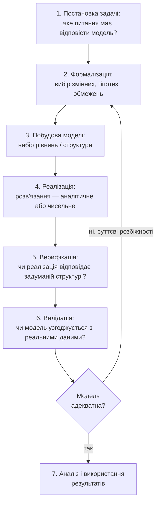
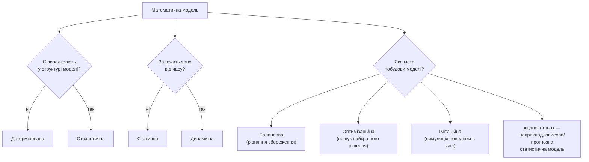

# Лекція 18. Поняття математичної моделі й етапи моделювання

*Лекції 16–17 будували конкретні статистичні моделі — кореляційну
структуру між двома змінними та регресійне рівняння, що передбачає
одну змінну через інші. Ця лекція робить крок назад від конкретної
формули до загального питання: що взагалі означає "побудувати
математичну модель", з яких етапів складається цей процес і за якими
ознаками моделі різняться між собою. Словник цієї лекції —
детермінована/стохастична, балансова/оптимізаційна/імітаційна,
верифікація/валідація, адекватність — не абстрактна класифікація для
самої класифікації: це мова, якою описуватиметься кожна наступна тема
курсу. Оптимізаційні моделі, виділені тут як окремий тип, детально
розглядаються в Лекції 19; імітаційні моделі — у Лекції 20 через метод
Монте-Карло; моделі часових рядів (Лекція 21) — це конкретний приклад
динамічної моделі в термінах, введених тут. А регресія з Лекцій 16–17 —
приклад статистичної моделі, чия адекватність перевіряється саме тими
інструментами, що вже введені в Лекції 15 (критерій хі-квадрат, тест на
нормальність).*

## Що таке математична модель

**Механіка визначення.** Математична модель — це спрощене формальне
представлення реальної системи чи процесу за допомогою математичних
об'єктів:

- **змінні** — величини, що описують стан системи й можуть змінюватися
  (температура, обсяг продажів, координата тіла);
- **параметри** — сталі, що налаштовують модель під конкретний випадок
  (коефіцієнт тертя, ставка податку, середньорічна температура міста);
- **рівняння чи нерівності** — формальні зв'язки між змінними й
  параметрами (закон руху, рівняння балансу, обмеження ресурсу);
- **область застосовності** — умови, за яких ці зв'язки вважаються
  чинними (діапазон швидкостей, часовий горизонт, розмір вибірки).

Побудувати модель — це замінити складну, багатофакторну реальну систему
цим набором математичних об'єктів так, щоб зв'язки між об'єктами
відтворювали ті аспекти поведінки реальної системи, які цікавлять
дослідника, і при цьому лишались достатньо простими, щоб з ними можна
було працювати математично чи обчислювально.

**Чому "спрощене" — не недолік, а необхідна умова.** Модель, що
намагається врахувати абсолютно все (кожну молекулу повітря при
розрахунку траєкторії м'яча, кожного окремого клієнта при розрахунку
попиту на товар), стає або математично нерозв'язною, або настільки
складною, що втрачає саму цінність моделі — здатність зробити систему
зрозумілою і придатною для розрахунків. У статистиці й прикладній
математиці широко відома ідея: жодна модель не описує реальність
абсолютно точно, і сенс моделі — не в буквальній, фотографічній
правдивості, а в тому, наскільки вона **корисна** для конкретної мети,
з якою її будували (цю думку часто пов'язують зі статистиком Джорджем
Боксом, хоча точне формулювання варіюється залежно від джерела —
головне тут сама ідея, а не точне цитування). Модель вільного падіння
`h = h0 - 0.5·g·t²` ігнорує опір повітря, форму тіла, обертання Землі —
і саме тому вона проста й придатна для розрахунку "на калькуляторі";
для падіння камʼя з невеликої висоти це прекрасно працює, для падіння
листка папера — вже ні. Це не робить модель "неправильною" в
абсолютному сенсі: вона правильна **в межах тієї області
застосовності**, для якої знехтувані фактори справді нехтовно малі.

**Компроміс точність–простота.** Будь-яке рішення при побудові моделі —
що включити, а що знехтувати — це точка на шкалі між гранично простою
моделлю (мало параметрів, легко зрозуміти й перевірити) і гранично
детальною (потенційно точніша, але кожен додатковий параметр потрібно
оцінити з обмежених даних, а отже вносить додаткову невизначеність).
Немає єдиної "правильної" точки на цій шкалі — вибір залежить від мети
моделювання: модель для швидкої оцінки порядку величини має бути іншою,
ніж модель для точного інженерного розрахунку.

## Етапи математичного моделювання

Побудова моделі — це не одноразовий акт "написати формулу", а
послідовність кроків, і, що принципово, ця послідовність — **цикл**, а
не пряма лінія: результат перевірки моделі на реальних даних часто
змушує повернутися й переглянути попередні кроки, а не просто "здати
готову модель".



**Механіка кожного кроку.**

1. **Постановка задачі.** Формулювання питання, на яке модель повинна
   відповісти, і мети моделювання (прогноз конкретного значення?
   пошук найкращого рішення? розуміння механізму явища?). Без чіткого
   питання неможливо оцінити, чи модель "хороша" — хороша для чого?
2. **Формалізація.** Переклад словесної задачі на мову математики:
   що вважати змінною, що — сталим параметром, які припущення
   прийнятні (наприклад, "температура протягом місяця коливається
   навколо середньої за синусоїдальним законом" — це вже конкретна
   формалізована гіпотеза, а не просто "буває тепліше, буває
   холодніше").
3. **Побудова моделі.** Вибір конкретної математичної структури, що
   реалізує формалізовані на попередньому кроці припущення: лінійне
   рівняння, система нерівностей, диференціальне рівняння, алгоритм
   імітації. Саме на цьому кроці ухвалюється те, що обговорюється далі
   в цій лекції — до якого класу (детермінована/стохастична,
   балансова/оптимізаційна/імітаційна) належатиме модель.
4. **Реалізація.** Фактичне отримання розв'язку: аналітично, закритою
   формулою (коли це можливо), або чисельно й програмно — коли
   аналітичного розв'язку немає або він занадто складний для ручного
   виведення. Більшість моделей цього курсу, від регресії до
   оптимізації й Монте-Карло, реалізуються саме програмно.
5. **Верифікація.** Перевірка, що реалізація на кроці 4 **відповідає**
   структурі, задуманій на кроці 3 — це запитання "чи немає помилки в
   коді чи в обчисленні", а не "чи модель хороша". Детальніше — окремо
   нижче.
6. **Валідація.** Перевірка, що модель, реалізована правильно (тобто
   що пройшла верифікацію), **узгоджується з реальністю** — з
   фактичними спостереженнями чи вимірюваннями. Це геть інше питання,
   ніж верифікація, і плутанина цих двох понять — одна з
   найпоширеніших помилок, розглянута нижче окремо.
7. **Аналіз і використання результатів.** Якщо валідація підтвердила
   прийнятну відповідність реальності — інтерпретація результатів
   моделі для відповіді на питання, поставлене на кроці 1: прогноз,
   рекомендація рішення, пояснення механізму.
8. **Уточнення моделі.** Якщо валідація виявляє суттєві й систематичні
   розбіжності між моделлю та реальністю — це не кінець процесу, а
   сигнал повернутися на крок формалізації (переглянути припущення,
   додати знехтуваний фактор, змінити структуру рівнянь) і пройти цикл
   знову. Саме тому на діаграмі вище стрілка від "ні" веде назад до
   кроку 2, а не до аварійного завершення: моделювання — ітеративний
   процес, і рідко яка модель стає остаточною з першої спроби.

## Класифікація математичних моделей: незалежні осі

Моделі класифікують за кількома **незалежними** ознаками одночасно — це
принципово: питання "чи є в моделі випадковість" і питання "яка мета
моделі: баланс, оптимум чи симуляція" стосуються геть різних аспектів
моделі, і відповідь на одне не визначає відповідь на інше. Та сама
модель може бути одночасно стохастичною, орієнтованою на симуляцію й
динамічною — це не суперечність, а три різні характеристики одного й
того самого об'єкта.

### Детерміновані та стохастичні моделі

**Механіка.** Детермінована модель — та, у якій **немає випадковості**:
за одним і тим самим набором вхідних значень модель завжди видає рівно
той самий результат. Стохастична модель — та, у якій випадковість
є частиною самої структури моделі (випадкова величина, розподіл
ймовірностей): той самий набір "вхідних умов" може породжувати різні
конкретні результати від запуску до запуску, і модель описує не одне
число, а розподіл можливих результатів.

Приклад — рух тіла за законами Ньютона (детермінована модель):

```python
def height(t, h0=100.0, g=9.8):
    """Детермінована модель: положення тіла в момент t обчислюється
    однією формулою. Той самий t завжди дає той самий результат."""
    return h0 - 0.5 * g * t ** 2

for t in [0, 1, 2, 3]:
    print(t, round(height(t), 1))
# 0 100.0
# 1 95.1
# 2 80.4
# 3 55.9
# запустіть ще раз — результат буде абсолютно той самий
```

Приклад — модель черги в банку (стохастична модель): час обслуговування
кожного клієнта — випадкова величина, тож навіть при тій самій кількості
клієнтів результат кожного запуску інший:

```python
import numpy as np

np.random.seed(0)
n_clients = 5
service_times = np.random.exponential(scale=3.0, size=n_clients)  # хв
print(np.round(service_times, 2))
# [2.53 6.24 0.28 1.28 5.42]

np.random.seed(1)                      # ті самі 5 клієнтів, інший запуск
service_times = np.random.exponential(scale=3.0, size=n_clients)
print(np.round(service_times, 2))
# [3.98 0.35 0.11 1.64 0.02]  -- інший результат при тій самій постановці
```

**Чому це важлива відмінність.** Детермінована модель дає одне число і
однозначну відповідь — вона доречна, коли випадковість у реальній
системі відсутня або нехтовно мала. Стохастична модель визнає, що
реальна система містить невизначеність, і замість одного числа дає
розподіл можливих результатів — середнє, розкид, ймовірність
перевищити певний порог (наприклад, ймовірність, що черга перевищить
10 людей). Описати чергу в банку формулою "кожен клієнт обслуговується
рівно 3 хвилини" було б грубим спрощенням, що ігнорує саму суть
проблеми — коливання навантаження; навпаки, додавати випадковість у
модель падіння каменя в лабораторних умовах — невиправдане
ускладнення, коли й без неї модель прекрасно узгоджується зі
спостереженнями.

### Балансові моделі

**Механіка.** Балансова модель побудована навколо **рівняння
збереження**: те, що входить у систему, або перетворюється всередині
системи, або виходить із неї, або накопичується — без "втрати" й без
"появи з нічого". Найзагальніша форма: `вхід = вихід + накопичення`.

```python
# Матеріальний баланс хімічного реактора: вхід = вихід + накопичення
inflow = 120.0     # кг/год сировини на вході
outflow = 95.0     # кг/год готового продукту на виході

accumulation = inflow - outflow
print(accumulation)   # 25.0 кг/год залишається (накопичується) в реакторі

# баланс виконується "за визначенням" — це рівняння не перевіряють
# статистичним тестом, воно є структурним записом закону збереження
```

**Чому саме так.** Балансові моделі формалізують закони збереження, які
не є гіпотезою для перевірки, а структурним фактом: маса, енергія чи
гроші не зникають і не з'являються самі собою в межах, для яких модель
проводить межу системи. Механіка балансової моделі — записати цей
закон явно як рівняння, а потім розв'язати його щодо невідомої
величини.

**Де використовується.** Матеріальний і енергетичний баланс у хімічній
та енергетичній інженерії; бухгалтерський баланс "активи = зобов'язання
+ капітал" і бюджетна модель "витрати = доходи − прибуток" в економіці;
баланс потоку речовини чи енергії в екологічній моделі (скільки
біомаси виробляється, споживається й накопичується в екосистемі за
рік).

### Оптимізаційні моделі

**Механіка.** Мета оптимізаційної моделі — не просто описати систему, а
**знайти найкраще рішення** за певним критерієм (цільовою функцією) при
заданих обмеженнях. Загальна структура:

```
максимізувати (або мінімізувати)   цільова функція
за умов                             обмеження на змінні рішення
```

Приклад — план виробництва двох товарів, що максимізує прибуток при
обмеженій сировині й людино-годинах:

```
максимізувати   прибуток = 40·x1 + 30·x2
за умов         2·x1 + x2   ≤ 100     (сировина, кг)
                x1 + 3·x2   ≤ 90      (людино-години)
                x1, x2 ≥ 0
```

де `x1` і `x2` — обсяги виробництва першого й другого товару, які
потрібно визначити.

**Чому саме такий вигляд.** На відміну від балансової моделі, де
рівняння просто описує систему, оптимізаційна модель ставить рівняння
й нерівності на службу **пошуку**: серед усіх комбінацій `x1, x2`, що
задовольняють обмеження (допустима область), знайти ту, яка дає
найбільше значення цільової функції. Саме явно сформульований критерій
"найкращого" і чітко відокремлені обмеження — формальна ознака, що
відрізняє оптимізаційну модель від інших типів.

**Де використовується.** Планування виробництва (скільки чого
виробляти при обмежених ресурсах), розподіл бюджету між проєктами,
складання розкладу, оптимізація маршрутів доставки, формування
інвестиційного портфеля при обмеженому ризику. **Лекція 19** детально
розглядає цей клас моделей — лінійне програмування і чисельну
мінімізацію засобами `scipy.optimize`.

### Імітаційні моделі

**Механіка.** Імітаційна (симуляційна) модель відтворює поведінку
системи **в часі** через алгоритм, що крок за кроком обчислює, як
система змінюється, — замість того, щоб розв'язувати рівняння
аналітично. Це підхід, коли аналітичний розв'язок або не існує, або
надто складний для практичного виведення.

```python
import numpy as np

# оцінка числа π методом Монте-Карло: замість аналітичної формули —
# багаторазова випадкова симуляція й підрахунок частки "влучень"
np.random.seed(1)
n = 10_000
x = np.random.uniform(-1, 1, n)
y = np.random.uniform(-1, 1, n)
inside_circle = (x**2 + y**2) <= 1

pi_estimate = 4 * inside_circle.mean()
print(pi_estimate)   # ≈ 3.14, точне число трохи відрізняється між запусками
```

**Чому саме симуляція, а не формула.** Немає простої закритої формули,
яка одним рядком обчислює середню довжину черги в банку з випадковими
часами обслуговування й випадковими моментами приходу клієнтів —
надто багато взаємодій між випадковими подіями. Але **симулювати**
таку систему крок за кроком цілком реально, і, повторивши симуляцію
багато разів, отримати статистично надійну оцінку середньої довжини
черги чи ймовірності перевантаження. Показово, що модель черги з
попереднього розділу — одночасно і **стохастична** (є випадковість), і
**імітаційна** (розв'язок отримують симуляцією в часі, а не формулою) —
наочна ілюстрація того, що осі класифікації незалежні: одна й та сама
модель отримує окрему відповідь за кожною ознакою.

**Де використовується.** Моделювання черг і систем обслуговування,
поширення епідемії в популяції, робота складної інженерної системи із
множинними випадковими відмовами, оцінка інтегралів і ймовірностей
методом Монте-Карло, коли аналітичне обчислення неможливе. **Лекція
20** розглядає це детально: генерацію випадкових потоків і метод
Монте-Карло як основний інструмент побудови й аналізу імітаційних
моделей.

### Статичні та динамічні моделі — ще одна вісь

**Механіка.** Ця класифікація незалежна від попередніх і відповідає на
інше питання: **чи залежить модель явно від часу**. Статична модель —
"фотографія": стан описується без урахування того, що було раніше чи
буде пізніше (регресія, що передбачає споживання за температурою того
самого місяця, — статична: кожне спостереження оцінюється незалежно).
Динамічна модель — стан у момент `t` залежить від попередніх станів
(модель, що передбачає завтрашню температуру на основі сьогоднішньої й
учорашньої, чи траєкторія тіла в часі) — саме такий тип моделей
розглядає **Лекція 21** (аналіз часових рядів).

## Класифікаційна схема

Три ознаки з попереднього розділу — не гілки одного дерева з єдиною
правильною відповіддю, а три окремі питання, які можна поставити про
будь-яку модель одночасно:



Той самий факт наочно у вигляді квадранта за двома першими ознаками —
з прикладом моделі в кожній клітинці:

| | Статична | Динамічна |
|---|---|---|
| **Детермінована** | Розрахунок точки безбитковості за формулою (без часу) | Рух тіла в часі за законами Ньютона |
| **Стохастична** | Регресія із випадковим залишком (Лекції 16–17): та сама температура завжди дає той самий прогноз, але фактичне значення коливається навколо нього | Імітаційна модель черги в банку: довжина черги в момент `t` залежить від випадкових подій до моменту `t` |

Третя ознака (балансова/оптимізаційна/імітаційна/жодне з трьох) не
влазить у цю таблицю саме тому, що вона незалежна від перших двох:
кожна клітинка могла б додатково бути "балансовою" чи
"оптимізаційною" — наприклад, оптимізаційна модель розподілу бюджету
зазвичай детермінована й статична, але нічого не забороняє їй бути
стохастичною (оптимізація за умов невизначеного попиту) чи динамічною
(рішення на кожному кроці часу).

## Верифікація і валідація

Ці два терміни часто плутають саме через їхню фонетичну й змістовну
близькість, а питання, на яке кожен з них відповідає, — принципово
різні.

**Верифікація** відповідає на питання: **"чи реалізована модель
правильно?"** — чи код (чи формула, чи система рівнянь) робить саме те,
що було задумано на кроці "побудова моделі", без помилок реалізації
(неправильний знак, переплутана степінь, помилка в індексації масиву,
неправильно заданий параметр розподілу). Верифікація не питає, чи
модель добра — вона питає, чи те, що виконується, відповідає тому, що
малося на увазі.

*Приклад верифікації для моделі вільного падіння:* перевірити вручну,
що `height(0)` дає `h0` (тіло на початку падіння перебуває на початковій
висоті) і що `height(t)` монотонно зменшується для зростаючого `t`, —
якщо код через помилку в степені видає, наприклад, `t` замість `t**2`,
це помилка реалізації, яку виявляє саме верифікація, ще до будь-якого
порівняння з реальними вимірюваннями.

*Приклад верифікації для моделі черги в банку:* перевірити, що
симуляція коректно оновлює довжину черги на кожному кроці (клієнт
додається до черги при прибутті, видаляється після завершення
обслуговування, а не, наприклад, видаляється двічі через помилку
індексації), і що параметр `scale=3.0` дійсно відповідає задуманому
середньому часу обслуговування 3 хвилини, а не переплутаний з іншим
параметром розподілу.

**Валідація** відповідає на геть інше питання: **"чи модель
відповідає реальності?"** — чи передбачення правильно реалізованої
(верифікованої) моделі узгоджуються з фактичними спостереженнями чи
вимірюваннями. Модель може бути ідеально верифікованою (код точно
робить те, що задумано) і водночас невалідною (задумана структура сама
погано описує реальну систему).

*Приклад валідації для моделі вільного падіння:* порівняти передбачені
моделлю висоти з реально виміряними значеннями під час фактичного
падіння тіла — якщо для малих `t` передбачення й вимірювання близькі, а
для великих `t` систематично розходяться (бо модель ігнорує опір
повітря), це провал валідації при цілком успішній верифікації: код
робить саме те, що задумано, але сама задумана структура (без опору
повітря) недостатньо точно описує реальність за межами малих швидкостей.

*Приклад валідації для моделі черги в банку:* порівняти середню довжину
черги й середній час очікування, отримані симуляцією, із фактично
виміряними значеннями в реальному відділенні банку впродовж тижня —
якщо симуляція систематично недооцінює довжину черги в години пік,
можливо, реальний розподіл часу прибуття клієнтів не такий рівномірний,
як припущено в моделі (наприклад, є пікові години, не відображені у
формалізації).

**Чому плутанина цих двох понять шкідлива.** Твердження "модель
верифікована, тому вона правильна" — логічна помилка: верифікація
підтверджує лише відповідність коду задуму, а не відповідність задуму
реальності. Ідеально написаний код, що реалізує модель на хибних
припущеннях, дає верифіковані, але невалідні результати. Без
верифікації неможливо довіряти числам із моделі (можливо, там помилка
коду); без валідації неможливо довіряти тому, що ці коректно обчислені
числа означають щось для реального світу.

## Адекватність моделі

**Адекватність** — узагальнена міра того, наскільки добре модель
описує реальну систему для заявленої мети; валідація — це процес
**перевірки** адекватності, а адекватність — те, що ця перевірка
встановлює чи спростовує.

**Як оцінюється адекватність — механіка.**

- **Порівняння передбачень з реальними/тестовими даними.** Модель
  застосовується до даних, які не використовувались при її побудові
  (чи навмисно відкладені для перевірки), і передбачені значення
  порівнюються з фактично спостереженими.
- **Аналіз залишків.** Різниця "спостережене мінус передбачене"
  (залишок) аналізується не лише за величиною, а й за **структурою**:
  залишки, що виглядають як випадковий шум без видимого зв'язку зі
  вхідними змінними, свідчать про адекватну модель у межах шуму
  вимірювання; залишки із систематичним трендом чи закономірністю
  (наприклад, завжди позитивні при великих значеннях `t`, як у прикладі
  вільного падіння вище) свідчать, що сама структура моделі щось
  упускає, а не просто "трохи шумить".
- **Чутливість до параметрів.** Перевірка, наскільки сильно змінюється
  результат моделі при невеликих змінах вхідних параметрів — модель,
  чий результат хаотично "стрибає" від мізерної зміни вхідного
  параметра, менш надійна для практичних висновків, ніж модель зі
  стабільною, передбачуваною реакцією на зміну параметрів.

**Прямий місток до Лекції 15.** Формальні критерії узгодженості з
Лекції 15 — це саме інструменти перевірки адекватності
**статистичної** моделі в точному, кількісному вигляді: критерій
хі-квадрат перевіряє, чи узгоджується спостережений розподіл частот із
тим, що передбачає модель; тест Шапіро-Вілка — чи узгоджується форма
вибірки з припущенням нормальності. Коефіцієнт детермінації R² з
регресії (Лекції 16–17) — ще один кількісний показник адекватності:
яку частку коливання залежної змінної пояснює модель. Різні типи
моделей використовують різні інструменти перевірки, але змістовне
питання завжди те саме: чи узгоджується модель з реальністю достатньо
добре для мети, з якою її будували.

## Типові помилки

**"Модель верифікована, тому вона правильна".** Розглянуто детально
вище: верифікація стосується коду й реалізації, валідація — реальності.
Ідеально реалізований код не гарантує адекватності моделі.

**Модель, валідна на одних даних, вважається універсально правильною
для будь-яких умов.** Валідація завжди відбувається в межах певного
діапазону даних. Застосування моделі поза цим діапазоном —
**екстраполяція** — несе ризик, який попередня валідація не могла
перевірити: модель вільного падіння без опору повітря чудово
узгоджується з вимірюваннями при малих швидкостях і дає відчутно
неточні передбачення при великих, де знехтуваний фактор стає значущим.

**Ототожнення "детермінований" з "точний/надійний", а "стохастичний" —
з "неточний/поганий".** Це геть різні осі: детермінована модель може
бути грубо неадекватною (модель черги в банку без випадковості
взагалі втратить сенс задачі), а стохастична модель може бути дуже
точним описом системи, у якій випадковість — не недолік опису, а сама
суть явища.

**Складніша модель автоматично вважається "кращою" чи "адекватнішою".**
Додавання параметрів майже завжди покращує узгодженість моделі саме з
тими даними, на яких її будували, але не означає автоматичного
покращення адекватності для нових даних: кожен додатковий параметр
потрібно оцінити з обмежених даних, а зайва складність може зробити
модель менш надійною поза межами вибірки, на якій її підганяли.

## Підсумок

- Математична модель — спрощене формальне представлення реальної
  системи через змінні, параметри, рівняння й область застосовності;
  "спрощене" — необхідна умова, а не недолік, і компроміс
  точність–простота завжди залежить від мети моделювання.
- Моделювання — цикл: постановка задачі → формалізація → побудова
  моделі → реалізація → верифікація → валідація → аналіз результатів,
  і за потреби — повернення до формалізації, якщо валідація виявляє
  суттєву розбіжність із реальністю.
- Моделі класифікуються за кількома **незалежними** ознаками одночасно:
  детермінована/стохастична (наявність випадковості), статична/
  динамічна (залежність від часу), і за метою побудови — балансова
  (рівняння збереження), оптимізаційна (пошук найкращого рішення),
  імітаційна (симуляція поведінки в часі) чи жодна з цих трьох.
- Верифікація перевіряє, чи модель реалізована правильно (відповідність
  коду задуманій структурі); валідація перевіряє, чи модель відповідає
  реальності (відповідність передбачень фактичним спостереженням) —
  плутанина цих двох понять — найпоширеніша помилка теми.
- Адекватність оцінюється порівнянням передбачень з реальними даними,
  аналізом структури залишків і чутливості до параметрів; формальні
  критерії узгодженості з Лекції 15 і R² з Лекцій 16–17 — конкретні
  кількісні інструменти цієї оцінки для статистичних моделей.

Оптимізаційні моделі, щойно класифіковані тут як окремий тип за метою
побудови, — тема **Лекції 19**: як формально ставити задачу пошуку
найкращого рішення при обмеженнях (лінійне програмування) і розв'язувати
її обчислювально.

**Практика до цієї лекції:** [Практика 19. Класифікація математичних моделей: аналіз прикладів, перевірка адекватності моделі](../practice/19-model-adequacy.md)
