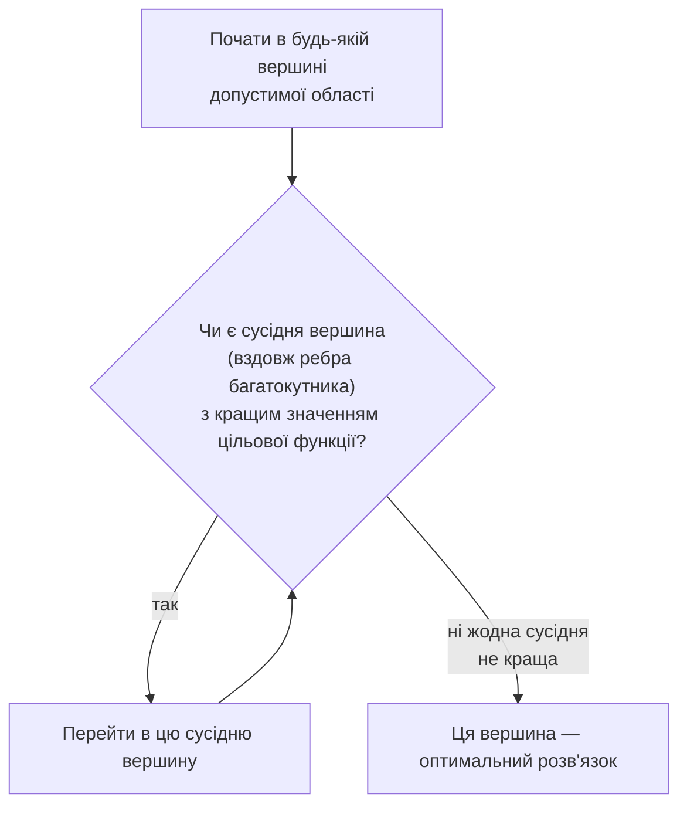

# Лекція 19. Задачі оптимізації та лінійне програмування

*Лекція 18 класифікувала математичні моделі за типом задачі, яку вони
розв'язують, і назвала **оптимізаційні моделі** окремою категорією поряд
із детермінованими, стохастичними, балансовими та імітаційними: модель,
яка не просто описує систему, а шукає найкращий (за заданим критерієм)
варіант дій у межах реальних обмежень. Ця лекція розбирає саме цю
категорію докладно — не оглядово, а з конкретним математичним апаратом.
Основна увага зосереджена на найпоширенішому і водночас найкраще
опрацьованому випадку — **лінійному програмуванні**, для якого існують
надійні, швидкі й гарантовано точні алгоритми розв'язання. Наостанок
лекція коротко оглядає, що змінюється, коли задача стає нелінійною або
вимагає цілих чисел, — і чому для цих випадків уже немає таких же
беззастережних гарантій.*

## Загальна постановка задачі оптимізації

**Механіка.** Будь-яка задача оптимізації складається з трьох частин:

1. **Змінні рішення** (decision variables) — величини, значення яких
   потрібно підібрати: скільки одиниць кожного продукту виробити,
   скільки коштів вкласти в кожен актив, який маршрут обрати.
2. **Цільова функція** (objective function) — число, яке потрібно
   зробити якомога більшим або якомога меншим: `максимізувати f(x)` або
   `мінімізувати f(x)`. Це єдиний критерій "краще/гірше", за яким
   порівнюються всі можливі варіанти.
3. **Обмеження** (constraints) — умови у формі рівностей чи нерівностей,
   яким мають задовольняти змінні: ресурс не може бути витрачений понад
   наявний обсяг, кількість продукції не може бути від'ємною, сума часток
   портфеля має дорівнювати 100%.

Множина всіх наборів значень змінних, які одночасно задовольняють **усі**
обмеження, називається **допустимою областю** (feasible region). Задача
оптимізації — знайти точку в допустимій області, де цільова функція
набуває найкращого значення.

**Чому обмеження — це не додаткова складність, а необхідна частина
задачі.** Без обмежень задача максимізації в реалістичному
економічному сенсі майже завжди не має розв'язку: якщо прибуток зростає
пропорційно кількості виробленої продукції і нічого не стримує це
зростання, оптимальна відповідь — "виробляти нескінченно багато", що не
є відповіддю, придатною для реального рішення. Обмеження (скінченна
кількість сировини, обладнання, робочого часу) саме й перетворюють
задачу з абстрактної на таку, що має конкретний, скінченний оптимальний
розв'язок. У цьому сенсі обмеження в задачі оптимізації — це формальний
запис того самого факту, який керує будь-яким реальним рішенням: ресурси
завжди скінченні, і оптимізація шукає найкраще використання **саме
скінченних** ресурсів, а не гіпотетично безмежних.

**Геометрична інтуїція для двох змінних.** Коли є лише дві змінні
рішення (`x1`, `x2`), кожне обмеження-нерівність — це пряма лінія на
площині, яка ділить площину на дві половини: одна половина задовольняє
обмеження, інша — ні. Допустима область — це перетин усіх таких
півплощин (і, як правило, ще й умов `x1 ≥ 0`, `x2 ≥ 0`, бо кількість
продукції не може бути від'ємною) — геометрично це **багатокутник**
(polygon), можливо, необмежений з одного боку, якщо обмежень для цього
недостатньо. Кожна пряма — межа одного ресурсу; точка всередині
багатокутника — допустимий, але не обов'язково найкращий варіант; точка
поза багатокутником — варіант, що порушує хоча б одне обмеження.

**Де використовується.** Виробниче підприємство: скільки одиниць кожного
виду продукції випустити за обмеженого часу роботи обладнання і
обмеженого запасу сировини. Логістика: як розподілити вантаж між
складами, щоб мінімізувати транспортні витрати за обмеженої
пропускної спроможності маршрутів. Фінанси: як розподілити капітал між
активами, щоб максимізувати очікувану дохідність за обмеженого рівня
ризику. У всіх цих прикладів спільна структура — цільова функція,
обмеження, допустима область — та самі три частини, лише зі своїм
змістом у кожній сфері.

## Лінійне програмування: наскрізний приклад

**Визначення.** Лінійне програмування (ЛП, linear programming) — це
задача оптимізації, у якій **і** цільова функція, **і** всі обмеження —
лінійні функції змінних рішення: сума змінних, кожна помножена на
константу, без квадратів, добутків змінних одна на одну чи інших
нелінійних перетворень. Це звужує клас задач, але натомість дає
надзвичайно потужний наслідок, який розкриється в наступному розділі:
для лінійних задач існують алгоритми, що гарантовано знаходять точний
глобальний оптимум за прийнятний час, — властивість, якої нелінійні
задачі загалом не мають.

**Постановка задачі словами.** Меблевий цех випускає два види продукції
— стільці та столи. Прибуток з одного стільця — 50 грн, з одного стола —
40 грн. Тижневий випуск обмежений трьома ресурсами:

- **дерево** (дошки): на стілець йде 1 м², на стіл — 2 м², у наявності
  80 м² на тиждень;
- **робочий час**: на стілець — 3 години, на стіл — 2 години, у
  наявності 120 людино-годин на тиждень;
- **лак**: на стілець — 1 літр, на стіл — 1 літр, у наявності 60 літрів
  на тиждень.

Скільки стільців і столів варто випускати на тиждень, щоб прибуток був
максимальним?

**Формалізація — той самий текст, переписаний математично, перш ніж
писати будь-який код.** Змінні рішення:

```
x1 — кількість стільців на тиждень
x2 — кількість столів на тиждень
```

Цільова функція (максимізувати тижневий прибуток):

```
максимізувати   50*x1 + 40*x2
```

Обмеження (кожен ресурс — окрема нерівність, плюс природна умова
невід'ємності кількості продукції):

```
1*x1 + 2*x2 <= 80    (дерево, м²)
3*x1 + 2*x2 <= 120   (робочий час, год)
1*x1 + 1*x2 <= 60    (лак, л)
x1 >= 0,  x2 >= 0
```

Це повна математична постановка задачі ЛП: три частини із загального
розділу вище — змінні, лінійна цільова функція, лінійні обмеження —
записані настільки конкретно, що подальший крок (передати це в код) уже
не вимагає жодних додаткових розв'язків, лише механічне перенесення.

## Геометрична інтуїція: чому оптимум завжди у вершині

**Механіка.** Допустима область прикладу вище — багатокутник на площині
`(x1, x2)`, обмежений трьома прямими ресурсів і двома осями координат.
У нього декілька вершин (кутових точок) — точок, де перетинаються рівно
дві межі багатокутника. Ключовий факт лінійного програмування:
**оптимальне значення лінійної цільової функції на багатокутнику завжди
досягається в одній з його вершин**, а не десь усередині чи на середині
ребра (окрім особливого випадку, коли ціле ребро дає однаково
оптимальний результат).

Чому це так, можна зрозуміти без формального доведення: лінійна функція
не має "гірок" чи "ямок" усередині області — вона монотонно змінюється
в напрямку свого градієнта. Якщо рухатися вздовж будь-якого відрізка
всередині багатокутника в напрямку, де цільова функція зростає, рух
можна продовжувати, доки не дійдеш до межі багатокутника; а вздовж межі
— аналогічно, доки не дійдеш до вершини, де дві межі перетинаються і
рухатися вигідно далі вже нікуди. У найгіршому разі кілька вершин (чи
навіть ціле ребро між ними) дають однаковий, теж оптимальний результат
— але **гіршого** розв'язку десь у "глибині" області, не на межі, для
лінійної функції просто не може існувати.

Обчисливши прибуток у кожній вершині багатокутника прикладу вище,
результат підтверджує цей факт напряму:

| Вершина `(x1, x2)` | Які межі перетинаються | Прибуток `50x1 + 40x2` |
|---|---|---|
| (0, 0) | обидві осі | 0 |
| (0, 40) | дерево (`x1+2x2=80`) і вісь `x1=0` | 1600 |
| **(20, 30)** | дерево і робочий час (`3x1+2x2=120`) | **2200** |
| (40, 0) | робочий час і вісь `x2=0` | 2000 |

Максимум прибутку — рівно у вершині (20, 30), і жодна інша вершина не
дає кращого результату. Це не випадковість цього конкретного прикладу, а
загальна властивість будь-якої задачі ЛП: достатньо перевірити вершини
(яких, на відміну від усіх точок області, скінченна кількість), щоб
знайти оптимум.

**Ідея симплекс-методу (лише концептуально).** Класичний алгоритм
розв'язання задач ЛП, симплекс-метод, використовує саме цей факт: замість
перебору всіх вершин одразу, він стартує з однієї допустимої вершини і
на кожному кроці переходить до сусідньої вершини вздовж ребра
багатокутника, якщо це поліпшує цільову функцію, — і зупиняється, коли
жоден сусідній перехід уже не дає поліпшення.



Доведення того, що цей покроковий процес завжди закінчується саме в
глобальному оптимумі (а не застрягає в "локально найкращій, але не
найкращій загалом" вершині), виходить за межі цієї лекції — важливо
запам'ятати сам факт і те, що саме на ньому побудований алгоритм,
який виконує `scipy.optimize.linprog` під капотом.

## Розв'язання засобами scipy.optimize.linprog

**Найважливіша пастка — напрямок оптимізації.** `linprog` завжди
**мінімізує** передану цільову функцію; окремого параметра
"максимізувати" немає. Якщо реальна задача — максимізація (як прибуток
у прикладі вище), потрібно передати **від'ємні** коефіцієнти цільової
функції: мінімізація `-50*x1 - 40*x2` дає точно те саме розв'язання
`(x1, x2)`, що й максимізація `50*x1 + 40*x2`, а знайдене мінімальне
значення `res.fun` буде від'ємним прибутком — тобто справжній
максимальний прибуток отримується, якщо взяти `-res.fun`. Забути цей
знак — найпоширеніша помилка новачків із `linprog`: код виконається без
помилок, `status` покаже успіх, але результат буде розв'язком
**протилежної** задачі (мінімізації прибутку, тобто виробництва
якнайменшої кількості продукції).

**Обмеження-нерівності `linprog` приймає у формі `A_ub @ x <= b_ub`** —
рядок матриці `A_ub` на кожне обмеження, з коефіцієнтами при `x1`, `x2`,
і відповідне число в `b_ub`. Усі три ресурсні обмеження прикладу вже
записані саме в цій формі (`<=`), тож перетворювати нічого не треба.
Параметр `bounds` задає межі для кожної окремої змінної: `(0, None)`
означає "від нуля до нескінченності" — саме це потрібно для кількості
продукції, яка не може бути від'ємною.

```python
from scipy.optimize import linprog

# x1 = стільці, x2 = столи; максимізуємо прибуток -> мінімізуємо -прибуток
c = [-50, -40]

A_ub = [
    [1, 2],   # дерево, м²
    [3, 2],   # робочий час, год
    [1, 1],   # лак, л
]
b_ub = [80, 120, 60]

res = linprog(
    c, A_ub=A_ub, b_ub=b_ub,
    bounds=[(0, None), (0, None)],
    method="highs",
)

print(res.x)         # [20. 30.]
print(-res.fun)       # 2200.0 -- справжній максимальний прибуток
print(res.status)    # 0
print(res.message)   # Optimization terminated successfully. (HiGHS Status 7: Optimal)
```

**Метод `'highs'`.** З версії SciPy 1.9.0 (2022) `method='highs'` —
значення за замовчуванням, тож параметр `method` навіть можна не писати
явно. `'highs'` не є окремим алгоритмом сам по собі — це
диспетчер, який автоматично обирає між двома реалізаціями пакета HiGHS:
`'highs-ds'` (дуальний симплекс-метод, пряма реалізація ідеї з
попереднього розділу) і `'highs-ipm'` (метод внутрішньої точки,
принципово інший підхід, що рухається через **середину** допустимої
області, а не по її межі, і лише наприкінці "притискається" до вершини).
Для задач цього курсу різниця між ними непринципова — обидва гарантовано
знаходять точний оптимум для задачі ЛП; `method='highs'` без додаткових
уточнень — правильний вибір за замовчуванням для будь-якого нового коду.
*(Історична примітка: у старих версіях SciPy за замовчуванням
використовувались інші методи — `'simplex'` і пізніше
`'interior-point'`; вони застарілі, і в новому коді їх обирати не варто
— йдеться про них лише тому, що такий код усе ще можна зустріти в
старіших підручниках чи прикладах.)*

**Що означають поля результату.**

- `res.x` — знайдений оптимальний вектор змінних (`[20.0, 30.0]`);
- `res.fun` — значення цільової функції **в тому вигляді, в якому вона
  була передана** (тобто мінімізованого `-прибутку`); для задачі
  максимізації справжній результат — це `-res.fun`;
- `res.status` — числовий код завершення: `0` — успішно знайдено
  оптимум, `1` — вичерпано ліміт ітерацій, `2` — задача несумісна
  (немає жодної точки, що задовольняє всі обмеження одночасно), `3` —
  задача необмежена (цільову функцію можна поліпшувати без кінця — ознака
  забутого обмеження), `4` — числові труднощі розв'язника;
- `res.message` — текстовий опис того самого статусу людською мовою;
- `res.slack` — на скільки кожне обмеження-нерівність **не** досягнуто в
  оптимумі (`b_ub - A_ub @ x`); саме це поле — ключ до наступного
  розділу.

Перед тим як довіряти `res.x`, варто завжди перевірити `res.status == 0`
(або рівносильно `res.success == True`) — код, що просто бере `res.x`
без цієї перевірки, ризикує прийняти за розв'язок щось, що розв'язком
насправді не є (наприклад, залишок від невдалої спроби при
незбіжній чи несумісній задачі).

## Аналіз розв'язку: активні обмеження

**Механіка.** Обмеження називається **активним** (binding constraint),
якщо в знайденому оптимальному розв'язку воно виконується як точна
**рівність** — ресурс витрачений повністю, без залишку. Обмеження
**неактивне** (slack), якщо в оптимумі є запас — ресурс не витрачений
до кінця. Це і є зміст поля `res.slack`: нульове значення — обмеження
активне, додатне — залишок цього ресурсу.

```python
usage = [a[0] * res.x[0] + a[1] * res.x[1] for a in A_ub]
for name, limit, used, slack in zip(
    ["дерево", "робочий час", "лак"], b_ub, usage, res.slack
):
    status = "АКТИВНЕ (вузьке місце)" if slack < 1e-6 else f"запас {slack:.1f}"
    print(f"{name}: використано {used:.1f} з {limit} -> {status}")

# дерево: використано 80.0 з 80 -> АКТИВНЕ (вузьке місце)
# робочий час: використано 120.0 з 120 -> АКТИВНЕ (вузьке місце)
# лак: використано 50.0 з 60 -> запас 10.0
```

**Чому це важливо — практична, а не суто математична інформація.**
Активне обмеження — це ресурс, який справді є **вузьким місцем**
(bottleneck) виробництва: саме він, а не інші, стримує прибуток від
подальшого зростання за поточних умов. У прикладі вище дерево і робочий
час використані вщент — цех міг би виробити ще більше та заробити ще
більше, якби мав більше дощок або більше робочих годин. Лак же
залишається з запасом 10 літрів — навіть якщо постачальник запропонує
цеху ще 20 літрів лаку безкоштовно, це нічого не змінить у прибутку,
бо лак і без того не є тим, що стримує виробництво. Розрізнення
"активне / неактивне" відповідає на конкретне управлінське питання: у
що варто інвестувати (більше дощок, більше робочих годин), а що
розширювати не має сенсу (запас лаку).

**Оглядово: тіньові ціни.** Значення в `res.ineqlin.marginals` (частина
розширеного об'єкта результату) показують, наскільки зміниться
оптимальний прибуток, якщо збільшити ліміт відповідного ресурсу на одну
одиницю, — так звана **тіньова ціна** (shadow price) ресурсу. Для
неактивного обмеження тіньова ціна завжди нульова (ресурсу і без
розширення вистачає із запасом), для активного — зазвичай додатна.
Повна теорія двоїстості лінійного програмування, що стоїть за цим
поняттям, залишається поза межами цього курсу — досить простої думки:
**активне обмеження — це той ресурс, який справді є вузьким місцем**, і
саме на нього варто звертати увагу, розглядаючи розширення виробництва.


## Огляд: нелінійна оптимізація

**Механіка.** Якщо цільова функція нелінійна (містить квадрати, добутки
змінних, тригонометричні чи інші нелінійні перетворення), `linprog` уже
незастосовний — потрібен інший інструмент: `scipy.optimize.minimize`.
На відміну від `linprog`, який гарантовано знаходить **глобальний**
оптимум для будь-якої задачі ЛП, `minimize` для загальної нелінійної
функції гарантує лише **локальний** оптимум: точку, де функція краща за
всіх найближчих сусідів, але не обов'язково за всі точки області
взагалі (якщо функція не є, наприклад, випуклою). Це фундаментальна
відмінність, яку варто пам'ятати: для нелінійних задач вибір початкової
точки (`x0`) іноді впливає на те, який саме локальний оптимум буде
знайдено.

Приклад: середні витрати на одиницю продукції як функція обсягу випуску
— типова U-подібна крива (спершу спадають за рахунок економії масштабу,
потім зростають через перевантаження виробництва):

```python
from scipy.optimize import minimize

def avg_cost(q):
    return 0.02 * q[0] ** 2 - 3 * q[0] + 200

res = minimize(avg_cost, x0=[0])
print(res.x, res.fun)        # ≈ [75.0], ≈ 87.5

# з обмеженням (контрактний мінімум випуску q >= 90 одиниць) --
# для задач із обмеженнями потрібен метод, що їх підтримує, напр. SLSQP
res_constrained = minimize(
    avg_cost, x0=[90], method="SLSQP", bounds=[(90, None)],
)
print(res_constrained.x, res_constrained.fun)   # [90.0], 92.0
```

Без обмежень мінімум середніх витрат — при випуску близько 75 одиниць
(87.5 грн/од.); якщо контракт вимагає випускати щонайменше 90 одиниць,
оптимум зсувається до самої межі обмеження `q = 90` (92 грн/од.) — це
той самий принцип активного обмеження з попереднього розділу, лише
тепер застосований до нелінійної задачі. **Де використовується**: підбір
параметрів моделі за критерієм мінімізації похибки (та сама ідея,
що лежить в основі методу найменших квадратів із Лекції 17, лише без
готової формули — там, де формули розв'язку немає, `minimize` шукає
відповідь чисельно), оптимізація нелінійних інженерних чи фінансових
критеріїв, де немає лінійної структури.

## Огляд: цілочислова оптимізація

**Механіка.** У багатьох реальних задачах змінні рішення мають бути
**цілими числами**: кількість вироблених стільців не може дорівнювати
23.7 — цех або випускає 23 стільці, або 24, третього варіанту немає.
Задача, у якій частина або всі змінні обмежені цілими значеннями, і
водночас цільова функція та обмеження лінійні, називається задачею
**цілочислового лінійного програмування** (MILP, mixed-integer linear
programming).

**`linprog` не розв'язує таких задач напряму** — він завжди повертає
неперервний розв'язок (як `x1 = 20.0`, `x2 = 30.0` у прикладі вище, чи
дробові значення в інших варіантах цієї практики), навіть якщо змістовно
потрібні лише цілі кількості. Найпростіший (і оманливий) підхід —
розв'язати задачу як звичайну ЛП і потім округлити результат до
найближчого цілого — не гарантує оптимальності: округлене значення може
навіть вийти недопустимим (порушити обмеження, які виконувались точно на
межі для дробового значення) або відрізнятись від справжнього
цілочислового оптимуму. Розв'язок звичайної ЛП без цілочислової умови
називають **релаксацією** задачі — він завжди принаймні не гірший за
цілочисловий оптимум (бо цілочислові розв'язки — це підмножина всіх
допустимих розв'язків релаксації), і слугує верхньою (для максимізації)
оцінкою того, на що можна розраховувати.

Для справжнього розв'язання MILP в SciPy (з версії 1.9) є окрема функція
`scipy.optimize.milp`, яка приймає параметр `integrality` — масив, що
позначає, які саме змінні мають бути цілими, — і використовує алгоритм
"branch and bound" (перебір із відсіканням неперспективних гілок,
концептуально схожий на перегляд вершин у симплекс-методі, але тепер і
за цілочисловою умovою). Для складніших промислових MILP-задач також
широко застосовують спеціалізовані бібліотеки, наприклад `PuLP` —
зручнішу мову для запису обмежень, яка "під капотом" викликає ті самі чи
подібні розв'язники. Повне розв'язання MILP-задачі виходить за межі
цієї лекції — тут важливо запам'ятати сам факт: **цілочислова умова —
це не деталь оформлення відповіді, а окрема, суттєво складніша задача**,
для якої `linprog` не є коректним інструментом.

## Типові помилки

**Забутий знак під час максимізації.** `linprog` мінімізує завжди;
передача `c = [50, 40]` замість `c = [-50, -40]` для задачі
максимізації прибутку не викличе помилки виконання — вона просто дасть
код, що мовчки розв'язує **іншу** задачу (мінімізацію прибутку, тобто
буквально "виробляти якнайменше"). Перед тим, як довіряти результату,
варто завжди явно перевірити напрямок: якщо задача — максимізація,
`res.fun` має бути **від'ємним**, і справжня відповідь — `-res.fun`.

**Обмеження-нерівність записане в неправильному напрямку.** `A_ub @ x
<= b_ub` очікує саме `<=`; обмеження виду "не менше" (наприклад,
мінімальна вимога до вмісту білка в кормовій змісти) потрібно спершу
помножити на `-1` з обох боків, щоб перетворити `a*x >= b` на
`-a*x <= -b`, а вже потім передавати в `A_ub`, `b_ub`. Пряме
підставляння коефіцієнтів вимоги "не менше" без цього перетворення —
поширена помилка, що дає формально інший, часто протилежний
за сенсом набір обмежень.

**`res.status == 3` (задача необмежена) сприймається як технічна
помилка коду, а не сигнал про пропущене обмеження.** Якщо цільова
функція для максимізації може зростати без обмеження, це майже завжди
означає, що в реальній задачі забуто якесь ресурсне обмеження — а не
що щось не так із самим викликом `linprog`.

**Дробовий результат `linprog` трактується як остаточна відповідь для
задачі, де змістовно потрібні цілі одиниці.** Округлення дробового
`res.x` "на око" без перевірки допустимості округленого варіанта чи
використання інструментів MILP — типова спроба обійти цілочислову
природу задачі, яка не гарантує ні допустимості, ні оптимальності
результату.

## Підсумок

- Задача оптимізації складається з трьох частин: змінні рішення,
  цільова функція (максимізувати/мінімізувати) і обмеження, що разом
  визначають допустиму область; без обмежень реалістична задача
  максимізації, як правило, не має скінченного розв'язку.
- Лінійне програмування — випадок, коли цільова функція і всі
  обмеження лінійні; допустима область для двох змінних — багатокутник,
  і оптимум лінійної цільової функції завжди досягається в одній з
  його вершин (ідея симплекс-методу — покроковий перехід між сусідніми
  вершинами, доки не знайдено ту, звідки нікуди рухатись вигідніше).
- `scipy.optimize.linprog` (метод `'highs'`, поточне значення за
  замовчуванням) завжди мінімізує передану цільову функцію — для
  максимізації потрібно передати від'ємні коефіцієнти й потім взяти
  `-res.fun`; обмеження-нерівності передаються у формі `A_ub @ x <=
  b_ub`.
- Активне (binding) обмеження — те, що виконується як точна рівність у
  знайденому оптимумі (`res.slack == 0`); саме воно є справжнім вузьким
  місцем ресурсу, на розширення якого варто звертати увагу першим.
- `scipy.optimize.minimize` розв'язує нелінійні задачі, але гарантує
  лише локальний, а не глобальний оптимум; справжня цілочислова
  оптимізація вимагає окремих інструментів (`scipy.optimize.milp`,
  `PuLP`) — звичайний `linprog` завжди повертає неперервний (дробовий)
  розв'язок.

Ця лекція розглядала повністю **детерміновану** оптимізацію: усі
коефіцієнти цільової функції та обмежень — фіксовані, відомі наперед
числа, і розв'язок для тих самих вхідних даних завжди один і той самий.
Наступна лекція робить крок у прямо протилежному напрямку — від
детермінованості до випадковості: як генерувати випадкові числа за
заданим розподілом і як метод Монте-Карло використовує саме таку
керовану випадковість для моделювання систем, які аналітично (як
задача ЛП тут) розв'язати неможливо чи надто складно.

**Практика до цієї лекції:** [Практика 20. Лінійне програмування: постановка задачі, розв'язання засобами scipy](../practice/20-linear-programming.md)
