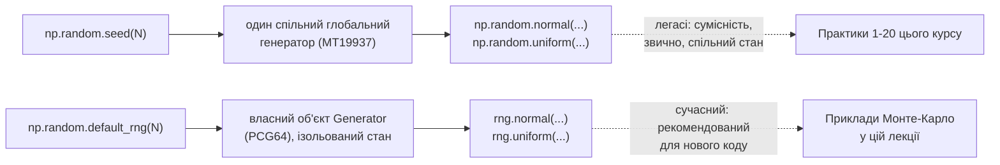
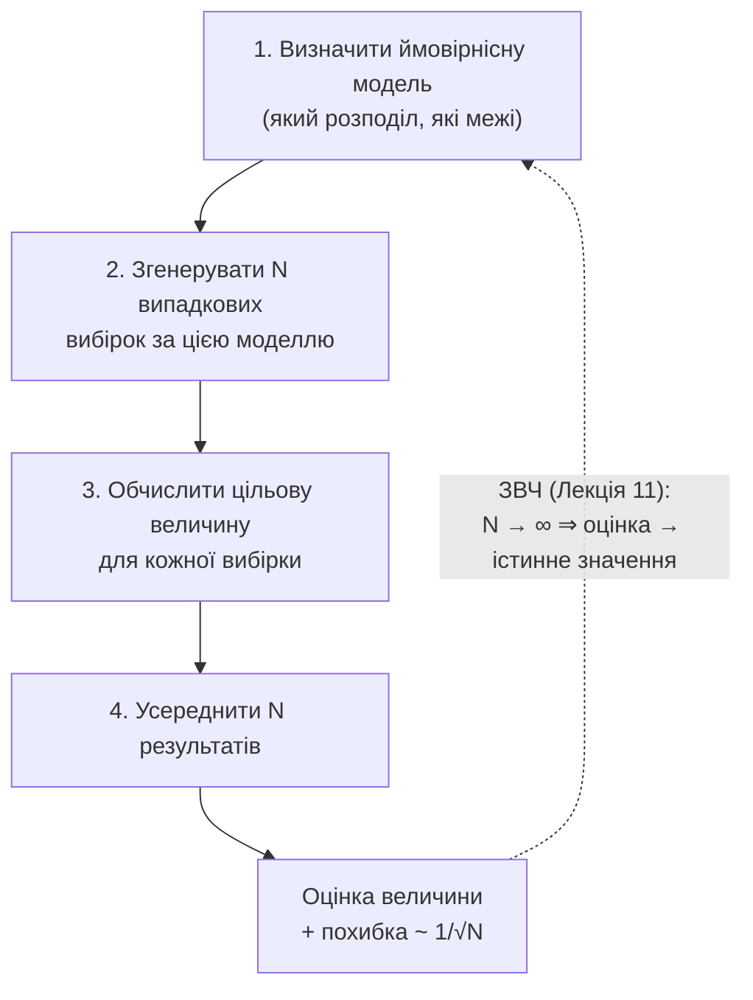
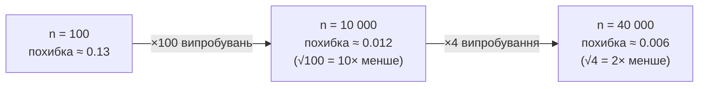

# Лекція 20. Генерація випадкових чисел і випадкових потоків

*Лекція 18 завершила Модуль 3 класифікацією математичних моделей і серед
інших категорій назвала **імітаційні** (симуляційні) моделі — моделі,
які не розв'язують задачу аналітичною формулою, а відтворюють процес
багаторазовим випадковим "прогоном" і роблять висновок зі статистики
результатів. Там це була лише назва категорії в переліку; ця лекція,
що відкриває Модуль 4, робить її конкретною. Інструмент, на якому
тримається все далі, — генерація випадкових чисел: без уміння
відтворювати випадковість у коді жодна імітаційна модель не існує. На
цьому самому інструменті побудований і метод Монте-Карло — спосіб
оцінити цілком детерміновану величину (площу фігури, значення
інтеграла, математичне сподівання) не формулою, а випадковим
вибірковуванням, і саме на нього піде друга половина лекції.*

## Генератори псевдовипадкових чисел: детермінований алгоритм, що виглядає випадковим

**Механіка.** Комп'ютер не вміє породжувати "справжню" випадковість —
кожна команда виконується детерміновано. Те, що `numpy` називає
"випадковим числом", — це результат **псевдовипадкового генератора**:
детермінованого алгоритму, який за початковим числом, **seed**, і
поточним внутрішнім станом обчислює наступне число послідовності так,
що вся послідовність статистично **виглядає** як набір незалежних
рівномірно розподілених чисел (проходить набір статистичних тестів на
випадковість), хоча насправді повністю визначена наперед.

Ключовий факт, який з цього прямо випливає: **той самий seed завжди
породжує ту саму послідовність**.

```python
import numpy as np

rng_a = np.random.default_rng(42)
rng_b = np.random.default_rng(42)

print(rng_a.random(5))
print(rng_b.random(5))
# [0.77395605 0.43887844 0.85859792 0.69736803 0.09417735]
# [0.77395605 0.43887844 0.85859792 0.69736803 0.09417735]  -- ідентично

rng_c = np.random.default_rng(7)
print(rng_c.random(5))
# [0.62509547 0.8972138  0.77568569 0.22520719 0.30016628]  -- інший seed, інша послідовність
```

**Чому це корисно, а не недолік.** На перший погляд здається, що
"справжня" випадковість мала би бути непередбачуваною завжди, і
детермінованість — це компроміс чи слабкість реалізації. Це не так:
відтворюваність — саме та властивість, яка робить псевдовипадкові
генератори придатними для наукової й інженерної роботи. Якщо симуляція
дає дивний результат, seed дозволяє відтворити **точно ту саму**
послідовність випадкових чисел і покроково знайти причину — без seed
налагодження було б неможливим, бо повторний запуск давав би щоразу
інші числа й інший результат. Так само оцінка домашнього завдання чи
наукова перевірка результату колеги: якщо два різні запуски з тим самим
seed дають той самий результат, це підстава довіряти, що обчислення
відтворюване, а не залежить від випадкового "вдалого" прогону. Саме
тому в цьому курсі кожна практика з випадковими числами (Практики
10–11, 15 і ця) починається з фіксації seed за номером варіанта —
не заради формальності, а щоб викладач міг відтворити рівно ті самі
дані, які бачив студент.

## Легасі підхід і сучасний підхід: дві API в numpy

`numpy` історично пропонує два способи роботи з випадковістю, і варто
розуміти обидва — не тому, що потрібно постійно перемикатись між ними,
а тому що в реальному коді (і в чужих ноутбуках) трапляються обидва.

**Легасі підхід** — глобальні функції модуля `numpy.random`:
`np.random.seed(N)` встановлює seed для **одного спільного глобального
генератора**, після чого будь-який виклик `np.random.normal(...)`,
`np.random.uniform(...)` тощо бере число з цього самого глобального
потоку. Це саме той стиль, яким побудовані Практики 1–20 цього курсу
(наприклад, `np.random.seed(<номер варіанта>)` на початку генерації
набору даних) — простий синтаксис, звичний і достатній для навчальних
задач одного ноутбука.

**Сучасний підхід** — об'єкт `Generator`, який створюється явно через
`np.random.default_rng(seed)` і зберігає свій стан **у собі**, а не в
прихованій глобальній змінній модуля. Усі методи генерації викликаються
на цьому конкретному об'єкті: `rng.normal(...)`, `rng.uniform(...)`.

```python
# легасі стиль (використовується в Практиках 1-20 цього курсу)
np.random.seed(1)
legacy = np.random.normal(loc=170, scale=8, size=5)

# сучасний стиль (рекомендований для нового коду)
rng = np.random.default_rng(1)
modern = rng.normal(loc=170, scale=8, size=5)
```

**Чому сучасний підхід є офіційно рекомендованим.** Дві причини, і обидві
практичні, а не косметичні:

1. **Якість самого алгоритму.** Легасі генератор — `MT19937` (Mersenne
   Twister), розроблений у 1990-х. `default_rng()` за замовчуванням
   використовує `PCG64` — новіший алгоритм з кращими статистичними
   властивостями (менше приховних закономірностей у довгих
   послідовностях) і швидшою роботою.
2. **Відсутність спільного глобального стану.** Легасі `np.random.seed()`
   змінює **один** генератор, спільний для всієї програми. Якщо в
   ноутбуці десь у середині виконання випадково викликається ще один
   `np.random.normal(...)` (наприклад, з іншої функції чи іншої
   імпортованої бібліотеки, яка теж використовує легасі глобальний
   генератор), він **зсуває** той самий глобальний потік — і всі наступні
   "випадкові" числа в коді нижче зміщуються непередбачувано, залежно
   від порядку виконання клітинок. Об'єкт `Generator` цієї проблеми не
   має за конструкцією: кожен `rng = np.random.default_rng(seed)` — це
   власний, ізольований потік, і два незалежні `rng`-об'єкти в одній
   програмі жодним чином не впливають один на одного.

**Коли яким користуватись.** Для нового й production-коду `numpy`
офіційно рекомендує `default_rng()` — це чинний стандарт із версії 1.17
(2019 рік). У цьому курсі варіантна генерація даних і надалі
використовує знайомий `np.random.seed(<номер варіанта>)` — заради
узгодженості з усіма попередніми практиками й простоти запису одним
рядком на початку ноутбука; легасі API нікуди не зникає й офіційно
підтримується. Але варто знати: якщо колись доведеться писати код поза
цим курсом (дослідницький проєкт, продакшн-скрипт), стандартний вибір —
`rng = np.random.default_rng(seed)`, і саме цей стиль використовується
далі в прикладах Монте-Карло цієї лекції, де важливо явно бачити, який
саме об'єкт генерує кожне число.



## Генерація з різних розподілів: тепер у ролі джерела, а не об'єкта аналізу

Лекція 10 розглядала розподіли (рівномірний, нормальний, експоненційний
та інші) як модель уже наявних даних — і рахувала для них PDF, CDF,
квантилі через `scipy.stats`. Тут ті самі розподіли з'являються в
протилежній ролі: не як опис готових спостережень, а як **джерело**,
з якого потрібно самому породити нові дані. `Generator` має по методу
на кожен стандартний розподіл:

```python
rng = np.random.default_rng(0)

u = rng.uniform(low=0, high=10, size=5)       # рівномірний на [0, 10)
n = rng.normal(loc=170, scale=8, size=5)      # нормальний, μ=170, σ=8
e = rng.exponential(scale=4.0, size=5)        # експоненційний, E[X] = 4.0
k = rng.integers(low=1, high=7, size=5)       # цілі числа 1..6 (кидок кубика)

print(u)
print(n)
print(e)
print(k)
```

Це той самий словник параметрів, що й у Лекції 10 (`scale` для
експоненційного — це `1/λ`, а не `λ`; `rng.integers(low, high)` не
включає `high`, аналогічно правилам зрізів Python) — лише застосований
у напрямку "від розподілу до чисел", а не "від чисел до розподілу".
Саме ці методи — будівельний матеріал для решти лекції: і генерація
синтетичних наборів нижче, і метод Монте-Карло далі, повністю
складаються з викликів `rng.uniform()`, `rng.normal()` та їм подібних.

## Генерація синтетичних наборів даних

**Механіка.** Синтетичний набір даних — це дані, отримані не
спостереженням реального процесу, а явно заданою формулою плюс
випадковий шум, згенерований описаними вище методами. Дослідник, який
створює такий набір, наперед точно знає "правильну відповідь" —
параметри, які реальні дані ніколи не розкривають напряму.

**Навіщо це потрібно**, коли реальних даних, здавалося б, і так
достатньо:

- **Перевірка методу перед реальними даними.** Якщо алгоритм (регресія,
  критерій, кластеризація) не може відновити параметри, які самі ж
  задали під час генерації, довіряти цьому алгоритму на реальних даних,
  де правильної відповіді ніхто не знає, — нема підстав.
- **"Що якщо"-сценарії.** Синтетичний набір дозволяє змінювати один
  параметр процесу (силу шуму, розмір ефекту, частку викидів) і
  спостерігати, як це впливає на результат методу — експеримент,
  неможливий на фіксованому реальному наборі.
- **Навчальні датасети з відомою правильною відповіддю** — саме цей
  випадок нижче: генерується набір із заздалегідь заданими коефіцієнтами
  лінійної залежності, і перевіряється, чи регресія (Лекції 16–17)
  відновлює їх із зашумлених даних.

```python
rng = np.random.default_rng(10)

n = 200
b0_true, b1_true = 3.0, 2.5          # свідомо відомі "правильні" коефіцієнти

x = rng.uniform(0, 10, size=n)
noise = rng.normal(loc=0, scale=1.0, size=n)
y = b0_true + b1_true * x + noise    # лінійна залежність + шум

# найпростіший спосіб перевірити регресію одним рядком: np.polyfit
# повертає коефіцієнти в порядку [нахил, перетин] для полінома степеня 1
b1_hat, b0_hat = np.polyfit(x, y, 1)

print(f"істинні:     b0={b0_true}, b1={b1_true}")
print(f"відновлені:  b0={b0_hat:.3f}, b1={b1_hat:.3f}")
# істинні:     b0=3.0, b1=2.5
# відновлені:  b0=2.971, b1=2.502
```

Регресія відновлює коефіцієнти майже точно (`2.971` і `2.502` проти
істинних `3.0` і `2.5`) — невелике розходження це саме той шум,
`noise`, який свідомо додано в дані, а не помилка методу. Це саме та
перевірка "чи метод узагалі працює", яку неможливо провести на
реальних даних, бо там ніхто не знає істинних `b0` і `b1` наперед.

## Метод Монте-Карло: загальна ідея

**Механіка.** Метод Монте-Карло — спосіб оцінити цілком детерміновану
величину (площу фігури, значення визначеного інтеграла, математичне
сподівання складної величини), для якої аналітична формула або
невідома, або надто складна, **через випадкове вибіркування замість
точного обчислення**: згенерувати багато випадкових вибірок за
підходящою ймовірнісною моделлю, обчислити цільову величину для кожної
вибірки й усереднити результат.

**Чому це взагалі працює.** Це не фокус і не наближення "на око" — це
пряме застосування закону великих чисел (Лекція 11): якщо цільова
величина — це математичне сподівання якоїсь випадкової величини (а
нижче буде показано, що площа, інтеграл і "сподівання" в буквальному
сенсі — усі три зводяться саме до цієї форми), то ЗВЧ гарантує, що
середнє з `n` незалежних вибірок наближається до істинного сподівання
зі зростанням `n`. Метод Монте-Карло — це ЗВЧ, застосований не до
"вибіркового середнього як оцінки E[X]" (як у Лекції 11), а до
довільної детермінованої величини, яку вдалось переписати у формі
математичного сподівання.



## Класичний приклад: оцінка числа π

**Механіка.** Квадрат зі стороною 2 (від −1 до 1 по обох осях) має
площу `2 × 2 = 4`. Коло радіуса 1, вписане в цей квадрат, має площу
`π·r² = π`. Якщо кидати точки навмання й рівномірно по всьому квадрату
(це і є "кидання дротиків"), частка точок, що потрапляють усередину
кола, наближається до відношення площ — `π / 4`:

```python
rng = np.random.default_rng(2)
n = 100_000

x = rng.uniform(-1, 1, size=n)
y = rng.uniform(-1, 1, size=n)

inside_circle = (x**2 + y**2) <= 1          # умова "точка всередині кола радіуса 1"
pi_estimate = inside_circle.mean() * 4      # частка всередині × площа квадрата

print(pi_estimate, np.pi, abs(pi_estimate - np.pi))
# 3.14032  3.14159...  похибка ≈ 0.0013
```

**Чому це працює.** `inside_circle.mean()` — це частка точок квадрата,
що потрапили в коло, і за побудовою рівномірного розбризкування ця
частка наближається саме до відношення площ `площа_кола / площа_квадрата
= π / 4` (та сама логіка "площа під кривою = ймовірність" з PDF рівномірного
розподілу, Лекція 10, лише застосована до двовимірної фігури, а не до
відрізка). Помноживши цю частку на відому площу квадрата (`4`),
одержують оцінку невідомої площі кола — а отже, й `π`. Жодна частина
розрахунку не використовує формулу площі кола напряму: усе, що відомо
наперед, — це форма квадрата й правило "чи точка всередині кола"
(`x² + y² ≤ 1`, звичайна теорема Піфагора).

**Де використовується.** Це навчальний приклад, але сама техніка —
"оцінити площу фігури довільної форми через частку випадкових точок,
що в неї потрапляють" — застосовується для фігур, для яких аналітичної
формули площі просто немає: складна географічна зона на карті,
перетин кількох умов у багатовимірному просторі параметрів (наприклад,
частка комбінацій параметрів проєкту, що одночасно задовольняють
кілька обмежень) — принцип той самий: порівняти з площею фігури, площу
якої знаємо (квадрат чи прямокутник, що охоплює всю область).

## Оцінка визначеного інтеграла методом Монте-Карло

**Механіка.** Визначений інтеграл `∫ₐᵇ f(x) dx` — це площа під кривою
`f(x)` на відрізку `[a, b]`. Середнє значення функції на відрізку,
помножене на довжину відрізка, дає ту саму площу:

```
∫ₐᵇ f(x) dx  ≈  (b - a) · середнє f(x) за випадковими x, рівномірно взятими на [a, b]
```

Це пряме узагальнення оцінки площі кола вище: там "функцією" була
індикатор "точка всередині кола" (0 або 1), а середнє цього індикатора
й давало частку площі. Тут `f(x)` — довільна функція, а не лише 0/1.

```python
rng = np.random.default_rng(3)
n = 100_000

# приклад 1: ∫₀¹ x² dx — аналітично відомо, що дорівнює 1/3
x1 = rng.uniform(0, 1, size=n)
integral_1 = (1 - 0) * (x1 ** 2).mean()
print(integral_1, 1 / 3, abs(integral_1 - 1 / 3))
# 0.3332   0.3333...   похибка ≈ 0.0001

# приклад 2: ∫₀^π sin(x) dx — аналітично відомо, що дорівнює 2
x2 = rng.uniform(0, np.pi, size=n)
integral_2 = np.pi * np.sin(x2).mean()
print(integral_2, 2.0, abs(integral_2 - 2.0))
# 2.0053   2.0   похибка ≈ 0.0053
```

В обох випадках відома аналітична відповідь узята саме для того, щоб
безпосередньо перевірити точність методу — на практиці метод Монте-Карло
цінний саме тоді, коли такої аналітичної відповіді немає (функція `f(x)`
не має первісної в елементарних функціях, або область інтегрування
багатовимірна й складна за формою) — а тут вона є лише як контрольна
відповідь для навчального прикладу.

**Де використовується.** Інтеграли без аналітичного розв'язку постійно
трапляються в задачах з кількома змінними: очікуваний прибуток проєкту,
що залежить від трьох невизначених параметрів одночасно (курс валюти,
попит, витрати), формально записується як інтеграл прибутку за спільним
розподілом усіх трьох — обчислити його аналітично здебільшого
неможливо, а оцінити симуляцією (згенерувати багато комбінацій трьох
параметрів, обчислити прибуток для кожної, усереднити) — стандартна
практика фінансового й інженерного моделювання.

## Оцінка математичного сподівання складної випадкової величини

**Механіка.** Ідея повторюється ще раз, тепер без "площі" як
проміжного образу: якщо потрібне сподівання `E[g(X)]` якоїсь складної
функції `g` від випадкової величини (чи кількох величин), а формула для
цього сподівання аналітично складна чи невідома, можна просто
згенерувати багато реалізацій `X`, обчислити `g(X)` для кожної й узяти
середнє — це вибіркове середнє за визначенням (Лекція 11) наближається
до `E[g(X)]`.

Приклад: яке очікуване значення **максимуму** з трьох кидків
шестигранного кубика? Формулу для сподівання максимуму кількох
незалежних величин вивести можна, але вона вже не тривіальна:

```python
rng = np.random.default_rng(5)
n = 200_000

rolls = rng.integers(1, 7, size=(n, 3))     # n рядків по 3 кидки кубика кожен
maxes = rolls.max(axis=1)                    # максимум у кожному рядку

expectation_estimate = maxes.mean()
print(expectation_estimate)
# 4.958   (аналітичне значення: 4.9583...)
```

Той самий трюк з `size=(n, 3)` і `.max(axis=1)`, що вже застосовувався
для одержання `n_repeats` вибіркових середніх у Лекції 11 — генерується
одна велика матриця `n × 3` замість циклу `for`, і `.max(axis=1)` рахує
максимум кожного рядка окремо, залишаючи масив довжини `n` — по одному
"максимуму трьох кидків" на кожен рядок.

**Де використовується.** Очікувана виплата за страховим полісом, що
залежить від максимального збитку серед кількох незалежних ризиків;
очікуваний час виконання паралельного процесу, що завершується тоді,
коли завершується **найповільніший** з кількох незалежних підпроцесів
(що теж максимум кількох випадкових величин); очікуваний прибуток
складної стратегії, що є нелінійною функцією кількох невизначених
факторів одночасно, — усюди, де аналітична формула сподівання вимагає
або складного інтегрування, або взагалі не існує в закритому вигляді,
а прямий симуляційний підрахунок середнього — це те саме E[g(X)] у
кілька рядків коду.

## Збіжність за кількістю випробувань: похибка убуває як 1/√n

**Механіка.** Кожна оцінка Монте-Карло вище — це вибіркове середнє
`n` незалежних випадкових доданків (індикатора "точка в колі", значення
функції у випадковій точці, значення `g(X)` для випадкової реалізації).
Це точно та сама конструкція, що вибіркове середнє x̄ₙ у Лекції 11 — і
тому на неї напряму переноситься результат тієї лекції: стандартна
похибка оцінки Монте-Карло убуває як `σ/√n`, де `σ` — стандартне
відхилення одного доданка (одного індикатора чи одного значення
функції), а не як `1/n`.

```python
rng = np.random.default_rng(0)
true_pi = np.pi
n_repeats = 300

print(f"{'n':>8}   середня |похибка|")
for n in [100, 1_000, 10_000, 100_000]:
    errors = []
    for _ in range(n_repeats):
        x = rng.uniform(-1, 1, size=n)
        y = rng.uniform(-1, 1, size=n)
        estimate = ((x ** 2 + y ** 2) <= 1).mean() * 4
        errors.append(abs(estimate - true_pi))
    print(f"{n:>8}   {np.mean(errors):.5f}")

# n=      100   середня |похибка| ≈ 0.129
# n=    1 000   середня |похибка| ≈ 0.043
# n=   10 000   середня |похибка| ≈ 0.012
# n=  100 000   середня |похибка| ≈ 0.004
```

Кожен рядок тут — не одна оцінка, а середня похибка за `300`
незалежних повторів оцінки при тому самому `n` (та сама ідея
"вибіркового розподілу середнього", що й повторні вибірки в Лекції 11
і Практиці 11) — щоб побачити типову величину похибки, а не випадкове
коливання одного конкретного запуску.

**Чому саме √n, а не n, і чому це принципове обмеження, а не недолік
реалізації.** Перехід від `n=100` до `n=10 000` — це зростання `n` у
**100 разів**, а середня похибка впала приблизно в `0.129 / 0.012 ≈
10.8` раза — близько до `√100 = 10`, а не до `100`. Це означає:

```
похибка(4n) ≈ похибка(n) / 2
```

вчетверо більше випробувань дають лише **вдвічі** меншу похибку — не
тому, що метод реалізовано неоптимально, а тому, що це формула
стандартної похибки `σ/√n` із Лекції 11, застосована буквально:

```python
rng = np.random.default_rng(9)
true_pi = np.pi

for n in [2_500, 10_000]:            # 10 000 = 4 × 2 500
    errors = []
    for _ in range(500):
        x = rng.uniform(-1, 1, size=n)
        y = rng.uniform(-1, 1, size=n)
        estimate = ((x ** 2 + y ** 2) <= 1).mean() * 4
        errors.append(abs(estimate - true_pi))
    print(n, np.mean(errors))

# 2500    ≈ 0.0271
# 10000   ≈ 0.0134   -- приблизно вдвічі менше за похибку при n=2500
```

Наслідок для планування обчислень: якщо поточна точність Монте-Карло
оцінки недостатня й потрібно зменшити похибку вдвічі, треба **вчетверо**
більше випробувань, а щоб зменшити похибку в 10 разів — у 100 разів
більше випробувань. Це той самий закон убуваючої віддачі, що вже
обговорювався в Лекції 11 для x̄ — тут він застосований до оцінок
Монте-Карло, а не до вибіркового середнього реальних вимірювань, але
математика буквально та сама, тому що оцінка Монте-Карло **і є**
вибіркове середнє.



## Типові помилки

**Очікування, що вдвічі більше випробувань дає вдвічі меншу похибку.**
Пряме перенесення помилки з Лекції 11: якщо симуляція з `n=1000` дала
недостатню точність, збільшення до `n=2000` зменшить похибку лише в
`√2 ≈ 1.41` раза, а не вдвічі — планування обчислювального часу "на
око" без урахування `1/√n` систематично недооцінює, скільки випробувань
насправді потрібно.

**Плутанина глобального seed між незалежними частинами коду.** Якщо в
одному ноутбуці використовується легасі `np.random.seed(N)` на початку,
а потім у різних клітинках послідовно викликаються різні `np.random.*`
функції, порядок виконання клітинок (не лише їхній вміст) впливає на
те, які саме числа отримає кожна клітинка — повторний запуск клітинок
у іншому порядку дає інший результат навіть із тим самим `seed`. Це
одна з причин, чому `default_rng()` — безпечніший вибір для коду, де
кілька незалежних симуляцій виконуються в одному файлі: кожна отримує
власний `rng`, і порядок виконання клітинок перестає мати значення.

**Замала кількість випробувань для оцінки рідкісної події.** Якщо
цільова ймовірність (чи частка "успіхів") сама дуже мала — скажімо,
0.001 — то при `n=1000` очікується в середньому лише одна "точка
всередині" цільової області, і оцінка виявиться або 0, або грубо
неточною через саму дискретність підрахунку; для надійної оцінки
рідкісних подій потрібне суттєво більше `n`, ніж для подій із часткою
близько 0.5, — той самий принцип "мала очікувана частота — ненадійна
статистика", що вже зустрічався в Лекції 15 для критерію хі-квадрат.

**Округлення чи усічення координат перед перевіркою умови.** Наприклад,
округлення `x` і `y` до цілих перед перевіркою `x**2 + y**2 <= 1`
перетворює неперервний рівномірний розподіл на дискретний з лише
кількома можливими значеннями — оцінка втрачає сенс, бо вибірка більше
не рівномірна на всьому квадраті, а зосереджена в кількох точках
ґратки.

## Підсумок

- Псевдовипадковий генератор — детермінований алгоритм, що за seed
  відтворює однакову послідовність; це властивість, яка робить
  результати відтворюваними для налагодження й перевірки, а не
  обмеження методу.
- `np.random.seed()` + глобальні функції (легасі, `MT19937`, спільний
  глобальний стан) — стиль, яким побудовано варіантну генерацію даних
  у Практиках 1–20 цього курсу; `np.random.default_rng()` (`Generator`,
  `PCG64`, власний ізольований стан) — сучасний рекомендований підхід
  для нового коду, застосований у прикладах цієї лекції.
- Генерація синтетичних наборів (відомі `b0`, `b1` + шум) дозволяє
  перевірити, чи метод (наприклад, регресія) відновлює правильну
  відповідь, коли вона наперед відома, — перевірка, неможлива на
  реальних даних.
- Метод Монте-Карло — оцінка детермінованої величини (площі, інтеграла,
  сподівання) через усереднення багатьох випадкових вибірок; це пряме
  застосування закону великих чисел (Лекція 11) до довільної величини,
  переписаної у формі математичного сподівання.
- Похибка оцінки Монте-Карло убуває як `1/√n` (та сама стандартна
  похибка з Лекції 11): учетверо більше випробувань — лише вдвічі
  менша похибка; це фундаментальне обмеження методу, а не наслідок
  поганої реалізації.

Наступна лекція дивиться на дані з іншого боку: не окремі незалежні
спостереження, а **часовий ряд** — послідовність значень, де порядок у
часі має значення сам собою, а не лише сукупність значень; випадковість
там теж присутня (шум навколо тренду), але головне питання — не
"скільки випробувань потрібно", а "як розділити послідовність на
тренд, сезонність і залишковий шум".

**Практика до цієї лекції:** [Практика 21. Метод Монте-Карло: обчислення площі та інтеграла, оцінка сподівання, збіжність за кількістю випробувань](../practice/21-monte-carlo.md)
