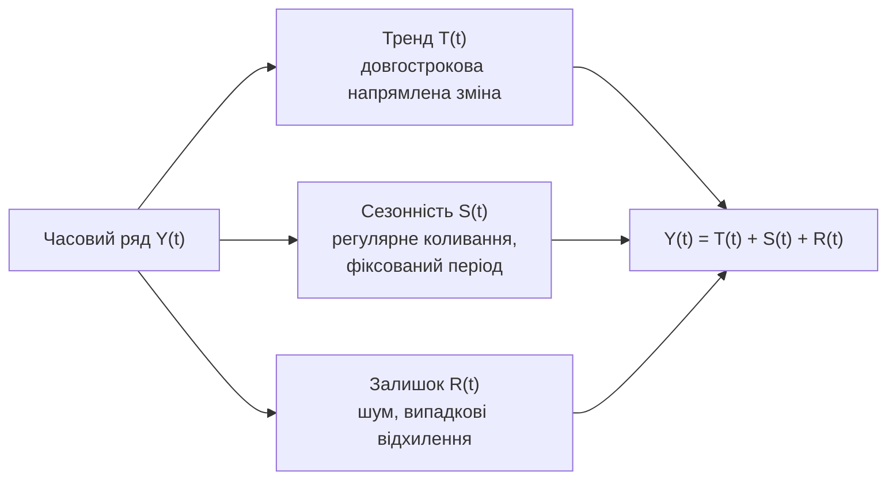

# Лекція 21. Часові ряди: структура і згладжування

*Модуль 4 відкрився методом Монте-Карло (Лекція 20) — способом оцінити
детерміновану величину через багаторазове випадкове вибіркування; там
порядок, у якому згенеровані випадкові числа, був цілком байдужий: усі
`n` вибіркових точок можна перемішати в будь-якому порядку, і оцінка
`π` чи інтеграла не зміниться ні на йоту. Це не випадковість, а
властивість буквально кожного набору даних, з яким цей курс працював
досі: вибірка зросту студентів (Лекція 5), пари "години підготовки —
бал" (Лекція 16), навіть послідовність кидків кубика в симуляції
Монте-Карло — усе це **i.i.d.**-дані (Лекції 11–15): незалежні,
однаково розподілені спостереження, де порядок запису в масиві не несе
жодної інформації. Ця лекція вперше за курс працює з даними
принципово іншої природи — **часовим рядом**: послідовністю вимірювань
однієї змінної в часі, де сусідні спостереження зазвичай залежні одне
від одного, а сам порядок — не технічна деталь зберігання, а частина
змісту даних. Переставити місяці місцями в ряду продажів чи
температур — це не "той самий набір даних в іншому порядку", а зовсім
інший, позбавлений сенсу ряд.*

## Що таке часовий ряд і чим він принципово відрізняється

**Механіка.** Часовий ряд — послідовність значень `Y(t₁), Y(t₂), ...,
Y(tₙ)` однієї змінної, виміряної в послідовні моменти часу через
рівні (як правило) інтервали — щодня, щомісяця, щороку. У Python
природне представлення — `pandas.Series` з індексом `DatetimeIndex`,
згенерованим `pd.date_range()`:

```python
import numpy as np
import pandas as pd

rng = np.random.default_rng(1)

dates = pd.date_range(start="2019-01-01", periods=72, freq="MS")  # 72 місяці = 6 років
month = dates.month

trend_true = np.linspace(500, 900, len(dates))                     # істинний тренд
seasonal_true = 250 * np.cos((month - 7) / 12 * 2 * np.pi)         # істинна сезонність, пік у липні
noise = rng.normal(0, 40, len(dates))                               # істинний шум

visitors = trend_true + seasonal_true + noise
ts = pd.Series(visitors, index=dates, name="відвідувачі")
print(ts.head(6))
```

`freq="MS"` — стандартний псевдонім частоти `pandas` "початок місяця"
(month start); та сама сезонна формула `amplitude * cos((month - 7) /
12 * 2π)`, що вже застосовувалась у Практиці 15 для кліматичних даних
— тут вона моделює не температуру, а сезонний потік відвідувачів парку
атракціонів: пік улітку (`cos(0) = 1` при `month = 7`), спад узимку.

**Чому порядок тут принципово важливий — на відміну від усіх
попередніх наборів курсу.** Переставимо ті самі числа випадково і
подивимось, що залишається, а що зникає:

```python
shuffled = rng.permutation(visitors)

print(np.isclose(visitors.mean(), shuffled.mean()))   # True
print(np.isclose(visitors.std(), shuffled.std()))      # True
print(np.array_equal(np.sort(visitors), np.sort(shuffled)))  # True -- ті самі числа
```

Середнє, дисперсія, навіть повний набір значень — ідентичні до й після
перемішування: для будь-якої статистики з Лекцій 5–15 (x̄, s²,
критерій хі-квадрат, кореляція Пірсона) `visitors` і `shuffled` дали б
буквально однаковий результат, бо жодна з тих формул не дивиться на
порядок запису. Але графік `shuffled` не показав би ні плавного
зростання популярності парку за шість років, ні річного сезонного
циклу — лише хаотичний зигзаг. Уся інформація про тренд і сезонність
живе не в самих числах, а саме **в порядку**, в якому вони йдуть одне
за одним — те, що часовий ряд додає понад "просто набір значень".

Друга сторона того самого факту: сусідні спостереження часового ряду
зазвичай **залежні** (корельовані) — місяць із високою кількістю
відвідувачів здебільшого сусідить з іншим місяцем із високою
кількістю (те саме сезонне піднесення чи той самий етап зростання
популярності), а не є незалежним "новим кидком кубика" щоразу. Це
пряма протилежність припущенню незалежності, на якому побудовані ЗВЧ і
ЦГТ (Лекція 11) і всі критерії Лекцій 12–15 — застосовувати ці критерії
до часового ряду напряму, ігноруючи залежність між сусідніми точками,
означає порушувати їхню базову передумову.

**Де використовується.** Ціни акцій і курси валют, щоденна кількість
відвідувачів сайту, щомісячний обсяг продажів, кількість пасажирів
метро за годинами доби, температура, показники з датчиків
промислового обладнання — будь-яке вимірювання, повторюване в часі
для одного об'єкта чи процесу, за визначенням є часовим рядом, і саме
тому аналіз часових рядів — окремий, добре розвинений розділ
статистики, а не варіація вже пройденого матеріалу.

## Структура часового ряду: тренд, сезонність, залишок

**Механіка.** Класична модель розкладає часовий ряд на три складові:

```
Y(t) = T(t) + S(t) + R(t)      -- адитивна декомпозиція
```

- **T(t), тренд** — довгострокова спрямована зміна рівня ряду (стійке
  зростання чи спадання впродовж багатьох періодів, без огляду на
  короткочасні коливання).
- **S(t), сезонність** — регулярне коливання з **фіксованим періодом**
  (річний цикл із 12 місяцями, тижневий цикл із 7 днями, добовий
  цикл із 24 годинами) — форма, що повторюється з періоду в період.
- **R(t), залишок (нерегулярна складова)** — усе, що лишається після
  віднімання тренду й сезонності: шум, випадкові відхилення, разові
  події без регулярної структури.

У прикладі вище всі три складові відомі наперед за побудовою —
`trend_true`, `seasonal_true`, `noise` — точно так само, як у Лекції
20 генерувались синтетичні набори з наперед відомими "правильними"
коефіцієнтами регресії: маючи ряд зі свідомо заданою структурою, можна
потім перевірити, чи метод декомпозиції (розділ нижче) справді
відновлює ці складові, а не якісь довільні числа.



**Мультиплікативна декомпозиція (оглядово).** Якщо амплітуда сезонного
коливання **зростає пропорційно** рівню ряду (сезонний розкид продажів
магазину, що росте, стає в абсолютних числах дедалі більшим саме тому,
що загальний обсяг продажів зростає), природніша модель —
мультиплікативна:

```
Y(t) = T(t) · S(t) · R(t)      -- мультиплікативна декомпозиція
```

Тут `S(t)` і `R(t)` — множники навколо 1.0 (наприклад, `S = 1.15`
означає "на 15% вище типового рівня цього періоду"), а не додаткові
величини в тих самих одиницях, що `Y`. Обидва варіанти реалізовані в
одній і тій самій функції `statsmodels` параметром `model=` (розділ
нижче) — вибір між ними залежить від того, чи сезонний розкид у даних
візуально сталий (адитивна) чи росте разом із рівнем ряду
(мультиплікативна).

**Де використовується.** Практично будь-який реальний бізнесовий чи
природний ряд — продажі роздрібної мережі (тренд зростання компанії +
сезонність передсвяткових місяців), споживання електроенергії (тренд
економічного розвитку регіону + сезонність опалювального сезону),
кількість пасажирів авіакомпанії (тренд + сезонність відпускних
місяців) — усі природно описуються саме цією трискладовою структурою.

## Візуалізація: перше "на око" виявлення тренду і сезонності

**Механіка.** Перш ніж рахувати будь-що формально, часовий ряд варто
просто побудувати як лінійний графік — вісь X це час, вісь Y значення
— і подивитись, чи форма підказує тренд і сезонний цикл на око, так
само, як діаграма розсіювання (Лекція 16) підказувала форму зв'язку
двох змінних перед обчисленням `r`.

```python
import matplotlib.pyplot as plt

fig, ax = plt.subplots(figsize=(10, 4))
ax.plot(ts.index, ts.values)
ax.set_xlabel("Місяць")
ax.set_ylabel("Кількість відвідувачів")
ax.set_title("Щомісячна кількість відвідувачів парку атракціонів, 2019-2024")
```

На такому графіку одразу видно дві речі одночасно: загальну лінію,
що повільно піднімається зліва праворуч (тренд зростання популярності
парку з ≈500 до ≈900 відвідувачів на місяць за шість років), і
регулярні "гірки" й "долини" всередині кожного року (сезонний пік
улітку, спад узимку) — саме ті `trend_true` і `seasonal_true`, що були
свідомо закладені в генерацію даних вище, тепер видно на графіку без
жодного розрахунку.

**Застереження з Лекції 7.** Правило "вісь Y стовпчикової діаграми
має починатися з нуля" там же явно позначене як таке, що найсуворіше
застосовується до **стовпчикових** діаграм; для лінійного графіка
зміни ряду в часі, де абсолютний нуль часто не має змістовного
значення на масштабі графіка (як тут: "0 відвідувачів" не є
природною точкою відліку для порівняння місяців між собою), обрізана
вісь — прийнятний і навіть типовий вибір за умови, що це не
спотворює порівняння сусідніх точок так, як спотворювало би
стовпчики. Саме тому графіки часових рядів у цій лекції не
форсують `ax.set_ylim(0, ...)`.

## Згладжування ковзним середнім

**Механіка.** Ковзне середнє (`rolling().mean()`) замінює кожну точку
ряду середнім значенням за **вікном** сусідніх точок навколо неї (чи
перед нею — залежно від налаштування, детальніше нижче):

```python
ts_ma3 = ts.rolling(window=3, center=True).mean()
ts_ma12 = ts.rolling(window=12, center=True).mean()
ts_ma36 = ts.rolling(window=36, center=True).mean()

fig, ax = plt.subplots(figsize=(10, 4))
ax.plot(ts.index, ts.values, alpha=0.35, label="оригінал")
ax.plot(ts.index, ts_ma3.values, label="вікно = 3")
ax.plot(ts.index, ts_ma12.values, label="вікно = 12")
ax.plot(ts.index, ts_ma36.values, label="вікно = 36")
ax.legend()
ax.set_title("Ковзне середнє при різних розмірах вікна")
```

**Чому це прибирає короткочасний шум і виявляє тренд.** Кожна точка
`ts_ma_k[i]` — це вибіркове середнє `k` сусідніх спостережень, а
вибіркове середнє за конструкцією має менший розкид навколо
"справжнього" рівня, ніж окремі спостереження (та сама логіка `Var(x̄)
= Var(X)/n` з Лекції 11, лише застосована до ковзного, а не одного
фіксованого, вікна): випадкові відхилення `R(t)` окремих місяців
здебільшого компенсують одне одного всередині вікна, а систематична
складова `T(t) + S(t)`, що змінюється повільно (чи регулярно
повторюється), лишається на місці.

**Чому розмір вікна змінює результат — надто мале й надто велике
вікно.** На графіку вище три криві поводяться по-різному:

- **`вікно = 3`** — надто мале порівняно з періодом сезонності (12
  місяців): усередині трьох сусідніх місяців усереднюється лише
  частина одного сезонного підйому чи спаду, тож у згладженій лінії
  й досі помітне "тремтіння" — шум прибраний лише частково, а
  сезонний цикл спотворено, не усунуто повністю.
- **`вікно = 12`** — точно один сезонний період: усереднення за повний
  рік автоматично гасить сезонну хвилю (кожне вікно містить рівно по
  одному "місяцю кожного сезону", і сезонні відхилення взаємно
  скасовуються), лишаючи практично чистий тренд — саме та крива,
  що найближче повторює `trend_true`.
- **`вікно = 36`** — надто велике: усереднення за три роки згладжує не
  лише сезонність, а й реальну **кривизну** самого тренду (якщо
  зростання популярності парку прискорювалось чи сповільнювалось у
  певний рік, вікно в 36 місяців це "розмазує" на весь інтервал) —
  частина справжньої структури втрачена, а не лише шум.

**Лаг: `center=False` (за умовчанням) проти `center=True`.** Другий,
окремий від розміру вікна ефект — де саме "розташована" згладжена
точка відносно вікна, з якого вона рахується:

```python
trailing = ts.rolling(window=12).mean()                # center=False (умовчання)
centered = ts.rolling(window=12, center=True).mean()   # вікно симетричне навколо точки
```

За умовчанням (`center=False`) вікно `[t-11, ..., t]` "тягнеться
позаду" точки `t` — значення в момент `t` це середнє за **минулі** 12
місяців, а не за місяці навколо `t`. Наслідок — систематичний **лаг**:
`trailing` реагує на реальний зламний момент тренду (наприклад, різке
прискорення зростання) із запізненням приблизно в половину вікна,
тому що поки останні кілька "нових", уже зрослих значень не потраплять
у вікно повністю, середнє продовжує показувати старіший, нижчий рівень.
`centered` (`center=True`) цього лагу не має — вікно симетричне, і
згладжена точка відповідає своєму справжньому моменту часу — але для
цього потрібні `k/2` майбутніх спостережень, яких у реальному часі,
на момент останнього наявного місяця, просто ще нема. Тому:
`center=True` — правильний вибір для **ретроспективного** аналізу й
декомпозиції готового ряду (як у розділі нижче), а `center=False` —
єдиний фізично можливий варіант, якщо згладжений ряд рахується "в
реальному часі", крок за кроком, без доступу до майбутніх значень.

```mermaid
flowchart LR
    A["Замале вікно<br/>(менше за період сезонності)"] --> A1["Шум прибрано частково,\nсезонна хвиля спотворена,\nне усунута"]
    B["Вікно \"якраз\"<br/>(= період сезонності)"] --> B1["Сезонність усереднюється\nдо нуля, тренд видно чітко"]
    C["Завелике вікно<br/>(набагато більше періоду)"] --> C1["Втрачається реальна\nкривизна тренду\n+ систематичний лаг"]
```

**Де використовується.** Ковзне середнє за 7 днів для щоденних
показників (гасить різницю "будній/вихідний"), за 12 місяців для
щомісячних рядів (гасить річну сезонність), за 200 торгових днів у
фінансовому аналізі (класична "200-денна ковзна середня" ціни акції,
що виявляє довгостроковий тренд крізь щоденний шум цін) — вибір вікна
завжди прив'язаний до відомого періоду сезонності чи бажаного
горизонту згладжування, а не обирається довільним числом.

## Формальна декомпозиція: `statsmodels.tsa.seasonal.seasonal_decompose`

**Механіка.** Ручний підбір вікна ковзного середнього вище дає
візуальне уявлення про тренд, але не виокремлює сезонну складову як
окремий, явний об'єкт. `seasonal_decompose` робить це формально: за
центрованим ковзним середнім (тим самим прийомом, що й вище) оцінює
тренд, потім усереднює те, що залишилось після віднімання тренду, за
кожним календарним періодом (кожним місяцем окремо для річної
сезонності) — це і є сезонна складова, — а все, що лишається після
віднімання обох, записує як залишок:

```python
from statsmodels.tsa.seasonal import seasonal_decompose

decomposition = seasonal_decompose(ts, model="additive", period=12)

trend_hat = decomposition.trend
seasonal_hat = decomposition.seasonal
resid_hat = decomposition.resid

print(trend_hat.dropna().head())
print(seasonal_hat.head(12))                 # один повний річний цикл
print(resid_hat.dropna().std())
```

`period=12` — довжина одного сезонного циклу у **кроках ряду**, а не
в місяцях чи днях абстрактно: для щомісячних даних із річною
сезонністю це 12, для щоденних даних із тижневою сезонністю це 7.
`model="additive"` відповідає моделі `Y = T + S + R` з розділу вище;
`model="multiplicative"` перемикає на добуткову форму.

**Інтерпретація результату — і пряма перевірка на синтетичному
прикладі.** Оскільки `ts` у цій лекції побудований із наперед
відомими `trend_true` і `seasonal_true`, можна прямо порівняти:

```python
print(np.nanmax(np.abs(trend_hat - trend_true)))     # відхилення оціненого тренду від істинного
print(np.abs(seasonal_hat.head(12).values - seasonal_true[:12]).max())
print(resid_hat.dropna().std())                       # порівняти з істинним std шуму = 40
```

`trend_hat` (за краями `NaN` — центроване вікно на 12 точок вимагає по
6 сусідів з обох боків, яких на самому початку й кінці ряду просто
нема, той самий ефект `centered` ковзного середнього з розділу вище)
близько повторює `trend_true`; `seasonal_hat` — той самий синусоїдний
профіль, що й `seasonal_true`, повторюваний щороку; а
`resid_hat.dropna().std()` виходить близько до `40` — саме того
розкиду шуму, який був явно закладений у генерацію. Це той самий
принцип перевірки методу на даних із наперед відомою відповіддю, що й
у синтетичних наборах Лекції 20: якщо декомпозиція не відновлює
закладені компоненти на такому контрольованому прикладі, довіряти їй
на реальних даних, де правильної відповіді ніхто не знає, немає
підстав.

**Де використовується.** Розділення попиту на "базовий рівень +
сезонний ефект + випадкове відхилення" — стандартний перший крок
будь-якого планування запасів роздрібної мережі (скільки товару
тримати на складі в грудні понад типовий місяць), аналізу споживання
електроенергії (яка частка зимового піку — це справжнє зростання
економіки регіону, а яка — звичний сезонний ефект опалення), контролю
якості виробничого процесу (чи відхилення показника цього тижня — це
шум у межах звичного, чи вихід за межі того, що пояснюється
тренд+сезонність).

## Прогнозування на кілька кроків уперед: огляд

**Механіка.** Маючи розкладений ряд, найпростіший спосіб зазирнути в
майбутнє — продовжити тренд формулою, а до нього додати типовий
сезонний ефект відповідного календарного періоду:

```python
from scipy.stats import linregress

trend_clean = trend_hat.dropna()
x = np.arange(len(trend_clean))
fit = linregress(x, trend_clean.values)              # той самий linregress, що в Лекції 16
print(fit.slope, fit.intercept)

n_ahead = 6
x_future = np.arange(len(trend_clean), len(trend_clean) + n_ahead)
trend_forecast = fit.intercept + fit.slope * x_future

# типовий сезонний ефект для кожного календарного місяця (усереднений за роками)
seasonal_by_month = seasonal_hat.groupby(seasonal_hat.index.month).mean()

future_dates = pd.date_range(ts.index[-1] + pd.offsets.MonthBegin(1),
                              periods=n_ahead, freq="MS")
seasonal_forecast = seasonal_by_month.reindex(future_dates.month).values

forecast = trend_forecast + seasonal_forecast
print(pd.Series(forecast, index=future_dates).round(1))
```

Це пряме продовження Лекції 16: `linregress` тут підбирає пряму лінію
не для пари довільних змінних `x, y`, а для тренду в часі — `x` це
просто номер кроку від початку ряду, `y` — оцінений тренд. Додавання
`seasonal_forecast` — це той самий тип сезонного коефіцієнта, що вже
оцінено `seasonal_decompose`, лише перенесений на майбутні календарні
місяці за їхнім номером.

**"Наївні" прогнози як базовий рівень порівняння.** Перш ніж вірити
складнішому прогнозу з тренду, варто порівняти його з найпростішими
можливими правилами, які часто на диво важко побити:

```python
naive_last_value = ts.iloc[-1]                  # прогноз = останнє відоме значення
naive_seasonal = ts.iloc[-12:-12 + n_ahead]     # прогноз = те саме значення рік тому
```

Якщо складніший прогноз (тренд + сезонність) не точніший за ці
наївні правила на історичних даних, це сигнал, що додаткова
складність моделі не виправдана.

**Що лишається за межами курсу.** Продовження прямої лінії й наївні
правила — найпростіші з можливих підходів; реальні прогнозні системи
здебільшого використовують складніші класи моделей — **ARIMA**
(авторегресійні моделі, що явно враховують залежність поточного
значення від кількох попередніх) та **експоненційне згладжування**
(зокрема метод Хольта-Вінтерса, що комбінує тренд і сезонність з
експоненційно зменшуваною вагою для старіших спостережень). Обидва
клас моделей — за межами цього курсу; тут важливо лише знати, що вони
існують і що саме вони, а не пряма екстраполяція, — стандартний
інструмент, коли прогноз потрібен серйозно, а не оглядово.

## Типова пастка: "добре описує минуле" ≠ "надійний прогноз"

Пряма лінія чи ковзне середнє, підібрані на історичних даних, за
конструкцією добре узгоджуються саме з тими даними, на яких їх
підбирали — це не підстава вважати прогноз на майбутні періоди
надійним. Це буквально те саме застереження щодо екстраполяції, що
Лекція 16 сформулювала для простої регресії: рівняння `y = b0 + b1·x`,
підібране методом найменших квадратів, коректне для `x` **всередині**
спостереженого діапазону, а підстановка `x` далеко за його межами —
екстраполяція без жодної гарантії, що залежність лишається тією ж
формою.

Для часового ряду це застереження ще гостріше: "діапазон" тут — це
не просто числовий інтервал, а **сам час**, і межа завжди рухається
вперед. Тренд, що добре описував шість років історії парку атракціонів,
міг узагалі не передбачити подію, якої в цих шести роках просто не
було — закриття на ремонт, появу конкурента поруч, зміну економічної
ситуації в регіоні. Пряма лінія тренду не "знає" про жодну з цих
можливостей: вона механічно продовжує той самий нахил `fit.slope`,
що спостерігався в минулому, і чим далі прогноз заходить у майбутнє,
тим менше підстав вважати цей нахил і надалі чинним. Практичний
висновок: прогноз на 1–2 кроки вперед зазвичай надійніший, ніж на
12–24 кроки, і будь-який прогноз варто супроводжувати явним
застереженням про горизонт, на якому він ще має сенс, а не подавати
одне число як точну відповідь.


## Типові помилки

**Застосування критеріїв Лекцій 12–15 до часового ряду без урахування
залежності між сусідніми точками.** Довірчі інтервали й перевірка
гіпотез побудовані на припущенні незалежних спостережень (Лекція 11);
сусідні точки часового ряду зазвичай залежні за побудовою — пряме
застосування тих формул до часового ряду систематично дає занадто
вузькі (надто оптимістичні) довірчі інтервали.

**Вибір розміру вікна ковзного середнього "на око", без урахування
періоду сезонності.** Як показано вище, вікно менше за період
залишає сезонну хвилю в згладженому ряду, а вікно, що набагато
перевищує період, губить реальну кривизну тренду — розумний
початковий вибір вікна — саме довжина одного сезонного циклу.

**Плутанина `center=True` і `center=False` при порівнянні згладженого
ряду з оригіналом.** Незауважений лаг трейлінгового (`center=False`)
ковзного середнього може виглядати як "модель відстає від реальності"
— хоча це очікувана й пояснювана властивість вибраного налаштування,
а не помилка методу.

**Адитивна декомпозиція там, де сезонна амплітуда явно росте разом з
рівнем ряду.** Якщо на графіку видно, що сезонні "гірки" стають дедалі
вищими в абсолютних числах у міру зростання загального рівня —
ознака, що потрібна мультиплікативна модель (`model="multiplicative"`)
чи логарифмічне перетворення ряду перед адитивною декомпозицією.

**Довіра до прогнозу на далекий горизонт без застереження.**
Розглянуто в розділі вище: пряма лінія тренду, що чудово описує
історичні шість років, не має жодної вбудованої гарантії щодо сьомого
й восьмого року — особливо якщо в майбутньому можлива подія, що не
мала аналогів у навчальних даних.

## Підсумок

- Часовий ряд — послідовність вимірювань однієї змінної в часі, де
  **порядок** несе інформацію, а сусідні спостереження зазвичай
  залежні; це принципова відмінність від i.i.d.-вибірок Лекцій 11–15,
  де порядок запису байдужий для будь-якої статистики.
- Класична адитивна декомпозиція `Y(t) = T(t) + S(t) + R(t)` розділяє
  ряд на тренд (довгострокова напрямлена зміна), сезонність (регулярне
  коливання з фіксованим періодом) і залишок (шум); мультиплікативна
  форма `Y = T · S · R` — альтернатива, коли сезонна амплітуда
  масштабується разом із рівнем ряду.
- Лінійний графік ряду — перший крок аналізу "на око", з окремим
  застереженням Лекції 7: обрізана вісь Y для лінійного графіка часу
  не так небезпечна, як для стовпчикової діаграми.
- Ковзне середнє (`rolling().mean()`) згладжує короткочасний шум,
  усереднюючи сусідні точки; розмір вікна — компроміс (замале —
  лишає шум і сезонність, завелике — губить реальну кривизну тренду
  й додає лаг), а `center=True`/`center=False` визначає, чи є в
  результаті систематичне запізнення відносно оригіналу.
- `statsmodels.tsa.seasonal.seasonal_decompose` формалізує розділення
  на тренд/сезонність/залишок; на синтетичному прикладі з наперед
  відомими компонентами перевірено, що метод дійсно відновлює їх, а
  не довільні числа — той самий принцип перевірки, що й у Лекції 20.
- Прогноз на кілька кроків — оглядово: продовження тренду через
  `linregress` (Лекція 16) плюс типовий сезонний ефект, або наївні
  правила (останнє значення, той самий період минулого року) як
  базовий рівень порівняння; ARIMA й експоненційне згладжування —
  стандартні складніші підходи, лише названі, за межами курсу.
- Головна пастка — плутати "модель добре описує історичні дані" з
  "прогноз на майбутнє надійний": це те саме застереження щодо
  екстраполяції, що й у простій регресії (Лекція 16), тільки гостріше,
  бо межа спостереженого діапазону в часовому ряді щоразу рухається
  вперед.

Наступна лекція (Лекція 22) переходить до зовсім іншого класу задач —
машинного навчання: постановки задачі, поділу на навчальну й тестову
вибірки, перенавчання, метрик якості. Для часових рядів існують і
власні підходи машинного навчання (перетворення попередніх значень
ряду на ознаки для регресії чи градієнтного бустингу, рекурентні
мережі для довших залежностей) — але це вже інструментарій Лекції 22,
застосований до задачі цієї лекції, а не тема, яку розкриває вона сама.

**Практика до цієї лекції:** [Практика 22. Часовий ряд: побудова, ковзне середнє, виділення тренду і прогноз на кілька кроків](../practice/22-time-series.md)
