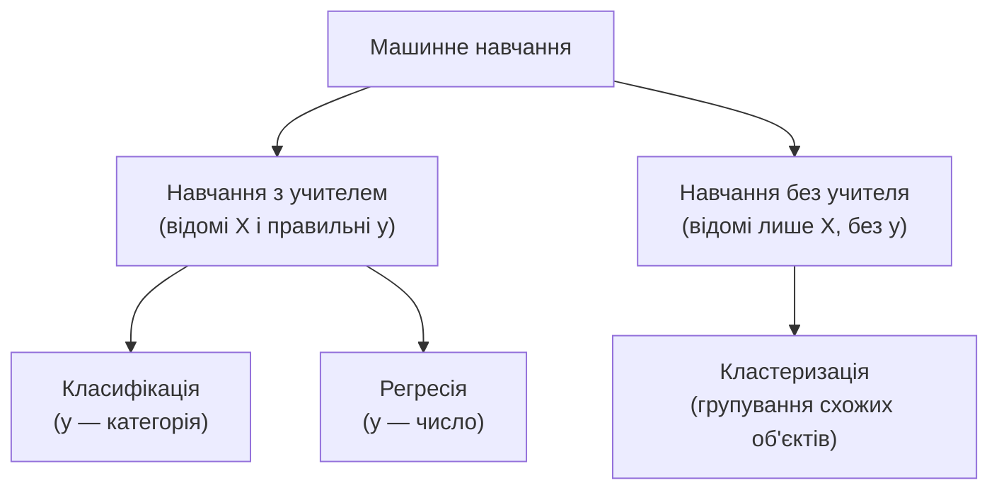
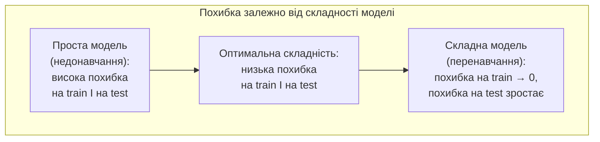
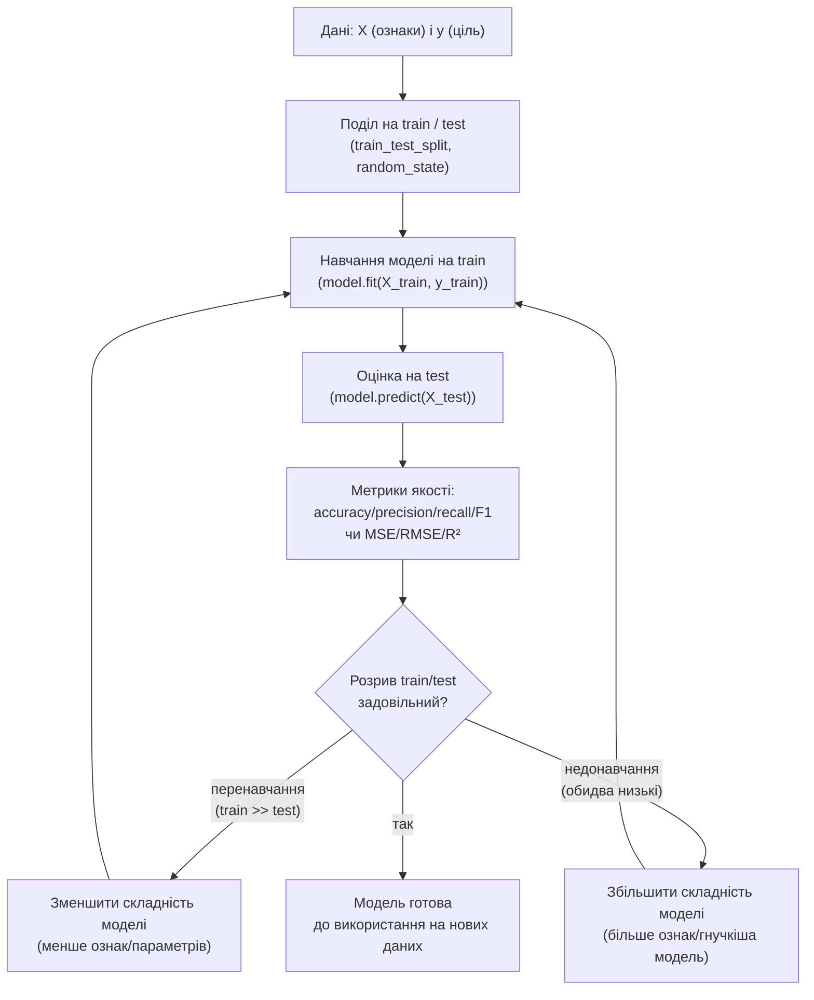

# Лекція 22. Машинне навчання: постановка задачі, навчальна і тестова вибірки, перенавчання, метрики якості (огляд)

*Це заняття 45 з 45 — останнє в курсі, і саме тому воно побудоване не як
черговий крок углиб однієї техніки, а як огляд: карта поняттєвого
апарату машинного навчання, а не поглиблене опрацювання жодного
конкретного алгоритму (на це вже не лишилось часу, і це свідомо так —
мета сьогодні не "навчитись будувати нейронну мережу", а впізнавати
словник і головну пастку машинного навчання, коли вони трапляться далі
в роботі чи навчанні). Лекції 16–17 будували модель того самого
математичного вигляду, що з'явиться тут знову, — лінійну регресію,
`y = b0 + b1·x1 + ... + bk·xk`, підібрану методом найменших квадратів.
Але мета була інша: **зрозуміти й пояснити** зв'язок — чи площа
значуще впливає на ціну квартири, з яким коефіцієнтом, з якою
довірчою імовірністю (`statsmodels.OLS`, p-value, довірчі інтервали).
Машинне навчання ставить над тим самим математичним апаратом геть
інше запитання: не "яка ця залежність і чи вона значуща", а "наскільки
точно ця модель передбачить `y` для **нового** прикладу, якого вона
під час навчання не бачила". Лекція 17 вже назвала цю пізнішу мету
напряму: `sklearn.LinearRegression` замість `statsmodels.OLS` — той
самий метод найменших квадратів, інша бібліотека, інша мета
використання. Ця лекція розгортає цю обіцянку в повноцінний словник:
навчальна й тестова вибірка, перенавчання, метрики якості прогнозу —
і завершує курс не мостом до наступної теми, а поглядом на всю
пройдену карту.*

## Що таке scikit-learn і де його використовують

`scikit-learn` (імпортується в коді як `sklearn`) — стандартна
бібліотека класичного машинного навчання в Python, побудована над
NumPy і SciPy. Її головна ідея — єдиний, узгоджений інтерфейс
(`.fit()`, `.predict()`) для десятків різних алгоритмів (лінійна
регресія, дерева рішень, кластеризація тощо): навчившись користуватись
одним алгоритмом бібліотеки, автоматично вмієш користуватись і всіма
іншими. Це не бібліотека для глибокого навчання (нейронні мережі) — для
цього існують окремі TensorFlow, PyTorch, Keras; `scikit-learn` — саме
для "класичного" ML: регресія, класифікація, кластеризація, підготовка
даних.

Індустрії, де sklearn — щоденний інструмент: фінанси (кредитний
скоринг, виявлення шахрайства), медицина (прогноз ризику захворювання
за результатами аналізів), маркетинг (рекомендаційні системи, прогноз
відтоку клієнтів), HR-аналітика (прогноз плинності персоналу). Це той
самий математичний апарат, що вже використовувався в курсі (лінійна
регресія — Лекції 16-17), але тепер застосований до нової мети —
прогноз на нових даних, а не пояснення наявних, як детально розкриває
решта цієї лекції.

## Постановка задачі машинного навчання

**Механіка.** У задачі навчання з учителем (найпоширеніший і
найважливіший тип, на якому зосереджена решта цієї лекції) дано:

- **ознаки** (features, зазвичай позначаються `X`) — вимірювані
  характеристики кожного об'єкта: площа квартири, кількість кімнат,
  відстань до центру;
- **цільова змінна** (target, `y`) — те, що потрібно передбачити: ціна
  квартири, факт "клієнт піде чи лишиться", завтрашня температура.

Задача — знайти функцію `f`, таку що `f(X) ≈ y`, і, що принципово, ця
функція має добре працювати не лише на тих прикладах, на яких її
підбирали, а на **нових**, ще не бачених об'єктах: квартира, яку
щойно виставили на продаж, новий клієнт, дані про якого модель ще не
обробляла (повний приклад підбору `f` на реальних даних — далі в цій
лекції).

**Чому мета інша, ніж у Лекцій 16–17, навіть коли формула та сама.**
Статистична модель з Лекції 17 оцінюється тим, наскільки добре вона
**описує й пояснює** наявні дані: p-value кожного коефіцієнта,
adjusted R², аналіз залишків — усе це питання про модель **на тих
самих даних**, на яких її будували. Модель машинного навчання
оцінюється геть інакше: наскільки точно вона передбачає `y` на
**нових** даних, і ці дві мети не завжди сумісні — модель, максимально
пристосована до пояснення наявних 22 квартир з точністю до кожного
викиду, може передбачати ціну нової квартири гірше, ніж проста модель
із трьох коефіцієнтів (розділ про перенавчання нижче — саме про це).
Ще одна відмінність: модель, чия єдина мета — точність прогнозу, не
зобов'язана бути інтерпретованою так, як наполягала Лекція 17 щодо
кожного коефіцієнта `bj` ("за інших рівних умов") — вона може бути
складною "чорною скринькою" (нейронна мережа, ансамбль дерев рішень),
де неможливо назвати "внесок" окремої ознаки, і для задачі прогнозу
це не проблема, якщо прогноз достатньо точний.

**Де використовується.** Банк, що передбачає, чи поверне позичальник
кредит, на основі доходу, кредитної історії й віку, — мета не
"зрозуміти механізм неплатоспроможності", а якомога точніше
передбачити результат для конкретного нового заявника. Інтернет-магазин,
що передбачає, які товари порекомендувати відвідувачу на основі
історії його переглядів, — те саме: точність для нового користувача,
а не пояснення купівельної поведінки взагалі.

## Навчання з учителем і без учителя

**Механіка.** Ознака, що розділяє два основні типи машинного навчання,
— чи є в даних цільова змінна `y`.

- **Навчання з учителем** (supervised learning) — для кожного
  навчального прикладу відомий і `X`, і правильна відповідь `y`.
  Модель навчається на парах "ознаки → відповідь" і потім передбачає
  `y` для нових `X`. Саме цей тип розглядає решта лекції.
- **Навчання без учителя** (unsupervised learning) — відомі лише
  ознаки `X`, без жодної "правильної відповіді". Мета — знайти
  структуру в самих даних: групи схожих об'єктів, приховані
  закономірності.



**Приклад навчання з учителем.** Дані про 22 квартири з Лекції 17, де
для кожної відомі і ознаки (площа, кімнати, відстань до центру), і
"правильна відповідь" — фактична ціна продажу.

**Приклад навчання без учителя — кластеризація.** Дані про клієнтів
магазину (частота покупок, середня сума чека), без жодної "правильної"
позначки типу клієнта:

```python
from sklearn.cluster import KMeans
import numpy as np

X_customers = np.array([          # [частота покупок/міс, середній чек, у.о.]
    [1, 250], [1, 300], [2, 220],       # рідкі великі покупки
    [12, 15], [15, 20], [10, 18],       # часті дрібні покупки
])
labels = KMeans(n_clusters=2, random_state=42, n_init=10).fit_predict(X_customers)
print(labels)   # [0 0 0 1 1 1] -- алгоритм сам розділив клієнтів на 2 групи
```

**Чому курс далі йде саме до навчання з учителем.** Наявність
"правильної відповіді" `y` дає чіткий, об'єктивний критерій якості —
наскільки передбачення близьке до факту (на цьому побудована решта
лекції). Оцінити якість кластеризації складніше саме тому, що немає
"правильного" розбиття, з яким порівнювати результат, — самостійна й
глибша тема, за межами обсягу цього огляду.

**Де використовується (без учителя).** Сегментація клієнтів для
маркетингу, пошук аномалій у потоці транзакцій (шахрайство), стиснення
зображень через групування схожих кольорів у палітру.

## Класифікація і регресія

**Механіка.** У навчанні з учителем цільова змінна `y` буває двох
принципово різних типів, і від типу залежить, які алгоритми й метрики
застосовні:

- **Класифікація** — `y` категоріальний: приналежність до одного з
  обмеженого набору класів ("спам / не спам", "хворий / здоровий",
  "поверне кредит / не поверне").
- **Регресія** — `y` числовий, неперервний: ціна, температура, час.

*(Термін "регресія" тут — те саме слово, що в Лекціях 16–17: "регресія"
в машинному навчанні означає не "конкретно лінійна модель", а
"будь-яка модель, що передбачає числову ціль" — лінійна регресія лише
один з можливих методів для такої задачі, і саме
`sklearn.linear_model.LinearRegression` нижче — та сама лінійна
регресія за суттю, з іншою метою застосування.)*

**Приклад класифікації.** Передбачити, чи вийде клієнт банку з
простроченням платежу (`y ∈ {"так", "ні"}`) на основі доходу, віку,
кредитної історії.

**Приклад регресії.** Передбачити ціну квартири (`y` — будь-яке
позитивне число) на основі площі, кількості кімнат і відстані до
центру — саме ця задача з Лекції 17 послужить наскрізним прикладом
далі.

**Де використовується кожен тип.** Класифікація — розпізнавання
рукописних цифр, медична діагностика за результатами аналізів
(діагноз з обмеженого переліку), фільтрація спаму. Регресія — прогноз
продажів наступного місяця, оцінка вартості автомобіля за пробігом і
роком випуску, час доставки замовлення.

## Навчальна і тестова вибірки: найважливіша ідея цієї лекції

**Механіка проблеми.** Якщо модель навчають на всіх наявних даних, а
потім перевіряють якість **на тих самих даних**, результат систематично
завищений: модель мала змогу підлаштуватись саме під ці конкретні
приклади, включно з їхнім шумом і випадковими особливостями, — і
"пригадування" наявних прикладів легко сплутати зі "здатністю
узагальнювати на нові дані". Розв'язання — розділити наявні дані на
дві незалежні частини **до** навчання:

- **навчальна вибірка** (training set) — на ній модель підбирає
  параметри (в лінійній регресії — коефіцієнти `b0, ..., bk`, ту саму
  величину, що в Лекції 17 підбирав МНК);
- **тестова вибірка** (test set) — відкладена **осторонь** і не
  використовується під час навчання взагалі; на ній оцінюється, як
  модель поводиться на даних, яких вона не бачила, — це чесна оцінка
  здатності узагальнювати.

```python
import pandas as pd
from sklearn.model_selection import train_test_split

# ті самі 22 квартири, що в Лекції 17
apartments = pd.DataFrame({
    "площа": [93.3, 52.8, 96.8, 107.4, 107.9, 69.0, 80.7, 93.2, 83.1, 89.2,
              37.6, 57.4, 39.4, 99.3, 63.0, 86.0, 54.2, 61.1, 35.7, 61.9,
              106.2, 51.3],
    "кімнати": [2, 5, 1, 1, 4, 4, 1, 4, 4, 1, 4, 3, 3, 5, 1, 2, 4, 2, 2, 4, 5, 2],
    "відстань_до_центру": [7.1, 4.2, 6.0, 9.3, 11.7, 1.5, 10.4, 8.4, 2.5, 1.9,
                            4.1, 2.7, 13.9, 10.4, 3.9, 8.7, 8.6, 1.6, 12.7, 6.4,
                            2.6, 3.3],
    "ціна": [114.5, 82.0, 98.0, 109.5, 117.7, 100.6, 86.9, 107.8, 105.5, 98.8,
             73.0, 92.5, 50.4, 120.3, 78.2, 91.9, 71.3, 78.2, 33.3, 79.5,
             135.2, 75.7],
})

X = apartments[["площа", "кімнати", "відстань_до_центру"]]
y = apartments["ціна"]

X_train, X_test, y_train, y_test = train_test_split(
    X, y, test_size=0.2, random_state=42
)
print(len(X_train), len(X_test))
# 17 5   -- 22 квартири поділено на 17 навчальних і 5 тестових
```

**Чому саме такі параметри `train_test_split`.** `test_size=0.2`
означає "залишити 20% даних для тесту" — типовий поділ 80/20 (інколи
70/30 для менших наборів). `random_state=42` — той самий принцип
фіксації випадковості, що `np.random.seed`/`np.random.default_rng(seed)`
у Лекції 20: поділ включає випадкове перемішування рядків перед
розрізанням, і без фіксованого `random_state` кожен запуск дав би
інший конкретний поділ, а з фіксованим — результат відтворюваний.

**Чому це найважливіша ідея цієї лекції.** Практично всі наступні
поняття — перенавчання, метрики якості на тесті, сама конструкція
"модель добре працює на нових даних" — прямо спираються на факт, що
навчальна й тестова вибірки не перетинаються. Оцінка якості моделі на
тих даних, на яких вона навчалась, не вимірює те, що насправді
потрібно (передбачення для **нових** прикладів) — вона вимірює
здатність моделі підлаштуватись під уже відомі приклади, а це геть
інше запитання. Саме ця помилка — оцінити модель на навчальних даних
і повідомити цю оцінку як показник якості — найпоширеніша й
найшкідливіша практична помилка початківця в машинному навчанні.

## Перенавчання і недонавчання

**Механіка перенавчання (overfitting).** Занадто гнучка модель — з
надто великою кількістю параметрів відносно обсягу даних — здатна
підлаштуватись не лише під справжню закономірність у даних, а й під
**шум**: випадкові, неповторювані особливості конкретної навчальної
вибірки. Ознака перенавчання — висока точність на навчальній вибірці
й помітно нижча точність на тестовій: модель "запам'ятала" навчальні
приклади замість того, щоб вивчити закономірність, яка узагальнюється
на нові дані.

**Механіка недонавчання (underfitting).** Протилежна проблема:
занадто проста модель не здатна вловити навіть реальну, справжню
структуру в даних. Ознака — низька точність **і на навчальній, і на
тестовій** вибірці одночасно: модель однаково погано працює всюди,
бо їй просто не вистачає гнучкості, щоб описати залежність.

**Класична ілюстрація — поліном різного степеня через ті самі точки.**
Лекція 17 вже згадувала доданок `x²` як спосіб надати лінійній моделі
гнучкості для нелінійного зв'язку. Той самий прийом, доведений до
крайності, — прямий, наочний приклад перенавчання: чим вищий степінь
полінома, тим точніше крива проходить через кожну навчальну точку
(аж до нуля помилки на навчальних даних при достатньо високому
степені), але тим гірше вона передбачає точки, яких не бачила.

```python
import numpy as np
from sklearn.model_selection import train_test_split
from sklearn.linear_model import LinearRegression
from sklearn.preprocessing import PolynomialFeatures
from sklearn.pipeline import make_pipeline
from sklearn.metrics import r2_score

rng = np.random.default_rng(25)
n = 30
x = np.linspace(0, 10, n)
y = 2 + 3 * np.sin(x / 2) + rng.normal(0, 0.8, n)   # справжня залежність + шум

X_train, X_test, y_train, y_test = train_test_split(
    x.reshape(-1, 1), y, test_size=0.3, random_state=25
)

for degree in [1, 3, 12]:
    model = make_pipeline(PolynomialFeatures(degree), LinearRegression())
    model.fit(X_train, y_train)
    r2_train = r2_score(y_train, model.predict(X_train))
    r2_test = r2_score(y_test, model.predict(X_test))
    print(f"степінь={degree:2d}  R2_train={r2_train:.3f}  R2_test={r2_test:.3f}")

# степінь= 1  R2_train=0.592  R2_test=0.385   -- недонавчання: погано і там, і там
# степінь= 3  R2_train=0.911  R2_test=0.866   -- добре узгоджений степінь
# степінь=12  R2_train=0.963  R2_test=-0.610  -- перенавчання: чудово на train,
#                                                  катастрофічно на test
```

**Механіка того, що показують ці три рядки.** При степені 1 модель
однаково не вловлює хвилеподібну форму справжньої залежності ні на
навчальних, ні на тестових точках — обидва R² низькі й близькі: це
недонавчання. При степені 3 модель має достатньо гнучкості, щоб
наблизити справжню синусоїдальну форму, і R² високий і близький на
обох вибірках — саме такий баланс і є метою. При степені 12 навчальна
крива проходить майже через кожну навчальну точку (`R2_train = 0.963`),
але між ними крива починає "вигинатись" довільним чином, щоб точно
пройти через кожну з них, — і на тестових точках ці вигини дають
передбачення, гірші навіть за просте "завжди передбачай середнє",
звідси **від'ємний** `R2_test`: R² може бути від'ємним саме тоді, коли
модель передбачає гірше, ніж найпростіша можлива модель константи.

**Загальна залежність від складності моделі (U-подібна крива).**
Якщо побудувати графік похибки моделі від складності (степеня
полінома, кількості параметрів), картина завжди подібна:



Похибка на **навчальній** вибірці монотонно спадає зі зростанням
складності — складнішій моделі завжди легше підлаштуватись під уже
відомі точки, аж до нуля. Похибка на **тестовій** вибірці спершу
спадає, досягає мінімуму при "правильній" складності, а потім знову
зростає — модель починає підлаштовуватись під шум. Ця **U-подібна
форма** кривої тестової похибки — формальний портрет того, що
продемонстровано вище на трьох степенях полінома.

**Де ця пастка трапляється на практиці.** Модель кредитного скорингу з
надто великою кількістю дрібних, вузькоспецифічних ознак (наприклад,
"чи брав клієнт кредит саме у вівторок") може показати відмінну
точність на історичних даних і провалитись на нових клієнтах, для
яких ці випадкові збіги вже не повторюються.

## Метрики якості класифікації

**Механіка accuracy.** Найпростіша метрика класифікації — **accuracy**
(частка правильних передбачень):

```
accuracy = (кількість правильних передбачень) / (загальна кількість прикладів)
```

**Чому accuracy оманлива при незбалансованих класах.** Уявімо задачу
виявлення шахрайських транзакцій, де лише 5% транзакцій справді
шахрайські (`y = 1`), а 95% — легітимні (`y = 0`). Модель, яка **завжди**
передбачає "не шахрайство" (`y_pred = 0` для абсолютно всіх прикладів,
незалежно від будь-яких ознак), досягає:

```python
import numpy as np
from sklearn.metrics import accuracy_score, precision_score, recall_score, f1_score

rng = np.random.default_rng(7)
n = 200
y_true = np.array([0] * 190 + [1] * 10)   # 95% легітимних, 5% шахрайських
rng.shuffle(y_true)

y_pred_naive = np.zeros(n, dtype=int)     # "завжди передбачай легітимну"

print("accuracy:", accuracy_score(y_true, y_pred_naive))    # 0.95
print("precision:", precision_score(y_true, y_pred_naive, zero_division=0))  # 0.0
print("recall:", recall_score(y_true, y_pred_naive, zero_division=0))        # 0.0
print("f1:", f1_score(y_true, y_pred_naive, zero_division=0))                # 0.0
```

`accuracy = 0.95` виглядає як відмінний результат — але ця "модель" не
виконує **жодної** корисної роботи: вона просто повторює, що
шахрайство рідкісне, і саме тому за визначенням майже завжди влучає,
хоча жодної шахрайської транзакції не виявлено. Ось чому для
незбалансованих класів (а це типова ситуація: шахрайство, рідкі
захворювання, дефекти продукції) accuracy практично завжди потребує
доповнення іншими метриками.

**Механіка precision і recall.** Обидві метрики розглядають клас,
який цікавить дослідника (тут — "шахрайство", `y = 1`), окремо від
загальної частки правильних відповідей:

```
precision = TP / (TP + FP)     -- із передбачених "шахрайство",
                                    яка частка справді шахрайство?
recall    = TP / (TP + FN)     -- із фактично шахрайських,
                                    яку частку модель знайшла?
```

(`TP` — правильно знайдені шахрайські, `FP` — легітимні, помилково
позначені як шахрайські, `FN` — шахрайські, які модель пропустила).
**F1** — єдине число, що узагальнює обидві:

```
F1 = 2 · precision · recall / (precision + recall)
```

Для наївної моделі вище `precision = recall = f1 = 0.0` — модель
жодного разу не позначила приклад як "шахрайство". Порівняємо з
моделлю, яка справді щось розпізнає, хай і не ідеально:

```python
idx_pos, idx_neg = np.where(y_true == 1)[0], np.where(y_true == 0)[0]
rng.shuffle(idx_neg)

y_pred_model = np.zeros(n, dtype=int)
y_pred_model[idx_pos[3:]] = 1     # знайшла 7 із 10 шахрайських (3 пропущено)
y_pred_model[idx_neg[:5]] = 1     # і помилково позначила 5 легітимних

print("accuracy:", accuracy_score(y_true, y_pred_model))              # 0.96
print("precision:", round(precision_score(y_true, y_pred_model), 3))  # 0.583
print("recall:", round(recall_score(y_true, y_pred_model), 3))        # 0.7
print("f1:", round(f1_score(y_true, y_pred_model), 3))                # 0.636
```

`accuracy = 0.96` тут ненабагато вища за наївні `0.95`, і саме тому
сама accuracy не показує різниці між "марною" і "корисною" моделями
так виразно, як precision, recall і F1: модель, що знаходить 7 із 10
шахрайських транзакцій (`recall = 0.7`), хай і з кількома хибними
тривогами (`precision = 0.583`), — реально корисний інструмент, попри
accuracy, що майже не відрізняється від марної моделі вище.

**Де використовується який акцент.** Медичний скринінг небезпечної
хвороби — **recall** критичніший за precision: пропустити хворого
(`FN`) небезпечніше, ніж один раз даремно перестрахуватись і
відправити на додаткове обстеження здорову людину (`FP`). Спам-фільтр
— навпаки, **precision** часто важливіший: помилково позначити важливий
лист як спам (`FP`) — гірше, ніж пропустити один спам-лист у папку
"вхідні" (`FN`). Коли обидва типи помилок важливі приблизно однаково —
**F1** дає єдине зведене число для порівняння моделей.

## Метрики якості регресії

**Механіка MSE і RMSE.** Для регресії, де `y` — число, а не категорія,
"правильно/неправильно" не застосовне — натомість вимірюють, наскільки
далеко передбачення від фактичного значення:

```
MSE  = (1/n) · Σ(y_факт - y_передбачене)²
RMSE = √MSE
```

`MSE` (середньоквадратична помилка) підносить кожну похибку до
квадрата перед усередненням — так само, як сума квадратів залишків у
МНК (Лекції 16–17), — тож великі помилки штрафуються сильніше, ніж
пропорційно. `RMSE` (корінь із MSE) повертає результат у ті самі
одиниці вимірювання, що й `y` (тисячі умовних одиниць ціни, а не їхній
квадрат), що зручніше для інтерпретації.

```python
from sklearn.metrics import mean_squared_error, root_mean_squared_error

y_test_actual = [98.8, 75.7, 117.7, 82.0, 135.2]
y_test_pred = [95.1, 79.4, 112.6, 85.3, 128.9]

mse = mean_squared_error(y_test_actual, y_test_pred)
rmse = root_mean_squared_error(y_test_actual, y_test_pred)
print(round(mse, 3), round(rmse, 3))
```

**Технічна деталь, вартa окремої уваги.** В деяких старіших матеріалах
із scikit-learn RMSE рахували через
`mean_squared_error(y_true, y_pred, squared=False)`. У поточних
версіях бібліотеки цього параметра в `mean_squared_error` вже **немає**
— тепер для RMSE є окрема, явна функція `root_mean_squared_error`, як
у прикладі вище. Якщо в чужому коді чи старішому підручнику
зустрічається `squared=False`, це ознака застарілого прикладу.

**Механіка R² у контексті прогнозу.** Коефіцієнт детермінації R² уже
знайомий з Лекцій 16–17, де він показував, яку частку дисперсії `y`
пояснює модель **на тих самих даних**, на яких її будували. У
машинному навчанні той самий `r2_score()` рахує те саме число, але
щодо **тестової** вибірки — і тому означає геть інше: не "наскільки
добре модель узгоджується з даними, які вона бачила", а "наскільки
добре вона узагальнює на дані, яких не бачила". Це саме те R², що
з'явилося в розділі про перенавчання (`R2_train` проти `R2_test`) —
і саме розбіжність між ними, а не абсолютне значення жодного з двох,
сигналізує про перенавчання чи недонавчання.

**Де використовується.** Прогноз попиту на товар: RMSE в конкретних
одиницях (штуках товару на тиждень) зрозумілий менеджеру без пояснень
статистики; R² на тестових даних показує, чи варто довіряти моделі
для нових, ще не пройдених тижнів, а не лише для історичних даних, на
яких її підбирали.

## Наскрізний приклад: `sklearn.LinearRegression` проти `statsmodels.OLS`

Продовжимо з тим самим поділом `X_train, X_test, y_train, y_test`, який
щойно отримали вище, і застосуємо до нього весь апарат цієї лекції —
той самий метод найменших квадратів, інша мета:

```python
from sklearn.linear_model import LinearRegression
from sklearn.metrics import r2_score, root_mean_squared_error

model = LinearRegression()
model.fit(X_train, y_train)          # тут відбувається "навчання" -- підбір b0..bk на train

print("R2 train:", round(r2_score(y_train, model.predict(X_train)), 4))
print("R2 test :", round(r2_score(y_test, model.predict(X_test)), 4))
print("RMSE train:", round(root_mean_squared_error(y_train, model.predict(X_train)), 3))
print("RMSE test :", round(root_mean_squared_error(y_test, model.predict(X_test)), 3))

# R2 train:   0.9612
# R2 test :   0.7778
# RMSE train: 4.702
# RMSE test:  6.673
```

**Механіка того, що показують ці числа.** `model.fit()` викликає той
самий метод найменших квадратів, що й `sm.OLS(y, X).fit()` у Лекції
17 (`LinearRegression` сама додає вільний член, тож `sm.add_constant()`
тут не потрібен). `R2_train = 0.961` — модель добре узгоджена з 17
квартирами, на яких її навчали, порівнюване з `R² = 0.951` для повної
моделі з Лекції 17 (трохи інше число — очікувано, це вже інша, менша
підмножина даних). `R2_test = 0.778` — помітно нижче, і це природно:
5 тестових квартир модель не бачила під час підбору коефіцієнтів, а
узгодження з ще не баченими даними — завжди складніше завдання.
Розрив між `0.961` і `0.778` тут не драматичний сигнал перенавчання
(модель проста, три коефіцієнти на 17 прикладів) — швидше типовий
розрив між "пояснює те, що вже бачила" і "передбачає те, чого не
бачила"; саме цей розрив і вимірює тестова вибірка.

`sklearn.LinearRegression`, на відміну від `statsmodels.OLS`, не
виводить `.summary()` з p-value та довірчими інтервалами — для задачі
"передбачити ціну нової квартири" ці числа не потрібні, потрібне саме
те, що обчислено вище: наскільки точним є прогноз на даних, яких
модель не бачила.

## Конвеєр навчання і оцінки моделі

Розділи цієї лекції складаються в один послідовний процес:



Це підсумок усього, розглянутого вище: поділ на train/test — до
навчання; навчання — лише на train; метрики — лише на test (інакше
оцінка систематично оптимістична, як показано в розділі про навчальну
й тестову вибірки); розрив між метрикою на train і на test — головний
сигнал того, чи модель має правильну складність (розділ про
перенавчання), а не лише один зафіксований результат.

## Погляд вперед: за межами цього курсу

Ця лекція — огляд словника, а не каталог алгоритмів: `LinearRegression`
вище — лише один, найпростіший спосіб побудувати функцію `f(X)`.
Реальні задачі машинного навчання часто використовують значно
гнучкіші моделі, кожна з яких заслуговує окремого курсу:

- **дерева рішень** — модель, що передбачає `y`, послідовно розбиваючи
  простір ознак умовами типу "якщо площа > 80 і кімнат ≥ 3, то...";
- **ансамблі** (випадковий ліс, градієнтний бустинг) — комбінація
  багатьох простих моделей (часто дерев рішень), що разом дають точніший
  і стійкіший до перенавчання прогноз, ніж будь-яка одна з них окремо;
- **нейронні мережі** — моделі з великою кількістю параметрів,
  організованих у шари, здатні наближати дуже складні, суттєво
  нелінійні залежності — основа сучасного глибокого навчання
  (розпізнавання зображень, обробка природної мови).

Усе це — конкретні відповіді на те саме запитання, поставлене на
початку лекції ("яка функція `f` передбачає `y` за `X`"), лише з іншим
ступенем гнучкості й внутрішньою механікою підбору параметрів. Але
словник, яким оцінюють **будь-яку** з цих моделей — навчальна й
тестова вибірка, перенавчання, accuracy/precision/recall/F1 чи
MSE/RMSE/R² — той самий, що розглянутий тут.

## Типові помилки

**Оцінка якості моделі на тих самих даних, на яких її навчали.**
Центральна ідея лекції: така оцінка систематично оптимістична і не
показує, як модель поведеться на нових даних, — обов'язковий крок
перед будь-яким висновком про якість моделі — `train_test_split` до
навчання, а не після.

**Довіра одній лише accuracy на незбалансованих класах.** Модель, що
завжди передбачає клас більшості, отримує високу accuracy, не
роблячи жодної корисної роботи (95% легітимних транзакцій вище).
Precision, recall і F1 показують цю проблему, а accuracy — ні.

**Ототожнення "складніша модель" з "краща модель".** Той самий
принцип, що в Лекції 17 для adjusted R² при доданні предикторів:
складніша модель майже завжди краще узгоджується з навчальними
даними, але це не гарантує кращого прогнозу на нових — саме розрив
між train- і test-метрикою показує, чи складність виправдана.

**Порівняння RMSE моделей із різним масштабом `y`.** RMSE = 5 для
моделі, що передбачає ціни в діапазоні 50–150 тис. у.о., — непогано;
RMSE = 5 для моделі, що передбачає значення в діапазоні 0–10, —
величезна помилка. RMSE і MSE — метрики в одиницях `y`, порівнювати
їх доцільно лише в межах однієї задачі.

## Підсумок

- Машинне навчання з учителем шукає функцію `f`, що передбачає цільову
  змінну `y` за ознаками `X` для **нових**, ще не бачених прикладів —
  на відміну від статистичної регресії Лекцій 16–17, метою якої було
  пояснити й описати наявний зв'язок (p-value, інтерпретованість
  коефіцієнтів).
- Класифікація (категоріальний `y`) і регресія (числовий `y`) — дві
  основні задачі навчання з учителем; кластеризація — приклад навчання
  без учителя, де немає `y` взагалі.
- Навчальна й тестова вибірки (`train_test_split`, типово 80/20 чи
  70/30, з фіксованим `random_state` для відтворюваності) — оцінка
  якості моделі на даних, які вона не бачила під час навчання, є
  чесною оцінкою; оцінка на навчальних даних систематично оптимістична.
- Перенавчання (висока точність на train, низька на test) виникає,
  коли модель занадто гнучка й підлаштовується під шум; недонавчання
  (низька точність на обох вибірках) — коли модель занадто проста для
  реальної структури даних; U-подібна крива тестової похибки залежно
  від складності моделі — формальний портрет цього балансу.
- Accuracy оманлива при незбалансованих класах; precision, recall і
  F1 (`sklearn.metrics`) дають змістовнішу картину. Для регресії —
  MSE, RMSE (`root_mean_squared_error` у поточних версіях
  scikit-learn — параметр `squared=False` у `mean_squared_error`
  прибрано) і R² на **тестовій** вибірці — той самий R² з Лекцій
  16–17, тепер у ролі показника узагальнення, а не пояснення наявних
  даних.
- `sklearn.LinearRegression` і `statsmodels.OLS` рахують той самий
  метод найменших квадратів — різниця лише в тому, що кожна
  бібліотека вважає "результатом": статистичний висновок про наявні
  дані чи точність прогнозу на нових.

## Замість завершального мосту — підсумок курсу

Це остання лекція курсу, і тому природний завершальний абзац — не
місток до наступної теми (наступної вже немає), а короткий погляд на
весь пройдений шлях. Курс почався з інструментів і описової
статистики (Модуль 1): NumPy, pandas, чищення й перетворення даних,
частотні розподіли й міри розсіювання — мова, якою взагалі можна
щось сказати про дані, ще без жодних припущень про випадковість.
Модуль 2 додав до цієї мови випадковість і статистичний висновок:
ймовірність, розподіли, закон великих чисел і ЦГТ, довірчі інтервали,
перевірка гіпотез, критерії узгодженості — інструменти, що дозволяють
зробити обґрунтований висновок про генеральну сукупність, маючи лише
обмежену вибірку. Модуль 3 застосував цю мову до зв'язку між змінними
— кореляція, множинна регресія з інтерпретацією коефіцієнтів і
перевіркою мультиколінеарності, — а потім зробив крок назад до самого
поняття математичної моделі, її типів і критеріїв адекватності,
включно з оптимізаційними моделями. Модуль 4 повернув випадковість у
явній, конструктивній формі: метод Монте-Карло як спосіб отримувати
відповіді симуляцією там, де аналітичної формули немає, часові ряди
як модель, що явно залежить від часу, і, нарешті, машинне навчання
цієї лекції — переформулювання того самого апарату регресії під
геть іншу мету: не пояснення, а прогноз, і не на наявних даних, а на
нових. Ці чотири модулі — не чотири окремі набори фактів, а одна
зростаюча здатність: спершу побачити дані чесно, потім зрозуміти, що
можна стверджувати про них з урахуванням невизначеності, потім
знайти й пояснити зв'язки між ними та формалізувати систему в
модель, і, нарешті, використати ту саму математику, щоб передбачати
ще не бачене. Саме ця послідовність — від чесного погляду на дані до
обґрунтованого прогнозу на основі них — і є аналізом даних і
математичним моделюванням як єдиною дисципліною, а не набором
розділів, що випадково опинились в одному курсі.
